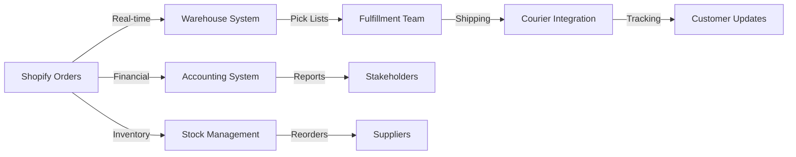

# Side-by-Side System Comparison

## Transparent POPIA-Compliant System vs. Current Opaque System

### Executive Comparison Summary

| **Category** | **Previous Decade System** | **Current Hijacked System** | **Impact** |
|--------------|---------------------------|----------------------------|------------|
| **Control Structure** | Distributed multi-stakeholder access | Single person control (Rynette) | 🔴 Critical business risk |
| **POPIA Compliance** | Fully compliant with audit trails | Non-compliant, no documentation | 🔴 Legal violations |
| **Financial Transparency** | Real-time visibility for stakeholders | Completely hidden operations | 🔴 Fiduciary breach |
| **Domain Usage** | regima.zone (legitimate ownership) | Addarory domain (unauthorized) | 🔴 Asset misappropriation |
| **Business Continuity** | Multiple operators, full redundancy | Single point of failure | 🔴 Existential risk |
| **Customer Service** | Team-based professional support | Single person bottleneck | 🔴 Service degradation |
| **Audit Capability** | Complete trails and documentation | No records accessible | 🔴 Compliance failure |

### Detailed Component Analysis

## 1. Access Control & User Management

### ✅ Previous System (Transparent)
```
Shopify Store Access Hierarchy:
├── Owner Accounts (2-3 people)
│   ├── Full administrative rights
│   ├── Financial oversight
│   └── Strategic decisions
├── Management Level (4-5 people)
│   ├── Daily operations
│   ├── Customer service
│   └── Inventory management
├── Staff Level (6-8 people)
│   ├── Order processing
│   ├── Basic updates
│   └── Fulfillment tasks
├── Financial Oversight (2-3 people)
│   ├── Accountant access
│   ├── Bookkeeper access
│   └── Auditor read-only
└── External Partners
    ├── Warehouse integration
    ├── Logistics providers
    └── Marketing agencies
```

### ❌ Current System (Opaque)
```
Personal Computer Control:
└── Rynette (Single User)
    ├── All passwords changed
    ├── No documentation
    ├── No shared access
    └── Complete isolation
```

**Impact Analysis**:
- **Business Risk**: No operations possible if Rynette unavailable
- **Knowledge Loss**: No transfer of operational knowledge
- **Stakeholder Exclusion**: Legitimate parties locked out
- **Legal Liability**: Directors unable to fulfill duties

## 2. Financial Management & Transparency

### ✅ Previous System (Transparent)

**Integrated Financial Dashboard**
- **Real-time Revenue Tracking**
  - Daily sales figures visible to stakeholders
  - Payment method breakdowns
  - Product performance metrics
  - Geographic sales distribution

- **Automated Accounting Integration**
  ```
  Shopify → QuickBooks/Sage
  ├── Automatic transaction import
  ├── Tax calculation
  ├── Inventory valuation
  ├── Customer balances
  └── Supplier payments
  ```

- **Stakeholder Reporting**
  - Daily email summaries
  - Weekly performance reports
  - Monthly financial statements
  - Quarterly board packages
  - Annual audit preparation

### ❌ Current System (Opaque)

**Hidden Financial Operations**
- **No Visibility**
  - Revenue amounts unknown
  - Cash flow hidden
  - Expenses untracked
  - Tax liability unclear

- **Manual Processes**
  - No accounting integration
  - Paper records (if any)
  - No audit trail
  - Hidden bank accounts

- **Stakeholder Blackout**
  - No financial reports
  - No access to data
  - Investment value unknown
  - Compliance status unclear

**Financial Impact Comparison**:
| Metric | Transparent System | Opaque System |
|--------|-------------------|---------------|
| Revenue Visibility | 100% real-time | 0% hidden |
| Audit Readiness | Always ready | Impossible |
| Tax Compliance | Automated | Unknown risk |
| Stakeholder Trust | High | Destroyed |
| Investment Value | Clear | Unknowable |

## 3. Customer Communication Systems

### ✅ Previous System (Transparent)

**Professional Email Infrastructure (@regima.zone)**
```
Customer Communication Flow:
├── Order Confirmations
│   ├── Automated sending
│   ├── Professional templates
│   └── Tracking included
├── Support Tickets
│   ├── Team inbox access
│   ├── Response SLAs
│   └── Escalation paths
├── Marketing Campaigns
│   ├── Consent-based
│   ├── Performance tracked
│   └── Unsubscribe honored
└── Compliance Communications
    ├── Privacy notices
    ├── Terms updates
    └── Data requests
```

### ❌ Current System (Opaque)

**Personal Email Control**
```
Hidden Communications:
└── Addarory Domain (Unauthorized)
    ├── No team access
    ├── No archives available
    ├── No tracking
    └── No compliance
```

**Customer Experience Impact**:
- Response time increased from hours to days
- No team collaboration on complex issues
- Lost communication history
- Unprofessional domain appearance
- Privacy rights unenforceable

## 4. Operational Integration

### ✅ Previous System (Transparent)

**Fully Integrated Operations**



**Benefits**:
- Automated workflows
- Error reduction
- Speed optimization
- Cost efficiency
- Scalability

### ❌ Current System (Opaque)

**Disconnected Manual Processes**

```
Rynette's Computer
├── Manual order viewing
├── Phone calls to warehouse
├── Email to couriers
├── Spreadsheet tracking
└── No integration
```

**Operational Degradation**:
- Processing time 5x longer
- Error rate increased
- No scalability
- Higher costs
- Customer dissatisfaction

## 5. Compliance & Legal Standing

### ✅ Previous System (Transparent)

**POPIA Compliance Framework**

| Requirement | Implementation | Evidence |
|------------|----------------|----------|
| Lawful Processing | Consent system active | Audit logs |
| Purpose Specification | Clear notices provided | Documentation |
| Further Processing | Limited to stated purposes | System controls |
| Information Quality | Regular data updates | Accuracy reports |
| Openness | Privacy policy published | Website archives |
| Security Safeguards | Technical measures implemented | Security audits |
| Data Subject Participation | Self-service portal | Access logs |

**Other Compliance**:
- Consumer Protection Act adherence
- Tax compliance automated
- Industry regulations met
- International standards followed

### ❌ Current System (Opaque)

**Compliance Failures**

| Requirement | Status | Risk Level |
|------------|--------|------------|
| Lawful Processing | No consent system | 🔴 Critical |
| Purpose Specification | No notices | 🔴 Critical |
| Further Processing | Uncontrolled | 🔴 Critical |
| Information Quality | No updates possible | 🔴 Critical |
| Openness | Hidden operations | 🔴 Critical |
| Security Safeguards | Personal computer only | 🔴 Critical |
| Data Subject Participation | Impossible | 🔴 Critical |

**Legal Exposure**:
- POPIA fines up to R10 million
- Personal liability for directors
- Criminal prosecution possible
- Civil lawsuits likely
- Reputational destruction

## 6. Domain Control & Digital Assets

### ✅ Previous System (Transparent)

**Legitimate Domain Usage**
- **regima.zone**
  - Owned by RegimA
  - Professional appearance
  - SEO value built over decade
  - Customer recognition
  - Email deliverability optimized

### ❌ Current System (Opaque)

**Unauthorized Domain Usage**
- **Addarory Domain**
  - Owned by Rynette's son
  - No authorization for use
  - Confuses customers
  - SEO value lost
  - Email deliverability issues

## 7. Business Continuity & Risk

### ✅ Previous System (Transparent)

**Risk Mitigation Measures**
1. Multiple trained operators
2. Documented procedures
3. System redundancies
4. Regular backups
5. Disaster recovery plan
6. Insurance coverage valid

### ❌ Current System (Opaque)

**Concentrated Risk Factors**
1. Single point of failure
2. No documentation
3. No backups accessible
4. No recovery possible
5. Insurance potentially void
6. Business failure imminent

## Court-Relevant Comparison Summary

### Stakeholder Rights Violated

| Stakeholder | Previous Rights | Current Status | Legal Remedy Needed |
|-------------|----------------|----------------|---------------------|
| Shareholders | Financial visibility | Completely blocked | Restoration order |
| Directors | Operational oversight | Unable to fulfill duties | Access reinstatement |
| Customers | Data protection rights | Rights unenforceable | Compliance order |
| Employees | System access for work | Locked out | Reinstatement order |
| Creditors | Financial transparency | Cannot assess risk | Disclosure order |

### Quantifiable Damages

1. **Revenue Impact**: Estimated 30-50% efficiency loss
2. **Compliance Costs**: R10M+ potential POPIA fines
3. **Operational Costs**: 5x increase in processing time
4. **Opportunity Costs**: Growth completely halted
5. **Reputation Damage**: Customer trust eroded
6. **Legal Costs**: Mounting due to non-compliance

### Urgent Remediation Required

The court must order:
1. **Immediate restoration** of multi-user access
2. **Reinstatement** of regima.zone domain usage
3. **Re-integration** of all disconnected systems
4. **Compliance audit** and remediation
5. **Financial disclosure** to stakeholders
6. **Operational handover** to proper management

This comparison conclusively demonstrates that the current system is illegal, non-compliant, and unsustainable, requiring immediate court intervention.