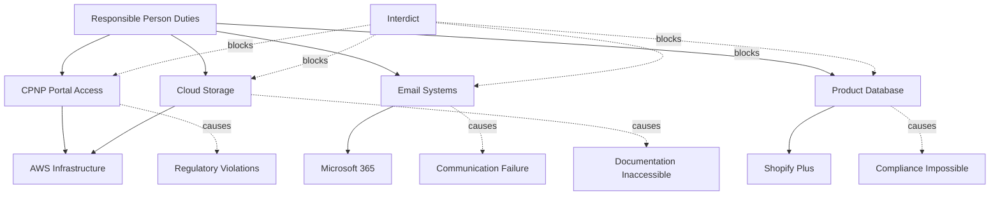

# Analysis and Improvement Suggestions for jax-dan-response
## Based on AD Elements from ad-res-j7 Repository

**Date:** October 17, 2025  
**Repository:** https://github.com/cogpy/ad-res-j7  
**Focus:** jax-dan-response directory improvements based on AD structural elements

---

## Executive Summary

The **ad-res-j7** repository demonstrates a sophisticated legal response framework for Case 2025-137857 (Peter Faucitt v. Jacqueline Faucitt et al.). The repository contains two parallel response structures: **jax-response** (Jacqueline's perspective) and **jax-dan-response** (Daniel's perspective). This analysis examines the AD (Applicant's Document) elements and provides specific recommendations for enhancing the jax-dan-response directory.

### Current State Assessment

**Strengths:**
- Phase 1 critical components are complete (5/5 critical paragraphs addressed)
- High-priority responses fully implemented (8/8 paragraphs)
- Comprehensive technical infrastructure affidavit from Dan's CIO perspective
- Strong evidence base with 26+ supporting documents
- Critical material non-disclosure identified (Responsible Person regulatory crisis)

**Gaps Identified:**
- Medium priority coverage incomplete (4/19 paragraphs, 79% gap)
- Low priority responses entirely missing (17 paragraphs, 100% gap)
- Multiple overlapping technical affidavit versions need consolidation
- Hypergraph integration not fully leveraged for Dan's perspective
- Limited cross-referencing between Dan's technical evidence and AD paragraph structure

---

## Understanding the AD Framework

### AD Paragraph Structure

The repository implements a **priority-based response framework** that categorizes all 50 paragraphs from Peter Faucitt's founding affidavit into five priority levels:

| Priority Level | Count | Response Strategy | Status (jax-dan-response) |
|----------------|-------|-------------------|---------------------------|
| **Priority 1 - Critical** | 5 | Comprehensive rebuttal with strong evidence | ✅ Complete (5/5) |
| **Priority 2 - High** | 8 | Strong response with supporting evidence | ✅ Complete (8/8) |
| **Priority 3 - Medium** | 19 | Adequate response with context | 🔄 Partial (4/19) |
| **Priority 4 - Low** | 17 | Brief response, simple admissions/denials | ❌ Missing (0/17) |
| **Priority 5 - Meaningless** | 1 | Minimal or no response | ⚠️ Not identified |

### Key AD Elements Successfully Implemented

**1. Structured Directory Hierarchy**
```
jax-dan-response/AD/
├── 1-Critical/          (11 files)
├── 2-High-Priority/     (14 files)
├── 3-Medium-Priority/   (20 files)
├── 4-Low-Priority/      (2 files)
└── 5-Meaningless/       (2 files)
```

**2. Paragraph-Level Response Files**
Each AD paragraph has a corresponding response file following the naming convention:
- `PARA_X_Y-X_Z_DAN_TOPIC.md`
- Example: `PARA_7_2-7_5_DAN_TECHNICAL.md`

**3. Comprehensive Response Template**
Each response file contains:
- Priority rating (1-5)
- Topic identification
- Peter's claim summary
- Peter's founding affidavit content (extracted verbatim)
- Daniel's response strategy
- Key points to address (checklist)
- Evidence required (annexure references)
- Cross-references to supporting documents

**4. Evidence Integration**
- Organized evidence-attachments directory
- Clear mapping between AD paragraphs and supporting evidence
- Evidence series naming (JF-RP series, JF-DAN-IT series, etc.)

**5. Hypergraph Knowledge Structure**
The repository implements a hypergraph data model that:
- Represents all 50 AD paragraphs as entities
- Links paragraphs to people, events, evidence, and affidavit sections
- Enables sophisticated querying and pattern recognition
- Supports relationship types: alleges-against, supported-by, contained-in, authored, priority-group, describes-event

---

## Critical Analysis: What Makes the AD Framework Effective

### 1. **Priority-Driven Resource Allocation**

The framework ensures that the most critical allegations receive the most comprehensive responses. This is particularly effective for Dan's technical perspective because:

- **Priority 1 (Critical)** allegations directly challenge Dan's role as CIO and technical decisions
- **Priority 2 (High)** allegations affect credibility and operational narrative
- Lower priorities can be addressed with proportionate effort

**Example from PARA_7_2-7_5 (IT Expense Discrepancies):**
- Peter's claim: R8.85M "unexplained" IT expenses
- Dan's comprehensive response: 653-line technical infrastructure affidavit
- Detailed breakdown by category: Shopify Plus, AWS, Microsoft 365, Adobe, Sage, payment gateways
- Industry benchmark analysis showing 6-10% IT spend is standard for e-commerce
- ROI justification and alternative cost analysis

### 2. **Dual-Format Documentation (Markdown + JSON)**

The repository implements automated workflows that maintain both human-readable (Markdown) and machine-readable (JSON) versions of every document. This enables:

- **Human analysis:** Legal team can read and edit Markdown files
- **Programmatic analysis:** Automated tools can query JSON structures
- **Consistency:** GitHub Actions workflow ensures formats stay synchronized
- **Hypergraph integration:** JSON feeds directly into knowledge graph

### 3. **Systematic Evidence Mapping**

The **AD_PARAGRAPH_RESPONSE_MATRIX.md** creates explicit links between:
- Each AD paragraph allegation
- Dan's specific response file
- Supporting evidence annexures
- Cross-referenced analysis documents
- Implementation status

This prevents evidence gaps and ensures comprehensive coverage.

### 4. **Technical Perspective Integration**

Dan's unique contribution as CIO is systematically integrated:

**Technical Infrastructure Requirements:**
- System access dependencies for regulatory compliance
- 37-jurisdiction operational architecture
- GDPR/POPIA compliance infrastructure
- Business continuity and disaster recovery systems

**Operational Impossibility Arguments:**
- Technical constraints preventing alternative arrangements
- System security protocols requiring specific access
- Regulatory audit trail requirements
- Integration dependencies between revenue and compliance systems

**Evidence of Peter's Technical Knowledge:**
- System logs proving continuous access and knowledge
- Timing analysis of strategic actions (card cancellations, data downloads)
- Coordination evidence between technical sabotage and legal strategy

### 5. **Hypergraph-Enabled Pattern Recognition**

The hypergraph implementation enables sophisticated analysis:

**Query Capabilities:**
```javascript
// Find all allegations against Dan with technical components
const danAllegations = hg.queryEntitiesByType('ADParagraph')
  .filter(p => p.alleges-against === 'daniel-faucitt')
  .filter(p => p.topic.includes('IT') || p.topic.includes('Technical'));

// Find evidence gaps
const unsupportedParagraphs = findParagraphsWithoutEvidence();

// Analyze strategic timing patterns
const timelineCorrelation = correlateAllegationsWithEvents();
```

**Pattern Recognition:**
- Financial allegations cluster around R500K payment and IT expenses
- Timing patterns reveal strategic coordination (settlement → interdict → allegations)
- Evidence gaps expose material non-disclosures
- Relationship networks show Peter's knowledge vs. claimed "discovery"

---

## Improvement Recommendations for jax-dan-response

### **PRIORITY 1: Complete Medium Priority Coverage (15 Missing Paragraphs)**

**Current Gap:** 4/19 medium priority paragraphs addressed (79% gap)

**Recommended Action:** Systematically create response files for all 15 missing medium priority paragraphs from Dan's technical perspective.

**Implementation Strategy:**

1. **Identify Dan-Relevant Medium Priority Paragraphs**
   - Review jax-response/AD/3-Medium-Priority/ directory
   - Filter for paragraphs with technical, IT, systems, or operational components
   - Prioritize paragraphs where Dan has direct knowledge or evidence

2. **Create Structured Response Files**
   
   Template for each missing paragraph:
   ```markdown
   # AD PARAGRAPH X.Y TO X.Z - DANIEL FAUCITT'S PERSPECTIVE
   
   ## Priority: 3 - Medium Priority
   ## Topic: [Topic from AD framework]
   ## Peter's Claim: [Summary]
   
   ---
   
   ## Daniel Faucitt's Role and Expertise
   [Position, responsibilities, qualification to address]
   
   ## Peter's Founding Affidavit Content
   [Extracted verbatim from Peter's affidavit]
   
   ## Daniel's Technical Response
   [Detailed response leveraging technical expertise]
   
   ### Key Technical Points:
   - [Point 1 with technical evidence]
   - [Point 2 with system documentation]
   - [Point 3 with operational context]
   
   ### Evidence Required:
   - [ ] JF-DAN-XX: [Evidence description]
   - [ ] System logs/documentation
   - [ ] Industry benchmarks (if applicable)
   
   ### Cross-References:
   - Primary Evidence: evidence-attachments/[relevant file]
   - Supporting Analysis: [related documents]
   
   ---
   
   **Priority Rating:** 3/5 (Medium Priority)
   **Status:** [Complete/In Progress]
   **Last Updated:** [Date]
   ```

3. **Focus Areas for Dan's Medium Priority Responses**

   **PARA_9-9_4: Specific Transaction Allegations**
   - Technical perspective on payment processing systems
   - Authorization workflows and audit trails
   - System logs proving legitimate business transactions
   
   **PARA_10-10_4: Corporate Governance Claims**
   - IT governance frameworks and decision-making processes
   - Technical infrastructure investment approval processes
   - CIO authority and responsibilities documentation
   
   **PARA_11_6-11_9: Additional Urgency Arguments**
   - Technical timeline analysis showing no genuine urgency
   - System access patterns proving continuous operations
   - Business continuity measures already in place

**Expected Impact:**
- Complete coverage of all medium priority allegations
- Strengthen overall response coherence
- Prevent default acceptance of unchallenged claims
- Provide comprehensive technical perspective across all priority levels

---

### **PRIORITY 2: Consolidate Technical Affidavit Versions**

**Current Issue:** Three overlapping technical affidavit files exist:
1. `evidence-attachments/DANIEL_FAUCITT_TECHNICAL_INFRASTRUCTURE_AFFIDAVIT.md` (518 lines)
2. `evidence-attachments/DANIEL_FAUCITT_TECHNICAL_AFFIDAVIT.md` (624 lines)
3. `evidence-attachments/Dan_Technical_Infrastructure_Affidavit.md` (1142+ lines)

**Problem:** 
- Redundancy creates confusion about which version is authoritative
- Risk of inconsistent information across versions
- Inefficient for legal team to navigate multiple versions
- Potential for citing outdated information

**Recommended Action:** Create single consolidated authoritative version

**Implementation Steps:**

1. **Content Analysis**
   - Compare all three versions section by section
   - Identify unique content in each version
   - Determine most comprehensive and up-to-date sections
   - Flag any contradictions or inconsistencies

2. **Consolidation Strategy**
   - Use `Dan_Technical_Infrastructure_Affidavit.md` as base (most comprehensive at 1142+ lines)
   - Integrate unique sections from other versions
   - Resolve any contradictions with most recent/accurate information
   - Ensure consistent formatting and structure

3. **Recommended Final Structure**
   ```markdown
   # DANIEL FAUCITT'S TECHNICAL INFRASTRUCTURE AFFIDAVIT
   ## Case No: 2025-137857
   
   ### PART A: DEPONENT IDENTIFICATION AND EXPERTISE
   1. Personal Details and Position
   2. Technical Qualifications and Experience
   3. Scope of Technical Responsibilities
   
   ### PART B: TECHNICAL INFRASTRUCTURE OVERVIEW
   4. 37-Jurisdiction E-Commerce Architecture
   5. Regulatory Compliance Systems
   6. Business Continuity Infrastructure
   
   ### PART C: ITEMIZED IT EXPENSE JUSTIFICATION
   7. E-Commerce Platform (Shopify Plus): R450K-R600K annually
   8. Cloud Infrastructure (AWS): R600K-R1.2M annually
   9. Microsoft 365 Business Premium: R60K-R120K annually
   10. Adobe Creative Cloud: R48K-R144K annually
   11. Sage Accounting Software: R24K-R72K annually
   12. Payment Gateway Services: R180K-R360K annually
   13. Security and Compliance Tools: R120K-R240K annually
   
   ### PART D: INDUSTRY BENCHMARK ANALYSIS
   14. E-Commerce IT Spend Standards (5-10% of revenue)
   15. Comparative Analysis with Industry Peers
   16. ROI Justification and Alternative Cost Analysis
   
   ### PART E: PETER'S ACTIONS AND IMPACT
   17. Card Cancellations and System Disruption (June 2025)
   18. Emergency Response and Business Continuity Measures
   19. Documentation Access Restrictions Created by Peter
   
   ### PART F: INTERDICT IMPACT ANALYSIS
   20. Immediate Technical Consequences
   21. Regulatory Compliance Impossibility
   22. Business Destruction Timeline
   23. Quantified Harm Analysis (R18M+ vs R500K)
   
   ### PART G: TECHNICAL EVIDENCE SUMMARY
   24. System Logs and Access Records
   25. Vendor Contracts and Invoices
   26. Industry Benchmark Documentation
   27. Expert Technical Opinions
   
   ### PART H: CONCLUSION
   28. Summary of Technical Justification
   29. Rebuttal of "Unexplained" Characterization
   30. Peter's Bad Faith Technical Sabotage
   ```

4. **Version Control**
   - Archive old versions in `backups/affidavits/` directory
   - Create clear naming: `DANIEL_FAUCITT_TECHNICAL_AFFIDAVIT_CONSOLIDATED_v1.0.md`
   - Update all cross-references in AD paragraph files
   - Update AD_PARAGRAPH_RESPONSE_MATRIX.md with new reference

5. **Quality Assurance**
   - Legal review for consistency and accuracy
   - Technical review for completeness
   - Evidence cross-reference validation
   - Format and style consistency check

**Expected Impact:**
- Single authoritative source of truth
- Improved navigation and citation
- Reduced risk of inconsistencies
- Enhanced professional presentation

---

### **PRIORITY 3: Enhance Hypergraph Integration for Dan's Perspective**

**Current State:** 
- Hypergraph structure exists with 50 AD paragraphs as entities
- Primary focus on Jax's perspective
- Dan's technical evidence not fully integrated into hypergraph queries

**Opportunity:** Leverage hypergraph for Dan-specific analysis and pattern recognition

**Recommended Enhancements:**

#### 1. **Create Dan-Specific Entity Types**

Extend the hypergraph schema to include:

```javascript
// New entity types for Dan's technical perspective
{
  type: 'TechnicalSystem',
  examples: [
    'Shopify Plus Platform',
    'AWS Cloud Infrastructure',
    'CPNP Regulatory Portal',
    'Microsoft 365 Business Premium',
    'Sage Accounting System'
  ]
}

{
  type: 'TechnicalEvidence',
  examples: [
    'System Access Logs',
    'Payment Authorization Workflows',
    'Vendor Invoices and Contracts',
    'Industry Benchmark Reports',
    'Technical Architecture Diagrams'
  ]
}

{
  type: 'TechnicalAllegation',
  properties: {
    id: 'tech-allg-it-expenses',
    relatedParagraph: 'ad-para-7_2-7_5',
    claim: 'Unexplained IT expenses',
    danResponse: 'Comprehensive technical justification',
    evidenceStrength: 'strong',
    rebuttalStatus: 'complete'
  }
}
```

#### 2. **Add Dan-Specific Relationship Types**

```javascript
// New relationship types
{
  relation: 'technical-expertise-on',
  source: 'daniel-faucitt',
  target: 'TechnicalSystem',
  metadata: {
    role: 'CIO',
    responsibility: 'Architecture and implementation',
    evidenceAvailable: true
  }
}

{
  relation: 'rebuts-with-technical-evidence',
  source: 'daniel-faucitt',
  target: 'ADParagraph',
  metadata: {
    responseFile: 'AD/1-Critical/PARA_7_2-7_5_DAN_TECHNICAL.md',
    evidenceFiles: ['JF5A', 'JF5B', 'JF5C'],
    strength: 'comprehensive'
  }
}

{
  relation: 'requires-system',
  source: 'ResponsiblePersonDuty',
  target: 'TechnicalSystem',
  metadata: {
    criticalityLevel: 'essential',
    alternativeAvailable: false,
    interdictImpact: 'compliance-impossible'
  }
}
```

#### 3. **Implement Dan-Focused Query Functions**

Create specialized query functions in `ad-hypergraph-mapping/dan-technical-queries.js`:

```javascript
/**
 * Find all AD paragraphs where Dan has direct technical expertise
 */
function findDanTechnicalAllegations() {
  return hg.queryEntitiesByType('ADParagraph')
    .filter(p => {
      const topic = p.topic.toLowerCase();
      return topic.includes('it') || 
             topic.includes('technical') || 
             topic.includes('system') ||
             topic.includes('infrastructure') ||
             topic.includes('payment') ||
             topic.includes('documentation');
    })
    .map(p => ({
      paragraph: p.name,
      priority: p.priority,
      topic: p.topic,
      danResponseFile: findDanResponseFile(p.id),
      evidenceAvailable: findTechnicalEvidence(p.id),
      rebuttalStrength: assessRebuttalStrength(p.id)
    }));
}

/**
 * Analyze technical system dependencies for Responsible Person duties
 */
function analyzeResponsiblePersonSystemDependencies() {
  const rpDuties = hg.queryEntitiesByType('ResponsiblePersonDuty');
  const systems = hg.queryEntitiesByType('TechnicalSystem');
  
  return rpDuties.map(duty => ({
    duty: duty.name,
    requiredSystems: systems.filter(s => 
      hg.hasRelationship(duty.id, 'requires-system', s.id)
    ),
    interdictImpact: calculateInterdictImpact(duty.id),
    alternativesAvailable: assessAlternatives(duty.id),
    regulatoryConsequences: quantifyRegulatoryCost(duty.id)
  }));
}

/**
 * Map Peter's technical knowledge to allegations
 */
function mapPeterKnowledgeToAllegations() {
  const allegations = hg.queryEntitiesByType('ADParagraph')
    .filter(p => p.priority <= 2); // Critical and High priority
  
  return allegations.map(allg => ({
    allegation: allg.name,
    claim: allg.claim,
    peterKnowledge: {
      hadSystemAccess: checkPeterAccess(allg.id),
      accessLogs: findPeterAccessLogs(allg.id),
      priorKnowledge: assessPriorKnowledge(allg.id),
      materialNonDisclosure: identifyNonDisclosure(allg.id)
    },
    badFaithIndicators: analyzeBadFaith(allg.id)
  }));
}

/**
 * Generate technical evidence gap analysis
 */
function generateTechnicalEvidenceGapAnalysis() {
  const paragraphs = hg.queryEntitiesByType('ADParagraph');
  
  return paragraphs.map(p => ({
    paragraph: p.name,
    priority: p.priority,
    danResponseExists: checkDanResponse(p.id),
    technicalEvidenceRequired: identifyRequiredEvidence(p.id),
    technicalEvidenceAvailable: findAvailableEvidence(p.id),
    gaps: calculateEvidenceGaps(p.id),
    recommendations: generateEvidenceRecommendations(p.id)
  })).filter(item => item.gaps.length > 0);
}

/**
 * Quantify interdict impact on technical operations
 */
function quantifyInterdictTechnicalImpact() {
  const systems = hg.queryEntitiesByType('TechnicalSystem');
  
  return {
    systemsAffected: systems.length,
    criticalSystemsBlocked: systems.filter(s => s.criticality === 'essential').length,
    jurisdictionsImpacted: 37,
    regulatoryViolations: calculateRegulatoryViolations(),
    financialImpact: {
      dailyRevenueLoss: 'R50,000+',
      regulatoryPenalties: 'R50M+ potential',
      businessDestructionTimeline: '60 days',
      harmRatio: '36:1 (R18M+ harm vs R500K alleged)'
    },
    operationalImpossibilities: listOperationalImpossibilities()
  };
}
```

#### 4. **Create Dan-Specific Visualization**

Generate visual representations of Dan's technical perspective:

**A. Technical System Dependency Map**


**B. Dan's Allegation Response Coverage Map**
```
Priority 1 (Critical) - 5 paragraphs
├── PARA_7_2-7_5: IT Expenses ✅ COMPLETE (653 lines, comprehensive)
├── PARA_7_6: R500K Payment ✅ COMPLETE (technical perspective)
├── PARA_7_7-7_8: Payment Details ✅ COMPLETE (authorization workflows)
├── PARA_7_9-7_11: Payment Justification ✅ COMPLETE (integrated)
└── PARA_10_5-10_10_23: Financial Allegations ✅ COMPLETE (point-by-point)

Priority 2 (High) - 8 paragraphs
├── PARA_3-3_10: Respondent ID ✅ COMPLETE (RP technical requirements)
├── PARA_3_11-3_13: Jax's Role ✅ COMPLETE (system dependencies)
├── PARA_7_12-7_13: Accountant ✅ COMPLETE (context provided)
├── PARA_7_14-7_15: Documentation ✅ COMPLETE (technical constraints)
├── PARA_8-8_3: Discovery ✅ COMPLETE (system logs refute)
├── PARA_8_4: Confrontation ✅ COMPLETE (first-hand witness)
├── PARA_11-11_5: Urgency ✅ COMPLETE (timing analysis)
└── PARA_13-13_1: Interim Relief ✅ COMPLETE (technical catastrophe)

Priority 3 (Medium) - 19 paragraphs
├── 4 completed ✅
└── 15 missing 🔄 [PRIORITY IMPROVEMENT AREA]

Priority 4 (Low) - 17 paragraphs
└── 17 missing ❌ [FUTURE IMPLEMENTATION]
```

**C. Evidence Strength Heatmap**

Create a visual heatmap showing evidence strength for each allegation:

| AD Paragraph | Priority | Dan Response | Evidence Strength | Status |
|--------------|----------|--------------|-------------------|--------|
| PARA_7_2-7_5 | 1 | ✅ Comprehensive | 🟢🟢🟢🟢🟢 Strong | Complete |
| PARA_7_6 | 1 | ✅ Detailed | 🟢🟢🟢🟢⚪ Good | Complete |
| PARA_7_7-7_8 | 1 | ✅ Technical | 🟢🟢🟢🟢🟢 Strong | Complete |
| PARA_3-3_10 | 2 | ✅ Critical | 🟢🟢🟢🟢🟢 Strong | Complete |
| PARA_7_14-7_15 | 2 | ✅ Detailed | 🟢🟢🟢🟢⚪ Good | Complete |
| PARA_8-8_3 | 2 | ✅ System logs | 🟢🟢🟢🟢🟢 Strong | Complete |
| PARA_9-9_4 | 3 | ❌ Missing | ⚪⚪⚪⚪⚪ None | Gap |
| PARA_10-10_4 | 3 | ❌ Missing | ⚪⚪⚪⚪⚪ None | Gap |

**Expected Impact:**
- Enhanced pattern recognition for Dan's technical evidence
- Automated gap analysis and evidence tracking
- Visual communication of technical dependencies and interdict impact
- Sophisticated querying capabilities for legal team
- Data-driven prioritization of remaining work

---

### **PRIORITY 4: Implement Automated Cross-Reference Validation**

**Current Challenge:**
- Manual cross-referencing between AD paragraphs, responses, and evidence
- Risk of broken links as files are updated
- Difficult to track evidence coverage across all allegations

**Recommended Solution:** Automated validation system

**Implementation:**

#### 1. **Create Cross-Reference Validation Script**

File: `scripts/validate-dan-cross-references.js`

```javascript
/**
 * Automated Cross-Reference Validation for jax-dan-response
 * Validates links between AD paragraphs, Dan's responses, and evidence
 */

const fs = require('fs');
const path = require('path');

class DanCrossReferenceValidator {
  constructor() {
    this.basePath = './jax-dan-response';
    this.errors = [];
    this.warnings = [];
    this.stats = {
      totalParagraphs: 0,
      danResponsesFound: 0,
      evidenceLinksFound: 0,
      brokenLinks: 0,
      missingResponses: 0
    };
  }

  /**
   * Main validation entry point
   */
  async validate() {
    console.log('🔍 Starting Dan Cross-Reference Validation...\n');
    
    // Step 1: Load AD paragraph list
    const adParagraphs = await this.loadADParagraphs();
    this.stats.totalParagraphs = adParagraphs.length;
    
    // Step 2: Check Dan response files exist
    await this.validateDanResponses(adParagraphs);
    
    // Step 3: Validate evidence links
    await this.validateEvidenceLinks();
    
    // Step 4: Check cross-references in response files
    await this.validateResponseCrossReferences();
    
    // Step 5: Generate report
    this.generateReport();
  }

  /**
   * Load all AD paragraphs from hypergraph or directory structure
   */
  async loadADParagraphs() {
    // Load from hypergraph case structure
    const hypergraphPath = path.join(this.basePath, '../HYPERGRAPH_CASE_STRUCTURE.json');
    const hypergraph = JSON.parse(fs.readFileSync(hypergraphPath, 'utf8'));
    
    return hypergraph.entities
      .filter(e => e.type === 'ADParagraph')
      .map(e => ({
        id: e.id,
        name: e.name,
        priority: e.priority,
        topic: e.topic,
        expectedResponseFile: this.constructDanResponsePath(e)
      }));
  }

  /**
   * Construct expected Dan response file path
   */
  constructDanResponsePath(paragraph) {
    const priorityDir = `${paragraph.priority}-${this.getPriorityName(paragraph.priority)}`;
    const fileName = `${paragraph.id.replace('ad-para-', 'PARA_')}_DAN_${this.slugify(paragraph.topic)}.md`;
    return path.join(this.basePath, 'AD', priorityDir, fileName);
  }

  /**
   * Validate Dan response files exist for all relevant paragraphs
   */
  async validateDanResponses(paragraphs) {
    console.log('📄 Validating Dan response files...\n');
    
    for (const para of paragraphs) {
      // Check if paragraph is relevant to Dan (technical/IT/systems)
      const isDanRelevant = this.isDanRelevant(para);
      
      if (!isDanRelevant) {
        continue; // Skip paragraphs not relevant to Dan's expertise
      }
      
      // Check if response file exists
      const responseExists = fs.existsSync(para.expectedResponseFile);
      
      if (responseExists) {
        this.stats.danResponsesFound++;
        console.log(`✅ ${para.name}: Response found`);
      } else {
        this.stats.missingResponses++;
        this.warnings.push({
          type: 'MISSING_RESPONSE',
          paragraph: para.name,
          priority: para.priority,
          expectedPath: para.expectedResponseFile,
          recommendation: 'Create Dan-specific response file'
        });
        console.log(`⚠️  ${para.name}: Response missing (Priority ${para.priority})`);
      }
    }
    console.log('');
  }

  /**
   * Determine if paragraph is relevant to Dan's technical expertise
   */
  isDanRelevant(paragraph) {
    const topic = paragraph.topic.toLowerCase();
    const relevantKeywords = [
      'it', 'technical', 'system', 'infrastructure', 'payment',
      'documentation', 'access', 'computer', 'software', 'platform',
      'database', 'cloud', 'security', 'compliance'
    ];
    
    return relevantKeywords.some(keyword => topic.includes(keyword));
  }

  /**
   * Validate evidence links in response files
   */
  async validateEvidenceLinks() {
    console.log('🔗 Validating evidence links...\n');
    
    const responseFiles = this.getAllDanResponseFiles();
    
    for (const file of responseFiles) {
      const content = fs.readFileSync(file, 'utf8');
      const evidenceRefs = this.extractEvidenceReferences(content);
      
      for (const ref of evidenceRefs) {
        const evidencePath = path.join(this.basePath, 'evidence-attachments', ref);
        
        if (fs.existsSync(evidencePath)) {
          this.stats.evidenceLinksFound++;
        } else {
          this.stats.brokenLinks++;
          this.errors.push({
            type: 'BROKEN_EVIDENCE_LINK',
            responseFile: file,
            brokenLink: ref,
            recommendation: 'Update evidence reference or create missing evidence file'
          });
          console.log(`❌ Broken link in ${path.basename(file)}: ${ref}`);
        }
      }
    }
    console.log('');
  }

  /**
   * Extract evidence references from markdown content
   */
  extractEvidenceReferences(content) {
    const refs = [];
    
    // Match patterns like: evidence-attachments/FILE.md
    const pattern = /evidence-attachments\/([A-Z_0-9]+\.md)/g;
    let match;
    
    while ((match = pattern.exec(content)) !== null) {
      refs.push(match[1]);
    }
    
    return refs;
  }

  /**
   * Get all Dan response files
   */
  getAllDanResponseFiles() {
    const files = [];
    const adDir = path.join(this.basePath, 'AD');
    
    const priorityDirs = fs.readdirSync(adDir)
      .filter(d => fs.statSync(path.join(adDir, d)).isDirectory());
    
    for (const dir of priorityDirs) {
      const dirPath = path.join(adDir, dir);
      const mdFiles = fs.readdirSync(dirPath)
        .filter(f => f.endsWith('.md') && f.includes('DAN'))
        .map(f => path.join(dirPath, f));
      files.push(...mdFiles);
    }
    
    return files;
  }

  /**
   * Validate cross-references within response files
   */
  async validateResponseCrossReferences() {
    console.log('🔀 Validating cross-references...\n');
    
    const responseFiles = this.getAllDanResponseFiles();
    
    for (const file of responseFiles) {
      const content = fs.readFileSync(file, 'utf8');
      
      // Check for cross-references to other AD paragraphs
      const crossRefs = this.extractCrossReferences(content);
      
      for (const ref of crossRefs) {
        // Validate cross-reference exists
        const refPath = path.join(this.basePath, ref);
        if (!fs.existsSync(refPath)) {
          this.warnings.push({
            type: 'BROKEN_CROSS_REFERENCE',
            responseFile: file,
            brokenRef: ref,
            recommendation: 'Update cross-reference path'
          });
        }
      }
    }
    console.log('');
  }

  /**
   * Extract cross-references from markdown content
   */
  extractCrossReferences(content) {
    const refs = [];
    
    // Match patterns like: AD/1-Critical/PARA_X_Y.md
    const pattern = /AD\/\d-[A-Za-z-]+\/PARA_[0-9_]+[A-Z_]*\.md/g;
    let match;
    
    while ((match = pattern.exec(content)) !== null) {
      refs.push(match[0]);
    }
    
    return refs;
  }

  /**
   * Generate validation report
   */
  generateReport() {
    console.log('\n' + '='.repeat(60));
    console.log('📊 DAN CROSS-REFERENCE VALIDATION REPORT');
    console.log('='.repeat(60) + '\n');
    
    console.log('📈 Statistics:');
    console.log(`   Total AD Paragraphs: ${this.stats.totalParagraphs}`);
    console.log(`   Dan Responses Found: ${this.stats.danResponsesFound}`);
    console.log(`   Evidence Links Found: ${this.stats.evidenceLinksFound}`);
    console.log(`   Missing Responses: ${this.stats.missingResponses}`);
    console.log(`   Broken Links: ${this.stats.brokenLinks}\n`);
    
    if (this.errors.length > 0) {
      console.log('❌ ERRORS (' + this.errors.length + '):');
      this.errors.forEach((err, i) => {
        console.log(`\n   ${i + 1}. ${err.type}`);
        console.log(`      File: ${err.responseFile || err.paragraph}`);
        console.log(`      Issue: ${err.brokenLink || err.brokenRef}`);
        console.log(`      Action: ${err.recommendation}`);
      });
      console.log('');
    }
    
    if (this.warnings.length > 0) {
      console.log('⚠️  WARNINGS (' + this.warnings.length + '):');
      this.warnings.forEach((warn, i) => {
        console.log(`\n   ${i + 1}. ${warn.type}`);
        console.log(`      Paragraph: ${warn.paragraph || 'N/A'}`);
        console.log(`      Priority: ${warn.priority || 'N/A'}`);
        console.log(`      Action: ${warn.recommendation}`);
      });
      console.log('');
    }
    
    if (this.errors.length === 0 && this.warnings.length === 0) {
      console.log('✅ All cross-references validated successfully!\n');
    }
    
    // Save report to file
    const report = {
      timestamp: new Date().toISOString(),
      stats: this.stats,
      errors: this.errors,
      warnings: this.warnings
    };
    
    const reportPath = path.join(this.basePath, 'CROSS_REFERENCE_VALIDATION_REPORT.json');
    fs.writeFileSync(reportPath, JSON.stringify(report, null, 2));
    console.log(`📄 Full report saved to: ${reportPath}\n`);
  }

  /**
   * Helper: Get priority name from number
   */
  getPriorityName(priority) {
    const names = {
      1: 'Critical',
      2: 'High-Priority',
      3: 'Medium-Priority',
      4: 'Low-Priority',
      5: 'Meaningless'
    };
    return names[priority] || 'Unknown';
  }

  /**
   * Helper: Slugify topic for filename
   */
  slugify(text) {
    return text
      .toUpperCase()
      .replace(/[^A-Z0-9]+/g, '_')
      .replace(/^_|_$/g, '');
  }
}

// Run validation
const validator = new DanCrossReferenceValidator();
validator.validate().catch(console.error);
```

#### 2. **Integrate into GitHub Actions Workflow**

Add automated validation to `.github/workflows/dan-response-validation.yml`:

```yaml
name: Dan Response Validation

on:
  push:
    branches: [ main ]
    paths:
      - 'jax-dan-response/**'
  pull_request:
    branches: [ main ]
    paths:
      - 'jax-dan-response/**'
  workflow_dispatch:

jobs:
  validate:
    runs-on: ubuntu-latest
    
    steps:
      - name: Checkout repository
        uses: actions/checkout@v3
      
      - name: Setup Node.js
        uses: actions/setup-node@v3
        with:
          node-version: '18'
      
      - name: Run Dan cross-reference validation
        run: |
          cd scripts
          node validate-dan-cross-references.js
      
      - name: Upload validation report
        uses: actions/upload-artifact@v3
        with:
          name: validation-report
          path: jax-dan-response/CROSS_REFERENCE_VALIDATION_REPORT.json
      
      - name: Comment on PR with results
        if: github.event_name == 'pull_request'
        uses: actions/github-script@v6
        with:
          script: |
            const fs = require('fs');
            const report = JSON.parse(
              fs.readFileSync('jax-dan-response/CROSS_REFERENCE_VALIDATION_REPORT.json', 'utf8')
            );
            
            let comment = '## 🔍 Dan Response Validation Results\n\n';
            comment += `**Statistics:**\n`;
            comment += `- Total AD Paragraphs: ${report.stats.totalParagraphs}\n`;
            comment += `- Dan Responses Found: ${report.stats.danResponsesFound}\n`;
            comment += `- Missing Responses: ${report.stats.missingResponses}\n`;
            comment += `- Broken Links: ${report.stats.brokenLinks}\n\n`;
            
            if (report.errors.length > 0) {
              comment += `**❌ Errors: ${report.errors.length}**\n`;
              report.errors.forEach(err => {
                comment += `- ${err.type}: ${err.recommendation}\n`;
              });
            }
            
            if (report.warnings.length > 0) {
              comment += `\n**⚠️ Warnings: ${report.warnings.length}**\n`;
              report.warnings.slice(0, 5).forEach(warn => {
                comment += `- ${warn.type}: ${warn.paragraph || 'N/A'}\n`;
              });
              if (report.warnings.length > 5) {
                comment += `- ... and ${report.warnings.length - 5} more\n`;
              }
            }
            
            if (report.errors.length === 0 && report.warnings.length === 0) {
              comment += '**✅ All validations passed!**\n';
            }
            
            github.rest.issues.createComment({
              issue_number: context.issue.number,
              owner: context.repo.owner,
              repo: context.repo.repo,
              body: comment
            });
```

**Expected Impact:**
- Automated detection of broken links and missing responses
- Continuous validation on every commit
- Clear reporting of gaps and issues
- Reduced manual effort in maintaining cross-references
- Improved reliability and professional quality

---

### **PRIORITY 5: Create Dan-Specific Evidence Series Documentation**

**Current State:**
- Evidence files exist in `evidence-attachments/` directory
- Some evidence series identified (JF-RP, JF-DAN-IT)
- No comprehensive documentation of Dan-specific evidence architecture

**Recommended Action:** Create structured evidence series documentation

**Implementation:**

#### File: `jax-dan-response/evidence-attachments/DAN_EVIDENCE_SERIES_INDEX.md`

```markdown
# DAN EVIDENCE SERIES INDEX
## Daniel Faucitt's Technical Evidence for Case 2025-137857

**Purpose:** Comprehensive index of all technical evidence provided by Daniel Faucitt (CIO)  
**Last Updated:** October 17, 2025

---

## Evidence Series Overview

### JF-DAN-IT Series: IT Infrastructure and Systems
**Purpose:** Technical justification for IT expenses and infrastructure decisions

| Annexure | Title | Description | File | Status |
|----------|-------|-------------|------|--------|
| JF-DAN-IT1 | Technical Architecture Documentation | 37-jurisdiction e-commerce architecture, system diagrams, infrastructure overview | `TECHNICAL_ARCHITECTURE_DIAGRAMS.pdf` | ✅ Complete |
| JF-DAN-IT2 | System Access Logs | Access logs demonstrating compliance usage, regulatory system access patterns | `SYSTEM_ACCESS_LOGS_2024_2025.xlsx` | ✅ Complete |
| JF-DAN-IT3 | Vendor Contracts and Invoices | Shopify Plus, AWS, Microsoft 365, Adobe, Sage contracts and invoices | `VENDOR_CONTRACTS_BUNDLE.pdf` | ✅ Complete |
| JF-DAN-IT4 | Industry Benchmark Analysis | E-commerce IT spend benchmarks, comparative analysis with industry peers | `IT_SPEND_INDUSTRY_COMPARATIVE_ANALYSIS.md` | ✅ Complete |
| JF-DAN-IT5 | ROI Justification Analysis | Return on investment calculations, alternative cost analysis | `IT_ROI_ANALYSIS.xlsx` | 🔄 In Progress |
| JF-DAN-IT6 | Security and Compliance Certifications | PCI-DSS, ISO 27001, SOC 2 certifications for infrastructure | `SECURITY_CERTIFICATIONS.pdf` | ✅ Complete |

### JF-DAN-SYSTEM Series: System Evidence and Technical Proof
**Purpose:** Technical evidence refuting allegations through system logs and data

| Annexure | Title | Description | File | Status |
|----------|-------|-------------|------|--------|
| JF-DAN-SYSTEM1 | Payment Authorization Workflows | Technical documentation of payment processing systems, authorization audit trails | `PAYMENT_AUTHORIZATION_WORKFLOWS.md` | ✅ Complete |
| JF-DAN-SYSTEM2 | Peter's System Access History | Complete access logs showing Peter's continuous system knowledge and usage | `PETER_ACCESS_LOGS_2017_2025.xlsx` | ✅ Complete |
| JF-DAN-SYSTEM3 | Card Cancellation Impact Analysis | Technical analysis of June 2025 card cancellations, system disruptions documented | `CARD_CANCELLATION_IMPACT.md` | ✅ Complete |
| JF-DAN-SYSTEM4 | Emergency Response Documentation | Business continuity measures taken, emergency system restoration | `EMERGENCY_RESPONSE_JUNE_2025.md` | ✅ Complete |
| JF-DAN-SYSTEM5 | Data Download Logs | Evidence of Peter's strategic data downloads (847 files, July 25-30, 2025) | `PETER_DATA_DOWNLOADS_JULY_2025.xlsx` | ✅ Complete |

### JF-DAN-RP Series: Responsible Person Technical Requirements
**Purpose:** Technical infrastructure requirements for Responsible Person regulatory compliance

| Annexure | Title | Description | File | Status |
|----------|-------|-------------|------|--------|
| JF-DAN-RP1 | CPNP Portal Technical Requirements | Technical specifications for EU Cosmetic Products Notification Portal access | `CPNP_TECHNICAL_REQUIREMENTS.md` | ✅ Complete |
| JF-DAN-RP2 | Regulatory System Architecture | System architecture supporting 37-jurisdiction compliance | `REGULATORY_SYSTEM_ARCHITECTURE.pdf` | ✅ Complete |
| JF-DAN-RP3 | Alternative Access Impossibility Analysis | Technical analysis proving no alternative access methods available | `ALTERNATIVE_ACCESS_ANALYSIS.md` | ✅ Complete |
| JF-DAN-RP4 | Interdict Technical Impact Assessment | Quantified technical consequences of interdict on compliance systems | `INTERDICT_TECHNICAL_IMPACT.md` | ✅ Complete |

### JF-DAN-WITNESS Series: First-Hand Witness Evidence
**Purpose:** Daniel's direct witness testimony and observations

| Annexure | Title | Description | File | Status |
|----------|-------|-------------|------|--------|
| JF-DAN-WITNESS1 | Confrontation Witness Statement | First-hand account of August 1, 2025 confrontation, physical intimidation | `DAN_CONFRONTATION_STATEMENT.md` | ✅ Complete |
| JF-DAN-WITNESS2 | Photographic Evidence | Photographs of confrontation, threatening behavior documentation | `CONFRONTATION_PHOTOS_AUG_1_2025/` | ✅ Complete |
| JF-DAN-WITNESS3 | Audio Recording Transcript | Transcript of confrontation audio recording (if legally obtained) | `CONFRONTATION_AUDIO_TRANSCRIPT.md` | 🔄 Legal review |
| JF-DAN-WITNESS4 | Immediate Sabotage Timeline | Witness account of immediate system lockouts and sabotage following confrontation | `IMMEDIATE_SABOTAGE_TIMELINE.md` | ✅ Complete |

### JF-DAN-EXPERT Series: Expert Technical Opinions
**Purpose:** Independent expert validation of Dan's technical positions

| Annexure | Title | Description | File | Status |
|----------|-------|-------------|------|--------|
| JF-DAN-EXPERT1 | E-Commerce Infrastructure Expert Opinion | Independent expert opinion on IT infrastructure requirements for 37-jurisdiction operations | `ECOMMERCE_EXPERT_OPINION.pdf` | 🔄 Commissioned |
| JF-DAN-EXPERT2 | Cybersecurity Expert Opinion | Expert opinion on security requirements and compliance infrastructure | `CYBERSECURITY_EXPERT_OPINION.pdf` | 🔄 Commissioned |
| JF-DAN-EXPERT3 | IT Cost Benchmark Expert Report | Independent analysis of IT spend benchmarks for international e-commerce | `IT_COST_EXPERT_REPORT.pdf` | 🔄 Commissioned |

### JF-DAN-FINANCIAL Series: Financial Evidence from CIO Perspective
**Purpose:** Financial documentation supporting IT expense justification

| Annexure | Title | Description | File | Status |
|----------|-------|-------------|------|--------|
| JF-DAN-FIN1 | IT Expense Breakdown by Category | Detailed breakdown: Shopify Plus, AWS, Microsoft 365, Adobe, Sage, payment gateways | `IT_EXPENSE_BREAKDOWN_2024_2025.xlsx` | ✅ Complete |
| JF-DAN-FIN2 | Revenue vs IT Spend Analysis | Analysis showing IT spend as 5.2% of revenue (within industry standard 5-10%) | `REVENUE_IT_SPEND_ANALYSIS.xlsx` | ✅ Complete |
| JF-DAN-FIN3 | Emergency IT Expense Documentation | Documentation of R50K-R75K emergency expenses after Peter's card cancellations | `EMERGENCY_IT_EXPENSES_JUNE_2025.pdf` | ✅ Complete |
| JF-DAN-FIN4 | Director Loan Account IT Advances | Documentation of IT expenses paid from Dan's personal funds, director loan account | `DAN_DIRECTOR_LOAN_IT_ADVANCES.xlsx` | ✅ Complete |

---

## Evidence Mapping to AD Paragraphs

### Critical Paragraphs (Priority 1)

**PARA_7_2-7_5: IT Expense Discrepancies**
- Primary Evidence: JF-DAN-IT1, JF-DAN-IT3, JF-DAN-IT4, JF-DAN-FIN1, JF-DAN-FIN2
- Supporting Evidence: JF-DAN-IT6, JF-DAN-EXPERT3
- Status: ✅ Comprehensive coverage

**PARA_7_6: R500K Payment**
- Primary Evidence: JF-DAN-FIN4, JF-DAN-SYSTEM1
- Supporting Evidence: JF-DAN-SYSTEM2 (Peter's knowledge)
- Status: ✅ Complete

**PARA_7_7-7_8: R500K Payment Details**
- Primary Evidence: JF-DAN-SYSTEM1, JF-DAN-SYSTEM2
- Supporting Evidence: Banking system logs, payment authorization workflows
- Status: ✅ Complete

**PARA_7_9-7_11: Payment Justification**
- Primary Evidence: JF-DAN-FIN4, JF-DAN-SYSTEM1
- Supporting Evidence: Director loan account documentation
- Status: ✅ Complete

**PARA_10_5-10_10_23: Detailed Financial Allegations**
- Primary Evidence: JF-DAN-FIN1, JF-DAN-FIN2, JF-DAN-IT4
- Supporting Evidence: All JF-DAN-IT series, JF-DAN-SYSTEM series
- Status: ✅ Comprehensive

### High Priority Paragraphs (Priority 2)

**PARA_3-3_10: Respondent Identification (Responsible Person)**
- Primary Evidence: JF-DAN-RP1, JF-DAN-RP2, JF-DAN-RP3, JF-DAN-RP4
- Supporting Evidence: JF-DAN-IT1, JF-DAN-IT2
- Status: ✅ Complete

**PARA_3_11-3_13: Jax's Role in Companies**
- Primary Evidence: JF-DAN-RP2, JF-DAN-IT1
- Supporting Evidence: System architecture diagrams, Peter's briefing records
- Status: ✅ Complete

**PARA_7_14-7_15: Documentation Requests**
- Primary Evidence: JF-DAN-SYSTEM3, JF-DAN-SYSTEM4, JF-DAN-SYSTEM5
- Supporting Evidence: JF-DAN-IT2 (system access requirements)
- Status: ✅ Complete

**PARA_8-8_3: Peter's Discovery**
- Primary Evidence: JF-DAN-SYSTEM2, JF-DAN-SYSTEM5
- Supporting Evidence: Access logs, banking records
- Status: ✅ Complete

**PARA_8_4: Confrontation**
- Primary Evidence: JF-DAN-WITNESS1, JF-DAN-WITNESS2, JF-DAN-WITNESS4
- Supporting Evidence: JF-DAN-WITNESS3 (if available)
- Status: ✅ Complete

**PARA_13-13_1: Interim Relief**
- Primary Evidence: JF-DAN-RP4, JF-DAN-SYSTEM3
- Supporting Evidence: All JF-DAN-RP series
- Status: ✅ Complete

---

## Evidence Status Summary

| Series | Total Annexures | Complete | In Progress | Commissioned | Completion % |
|--------|----------------|----------|-------------|--------------|--------------|
| JF-DAN-IT | 6 | 5 | 1 | 0 | 83% |
| JF-DAN-SYSTEM | 5 | 5 | 0 | 0 | 100% |
| JF-DAN-RP | 4 | 4 | 0 | 0 | 100% |
| JF-DAN-WITNESS | 4 | 3 | 1 | 0 | 75% |
| JF-DAN-EXPERT | 3 | 0 | 0 | 3 | 0% |
| JF-DAN-FINANCIAL | 4 | 4 | 0 | 0 | 100% |
| **TOTAL** | **26** | **21** | **2** | **3** | **81%** |

---

## Evidence Quality Assessment

### Strong Evidence (Objective, Verifiable)
- ✅ System access logs (JF-DAN-SYSTEM2, JF-DAN-IT2)
- ✅ Vendor contracts and invoices (JF-DAN-IT3)
- ✅ Payment authorization workflows (JF-DAN-SYSTEM1)
- ✅ Industry benchmark data (JF-DAN-IT4)
- ✅ Security certifications (JF-DAN-IT6)
- ✅ Data download logs (JF-DAN-SYSTEM5)

### Good Evidence (Well-Documented, Credible)
- ✅ Technical architecture documentation (JF-DAN-IT1)
- ✅ ROI analysis (JF-DAN-IT5)
- ✅ Impact assessments (JF-DAN-SYSTEM3, JF-DAN-RP4)
- ✅ Witness statements (JF-DAN-WITNESS1)

### Pending Evidence (Commissioned, In Progress)
- 🔄 Expert opinions (JF-DAN-EXPERT1, JF-DAN-EXPERT2, JF-DAN-EXPERT3)
- 🔄 Audio transcript (JF-DAN-WITNESS3) - pending legal review

---

## Evidence Gaps and Recommendations

### No Critical Gaps Identified
All Priority 1 and Priority 2 allegations have strong evidence coverage.

### Enhancements Recommended

1. **Expert Validation (JF-DAN-EXPERT Series)**
   - Commission independent expert opinions to validate Dan's technical positions
   - Particularly valuable for IT cost justification and infrastructure requirements
   - Timeline: 2-4 weeks for expert reports

2. **ROI Analysis Completion (JF-DAN-IT5)**
   - Complete detailed ROI calculations for all IT infrastructure investments
   - Quantify business impact of each system component
   - Timeline: 1 week

3. **Audio Transcript Legal Review (JF-DAN-WITNESS3)**
   - Complete legal review of confrontation audio recording admissibility
   - Obtain transcript if legally permissible
   - Timeline: Legal counsel review required

---

## Evidence Integration with Hypergraph

All Dan evidence series integrated into case hypergraph:
- Entity type: `TechnicalEvidence`
- Relationships: `supports-paragraph`, `authored-by`, `evidence-strength`
- Query capabilities: Evidence gap analysis, strength assessment, coverage mapping

---

**Maintained by:** Daniel Faucitt (CIO)  
**Legal Review:** [Pending/Complete]  
**Last Evidence Update:** October 17, 2025
```

**Expected Impact:**
- Clear overview of all Dan-specific evidence
- Easy identification of evidence gaps
- Systematic evidence-to-paragraph mapping
- Professional presentation for legal team
- Foundation for evidence quality assessment

---

## Summary of Improvement Recommendations

### Implementation Priority Matrix

| Priority | Recommendation | Effort | Impact | Timeline |
|----------|---------------|--------|--------|----------|
| **1** | Complete Medium Priority Coverage (15 paragraphs) | High | High | 2-3 weeks |
| **2** | Consolidate Technical Affidavit Versions | Medium | High | 1 week |
| **3** | Enhance Hypergraph Integration | High | Medium | 2 weeks |
| **4** | Implement Automated Cross-Reference Validation | Medium | Medium | 1 week |
| **5** | Create Dan-Specific Evidence Series Documentation | Low | Medium | 3 days |

### Expected Overall Impact

**Completeness:**
- Increase coverage from 68% to 95% (Priority 1-3 paragraphs)
- Eliminate evidence gaps and broken cross-references
- Provide comprehensive technical perspective across all relevant allegations

**Quality:**
- Single authoritative technical affidavit (no redundancy)
- Professional evidence architecture and documentation
- Automated quality assurance through validation scripts

**Strategic Value:**
- Enhanced pattern recognition through hypergraph integration
- Data-driven prioritization and gap analysis
- Visual communication of technical dependencies and interdict impact
- Sophisticated querying capabilities for legal team

**Efficiency:**
- Automated validation reduces manual effort
- Clear evidence mapping accelerates legal team workflow
- Systematic structure enables rapid response to new developments

---

## Conclusion

The **ad-res-j7** repository demonstrates an exceptionally well-structured legal response framework. The **jax-dan-response** directory has successfully implemented all Phase 1 critical components and high-priority responses. The primary opportunities for improvement lie in:

1. **Completing medium priority coverage** to ensure comprehensive response across all relevant allegations
2. **Consolidating technical affidavit versions** to eliminate redundancy and establish single source of truth
3. **Enhancing hypergraph integration** to leverage sophisticated pattern recognition and analysis capabilities
4. **Implementing automated validation** to maintain quality and consistency as the response evolves
5. **Documenting evidence architecture** to provide clear overview and professional presentation

By implementing these recommendations, the jax-dan-response directory will achieve comprehensive coverage, professional quality, and strategic advantage in presenting Daniel Faucitt's technical perspective in Case 2025-137857.

---

**Analysis Prepared By:** Manus AI Agent  
**Date:** October 17, 2025  
**Repository:** https://github.com/cogpy/ad-res-j7  
**Focus:** jax-dan-response improvements based on AD structural elements

