# Technical Architecture Documentation - AD-RES-J7 System
## Comprehensive System Architecture with Formal Analysis

**Document Version:** 1.0  
**Date:** 2025-11-07  
**Repository:** cogpy/ad-res-j7  
**Case:** 2025-137857 (Jacqueline & Daniel Faucitt vs Peter Faucitt)

---

## Executive Summary

The AD-RES-J7 system is a hybrid **legal reasoning and case management platform** that combines:
1. **AI-powered legal inference** using transformer-based attention mechanisms (PyTorch)
2. **Multi-schema relational database** for case data, evidence, and legal reasoning (PostgreSQL)
3. **Formal legal framework** with 60+ foundational principles and 8 branches of law (Scheme)
4. **Case-specific implementation** for Case 2025-137857 with R10.227M+ in documented damages

The system architecture integrates **symbolic legal reasoning** (Scheme-based lex framework) with **neural attention mechanisms** (PyTorch transformers) to model legal causation, burden of proof, and guilt determination.

---

## 1. System Architecture Overview

```mermaid
graph TB
    subgraph "Client Layer"
        CLI[CLI Tools]
        SCRIPTS[Automation Scripts]
    end
    
    subgraph "Application Layer"
        subgraph "Legal Reasoning Engine (Python)"
            LAE[Legal Attention Engine<br/>PyTorch Transformer]
            BOP[Burden of Proof Analyzer<br/>Civil/Criminal/Mathematical]
            LEX_PY[Lex Framework Loader]
        end
        
        subgraph "Case Management Backend (Node.js)"
            HIM[Hierarchical Issue Manager]
            HGM[Hypergraph Manager]
            LEX_MGR[Lex Inference Engine]
            CASE_MGR[Case Manager]
            XREF[Cross-Reference Manager]
        end
    end
    
    subgraph "Data Layer (PostgreSQL)"
        subgraph "Base Schema"
            DOCS[case_documents]
            EVIDENCE[evidence_records]
            ISSUES[issues]
        end
        
        subgraph "Hierarchical Schema"
            ARGS[legal_arguments]
            PARAS[issue_paragraphs]
            LINKS[issue_argument_links]
        end
        
        subgraph "Hypergraph Schema"
            NODES[hypergraph_nodes]
            EDGES[hypergraph_edges]
            RELATIONS[hypergraph_relations]
        end
        
        subgraph "Lex Inference Schema"
            AGENTS[agents]
            ARENAS[arenas]
            EVENTS[events]
            CONFIGS[configurations]
            GUILT[guilt_assignments]
        end
    end
    
    subgraph "Legal Framework (Scheme)"
        LV1[Level 1: 60+ Principles<br/>known_laws.scm]
        CIV[Civil Law Framework]
        CRI[Criminal Law Framework]
        CON[Constitutional Law]
        LAB[Labour Law]
        ENV[Environmental Law]
        ADM[Administrative Law]
        CONST[Construction Law]
        INTL[International Law]
    end
    
    CLI --> HIM
    CLI --> HGM
    CLI --> LEX_MGR
    SCRIPTS --> LAE
    SCRIPTS --> BOP
    
    LAE --> LEX_PY
    BOP --> LAE
    LEX_PY --> LV1
    
    HIM --> DOCS
    HIM --> EVIDENCE
    HIM --> ISSUES
    HIM --> ARGS
    HIM --> PARAS
    HIM --> LINKS
    
    HGM --> NODES
    HGM --> EDGES
    HGM --> RELATIONS
    
    LEX_MGR --> AGENTS
    LEX_MGR --> ARENAS
    LEX_MGR --> EVENTS
    LEX_MGR --> CONFIGS
    LEX_MGR --> GUILT
    
    CASE_MGR --> DOCS
    CASE_MGR --> EVIDENCE
    
    LV1 --> CIV
    LV1 --> CRI
    LV1 --> CON
    LV1 --> LAB
    LV1 --> ENV
    LV1 --> ADM
    LV1 --> CONST
    LV1 --> INTL
    
    style LAE fill:#ff9999
    style BOP fill:#ff9999
    style HIM fill:#99ccff
    style HGM fill:#99ccff
    style LV1 fill:#99ff99
```

---

## 2. Component Architecture

### 2.1 Legal Attention Engine (Python/PyTorch)

The core AI component that performs legal reasoning using transformer attention mechanisms.

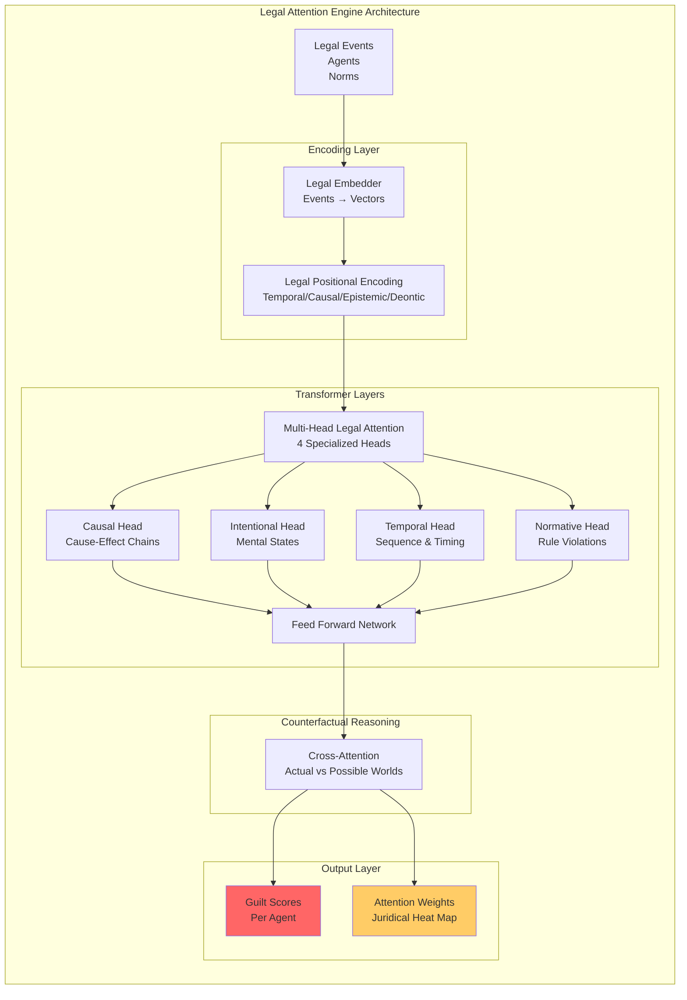

**Key Features:**
- **Multi-head attention** with 4 specialized legal reasoning heads
- **Legal positional encoding** captures temporal, causal, epistemic, and deontic positions
- **Cross-attention** for counterfactual reasoning (what-if scenarios)
- **Attention weights** form interpretable "juridical heat maps"
- **Emergent guilt determination** from learned relational patterns

### 2.2 Burden of Proof Analyzer

Implements three legal standards of proof and provides strategic guidance.

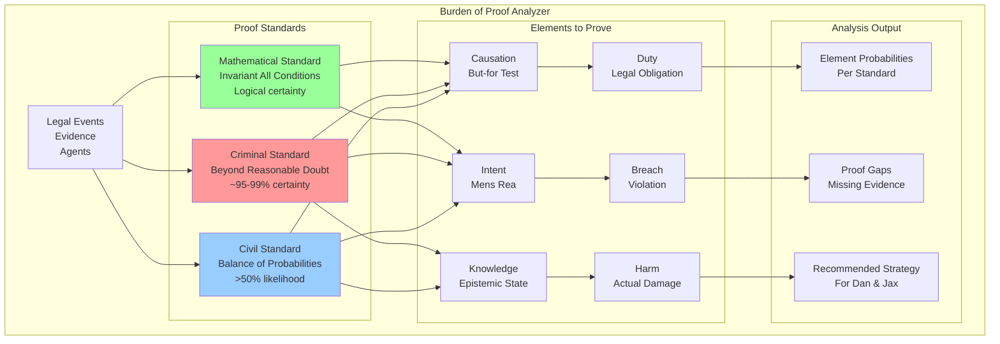

---

## 3. Database Architecture

### 3.1 Multi-Schema Design

The system uses **four interconnected schemas** in PostgreSQL:

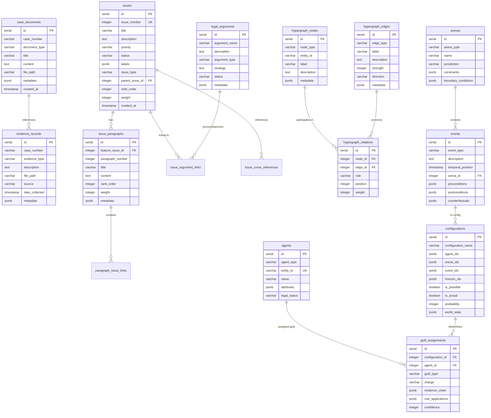

### 3.2 Hierarchical Issue Structure

The hierarchical issue system organizes legal work into a 4-level structure:

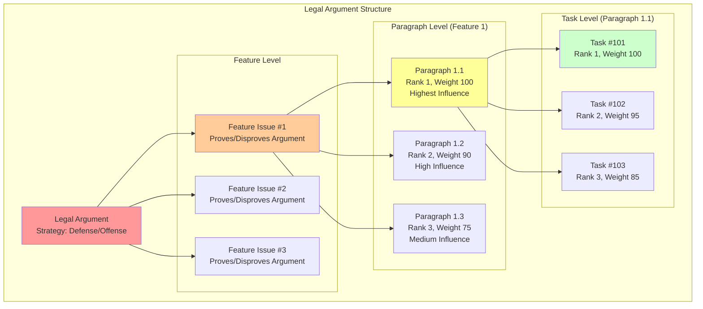

**Structure Rules:**
- **Legal Argument** → **Feature Issue** → **Paragraph** → **Task Issue**
- Each level has **rank ordering** (1 = highest importance)
- Each level has **weighting** (0-100 = degree of influence)
- Aggregate strength calculated from weighted sum of children
- Aim for **3×3 rule**: 1 feature ≈ 3 paragraphs ≈ 9 tasks

---

## 4. Data Flow Architecture

### 4.1 Legal Reasoning Pipeline

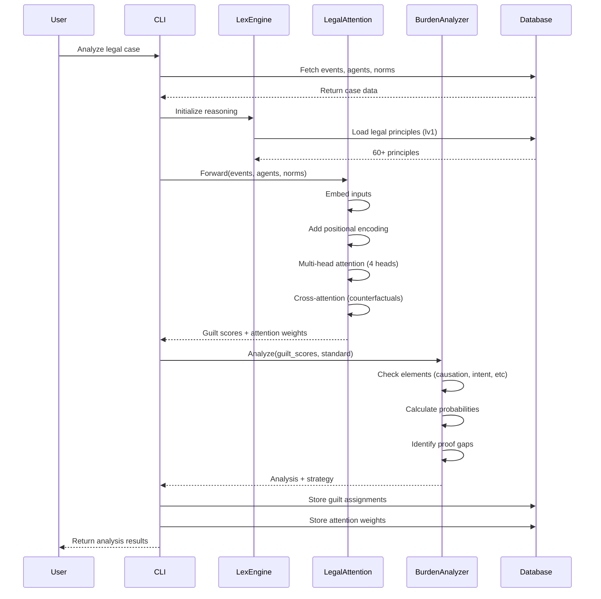

### 4.2 Hierarchical Issue Management Pipeline

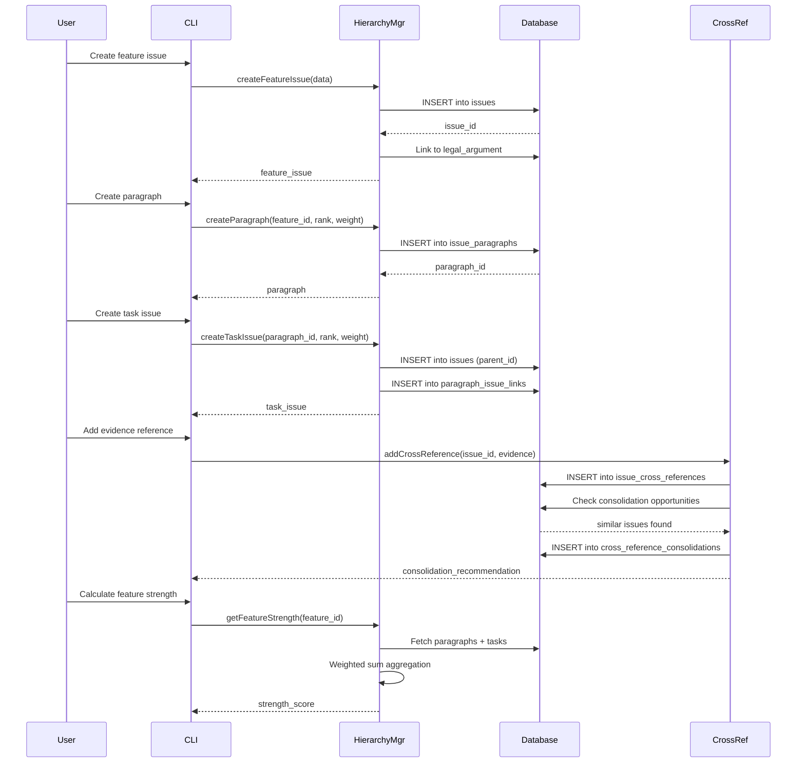

### 4.3 Hypergraph Relationship Pipeline

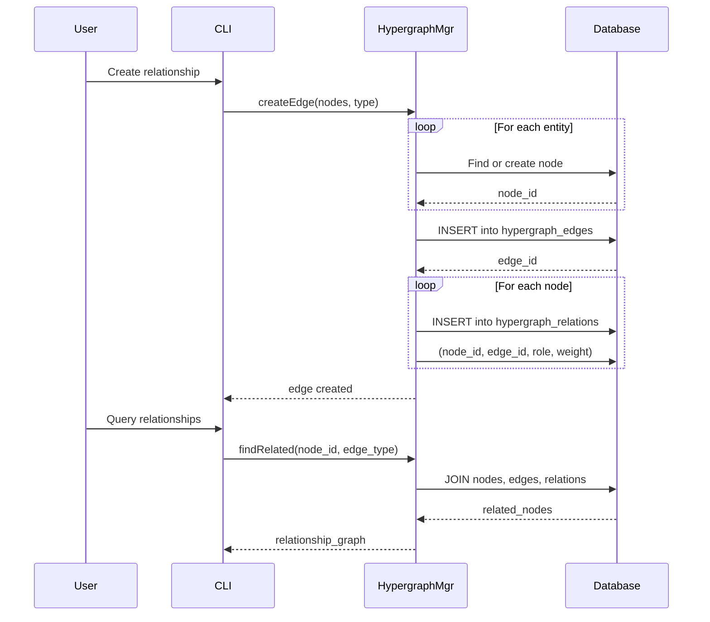

---

## 5. Integration Architecture

### 5.1 External System Integrations

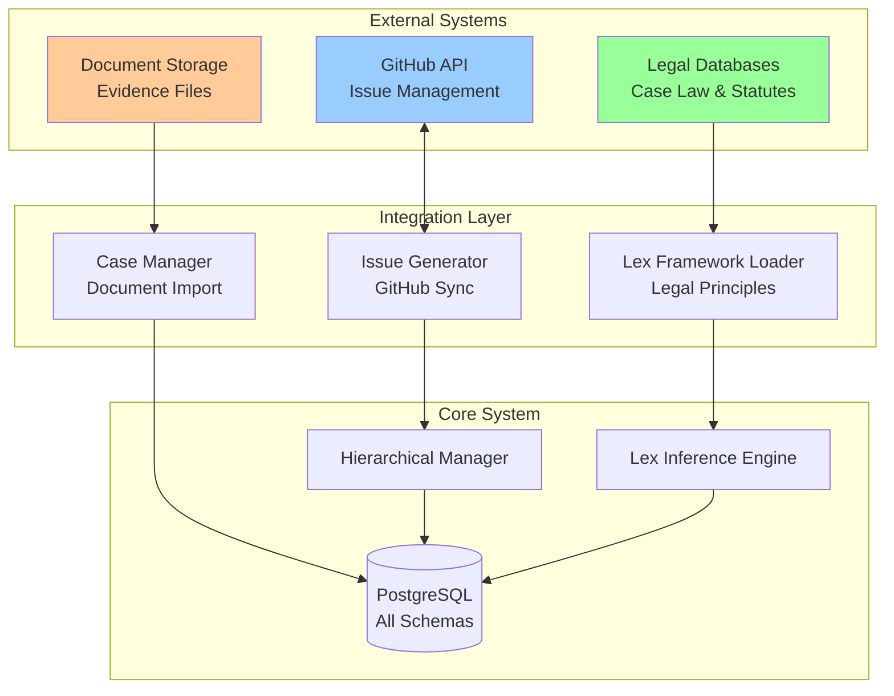

### 5.2 API Contracts

The system exposes several internal APIs for integration:

**HierarchicalIssueManager API:**
- `createLegalArgument(name, description, type, strategy)`
- `createFeatureIssue(number, title, description, argumentId)`
- `createTaskIssue(number, title, parentFeatureId, paragraphId, rank, weight)`
- `createParagraph(featureId, number, title, content, rank, weight)`
- `linkIssueToArgument(issueId, argumentId, linkType, strength)`
- `addCrossReference(issueId, refType, refId, path, title, relationshipType)`
- `getFeatureStrength(featureId)` - Calculates aggregate strength
- `detectConsolidationOpportunities()` - Finds duplicate work

**HypergraphManager API:**
- `createNode(nodeType, label, entityId, description, metadata)`
- `createEdge(edgeType, label, nodes, strength, direction, metadata)`
- `getEdgeWithNodes(edgeId)` - Retrieves complete relationship
- `findNodesByType(nodeType)` - Filters by entity type
- `findRelatedNodes(nodeId, edgeType, maxDepth)` - Graph traversal
- `findPath(sourceId, targetId, maxHops)` - Shortest path

**LexInferenceEngine API:**
- `createAgent(agentType, name, attributes, legalStatus)`
- `createArena(arenaType, name, jurisdiction, constraints)`
- `createEvent(eventType, description, temporalPosition, arenaId)`
- `createConfiguration(name, agentIds, arenaIds, eventIds, isPossible, isActual)`
- `assignGuilt(configId, agentId, guiltType, charge, evidenceChain, confidence)`
- `enumeratePossibleWorlds(constrains)` - Generate configurations

---

## 6. Deployment Architecture

### 6.1 Runtime Environment

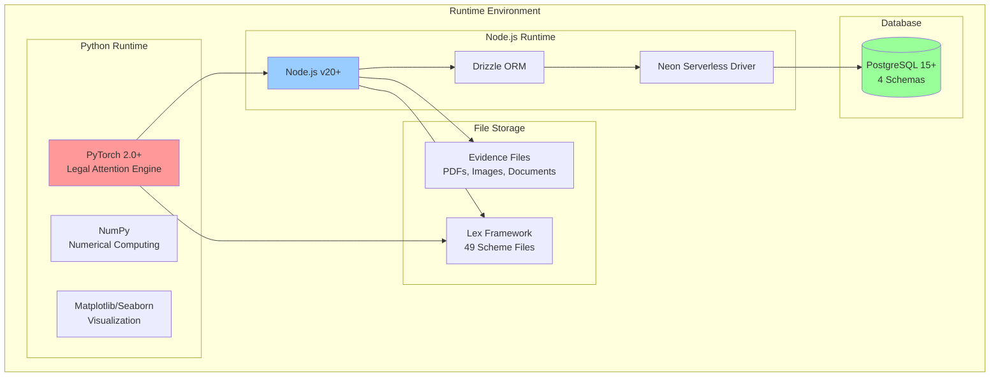

### 6.2 Configuration Management

**Environment Variables:**
- `DATABASE_URL` - PostgreSQL connection string
- `NODE_ENV` - Development/production mode
- `LOG_LEVEL` - Logging verbosity

**Database Migrations:**
- `npm run db:migrate` - Base schema
- `npm run db:hierarchy:setup` - Hierarchical issues schema
- `npm run db:hypergraph:setup` - Hypergraph schema
- `npm run db:lex:setup` - Lex inference schema

---

## 7. Performance Characteristics

### 7.1 Scalability

**Database:**
- Base schema: Handles 2,866+ files, R10.227M+ in damages
- Hierarchical schema: 2 arguments, 3 features, 7 paragraphs, 13+ tasks
- Hypergraph schema: Multi-way relationships with arbitrary arity
- Lex inference: Enumerates possibility spaces (combinatorial)

**Legal Attention Engine:**
- Input: Variable-length sequences (events, agents, norms)
- Time complexity: O(n²) for self-attention
- Space complexity: O(n × d_model) for embeddings
- Parallelizable: Batch processing across GPUs

### 7.2 Performance Optimization

**Database Indexing:**
- B-tree indexes on foreign keys
- GIN indexes on JSONB fields
- Partial indexes on status fields
- Covering indexes for common queries

**Caching Strategies:**
- Lex principles loaded once at startup
- Attention weights cached per configuration
- Feature strength calculations memoized
- Cross-reference consolidations computed incrementally

---

## 8. Security Architecture

### 8.1 Data Protection

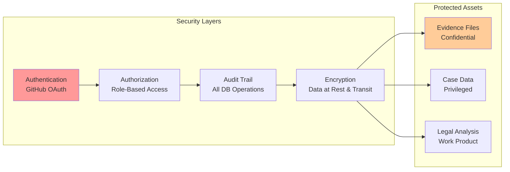

### 8.2 Access Control

**Database Permissions:**
- Read-only for analysis queries
- Write access for case managers
- Admin access for schema migrations
- No direct public access

**API Security:**
- GitHub token authentication
- PostgreSQL SSL connections
- Environment variable secrets
- No hardcoded credentials

---

## 9. Case-Specific Implementation (2025-137857)

### 9.1 Case Overview

**Parties:**
- **Applicants:** Jacqueline Faucitt (Jax), Daniel James Faucitt (Dan)
- **Respondent:** Peter Faucitt
- **Related Parties:** Rynette, Bantjies (trustees)

**Claims:**
- **Revenue theft:** R3.141M+ (Shopify platform hijacking)
- **Financial flows:** R4.276M+ (unauthorized transfers)
- **Family trust:** R2.851M+ (trust fund misappropriation)
- **Total:** R10.227M+ in documented damages

**Legal Arguments (Hierarchical Structure):**
1. **Revenue Stream Hijacking** - Proves Peter's unauthorized control
2. **Financial Fraud** - Proves systematic theft from company accounts
3. **Fiduciary Breach** - Proves trustee violations

### 9.2 Case Data Model

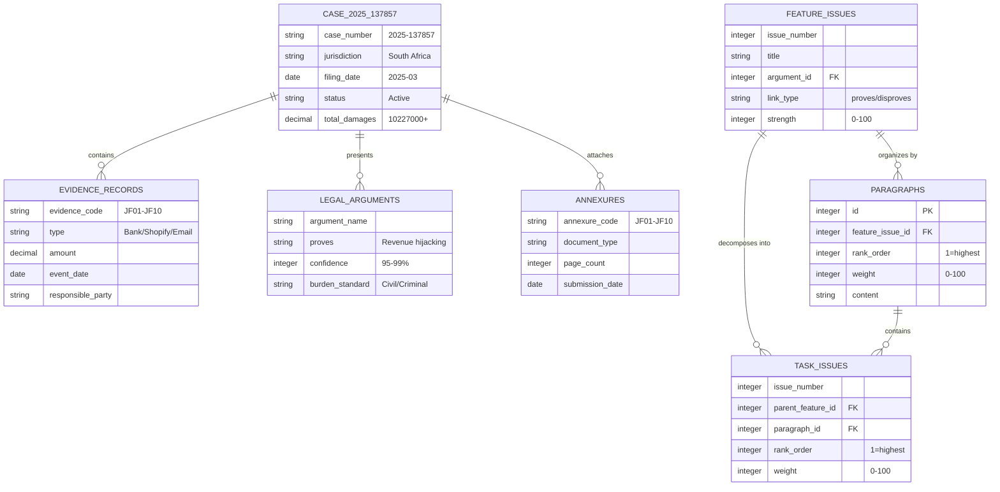

### 9.3 Case-Specific Workflows

**Evidence Processing Workflow:**
1. Scan evidence packages (JF01-JF10 annexures)
2. Extract metadata (dates, amounts, parties)
3. Create hypergraph nodes for entities
4. Link to relevant legal arguments
5. Calculate burden of proof requirements
6. Generate cross-references for consolidation

**Legal Analysis Workflow:**
1. Load events from evidence (bank transfers, email communications)
2. Define agents (Peter, Jax, Dan, Rynette, Bantjies)
3. Apply legal principles (lv1: 60+ principles)
4. Run legal attention engine (guilt determination)
5. Run burden of proof analyzer (civil/criminal standards)
6. Generate juridical heat maps (attention visualization)
7. Output strategic recommendations

---

## 10. Technology Stack Summary

| Layer | Technology | Purpose |
|-------|-----------|---------|
| **AI/ML** | PyTorch 2.0+ | Legal attention transformer |
| **Backend** | Node.js v20+ | Case management, APIs |
| **Database** | PostgreSQL 15+ | Multi-schema persistence |
| **ORM** | Drizzle | Type-safe queries |
| **Legal Framework** | Scheme | Formal legal principles |
| **Visualization** | Matplotlib, Seaborn | Attention heat maps |
| **Testing** | Node.js Test Runner | Integration tests |
| **CI/CD** | GitHub Actions | Automated testing |

---

## 11. Future Extensions

### 11.1 Planned Enhancements

**Legal Reasoning:**
- Abductive reasoning engine (hypothesis generation)
- Analogical reasoning (transfer across cases)
- Case law citation network integration
- Natural language legal document parsing

**Scalability:**
- Distributed inference across multiple GPUs
- Sharded database for large case volumes
- Event sourcing for audit trail
- CQRS pattern for read-optimized queries

**Integration:**
- Court filing system APIs
- Legal database integrations (LexisNexis, Westlaw)
- Expert witness management
- Client communication portal

### 11.2 Research Directions

- **Interpretable AI:** Explaining attention-based guilt determination
- **Multi-jurisdictional reasoning:** Transfer learning across legal systems
- **Temporal reasoning:** Dynamic norms and evolving legal landscapes
- **Uncertainty quantification:** Bayesian confidence intervals for guilt scores

---

## 12. References

**Code Repository:**
- GitHub: https://github.com/cogpy/ad-res-j7
- Documentation: `/docs/` directory
- Tests: `/tests/` directory

**Key Documentation:**
- `README.md` - System overview
- `HIERARCHICAL_ISSUES_SUMMARY.md` - Issue structure
- `BURDEN_OF_PROOF_IMPLEMENTATION_COMPLETE.md` - Proof standards
- `COMPREHENSIVE_EVIDENCE_INDEX.md` - Evidence catalog
- `db/README.md` - Database setup guide

**Academic Foundations:**
- Transformer attention mechanisms (Vaswani et al., 2017)
- Legal reasoning as graph inference
- Burden of proof standards (civil/criminal)
- South African law (8 branches, 60+ principles)

---

## Document History

| Version | Date | Author | Changes |
|---------|------|--------|---------|
| 1.0 | 2025-11-07 | System | Initial comprehensive architecture documentation |

---

**End of Architecture Overview**
