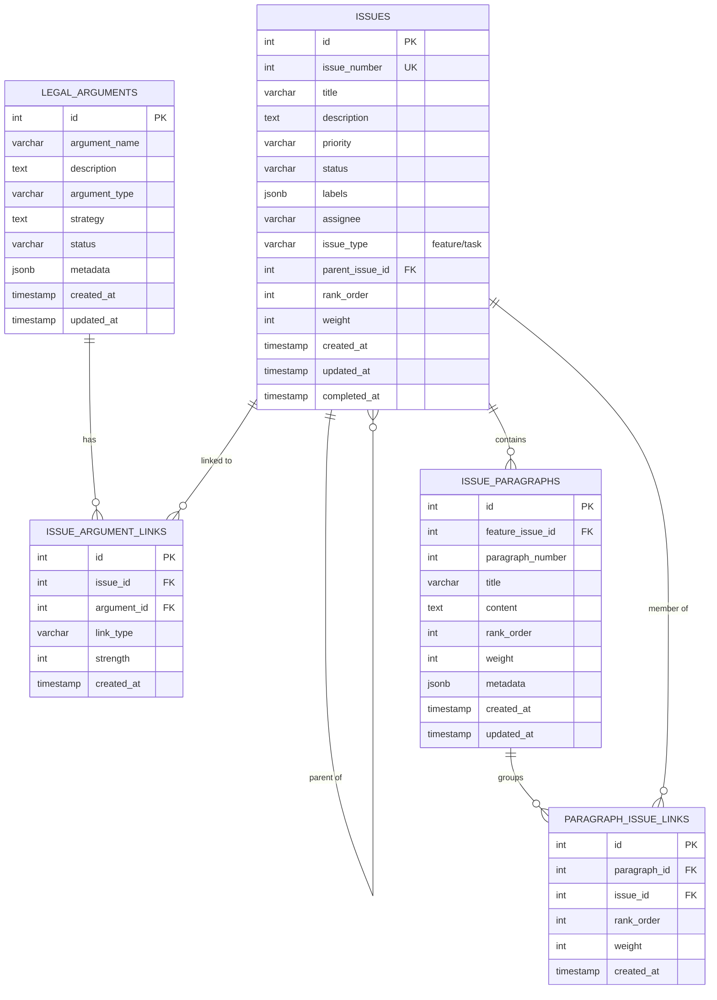
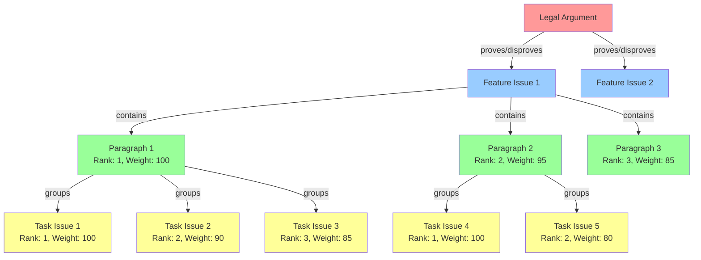
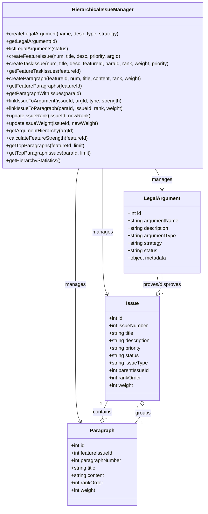
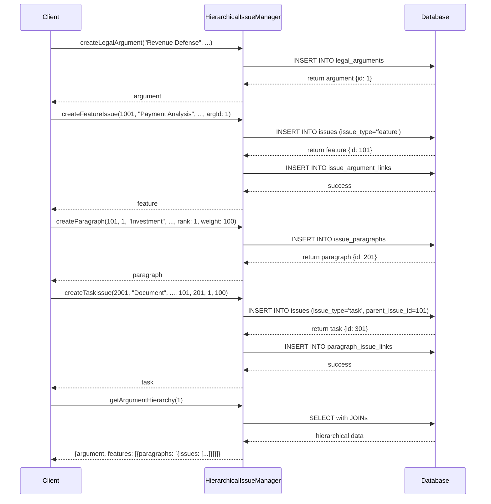
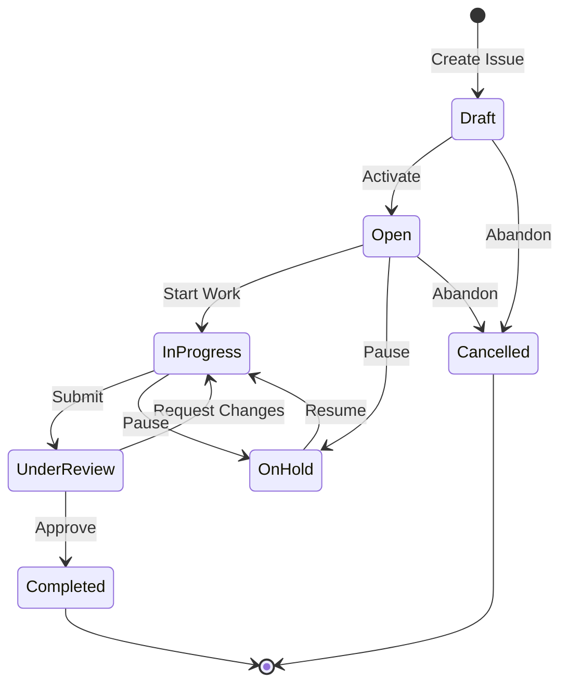
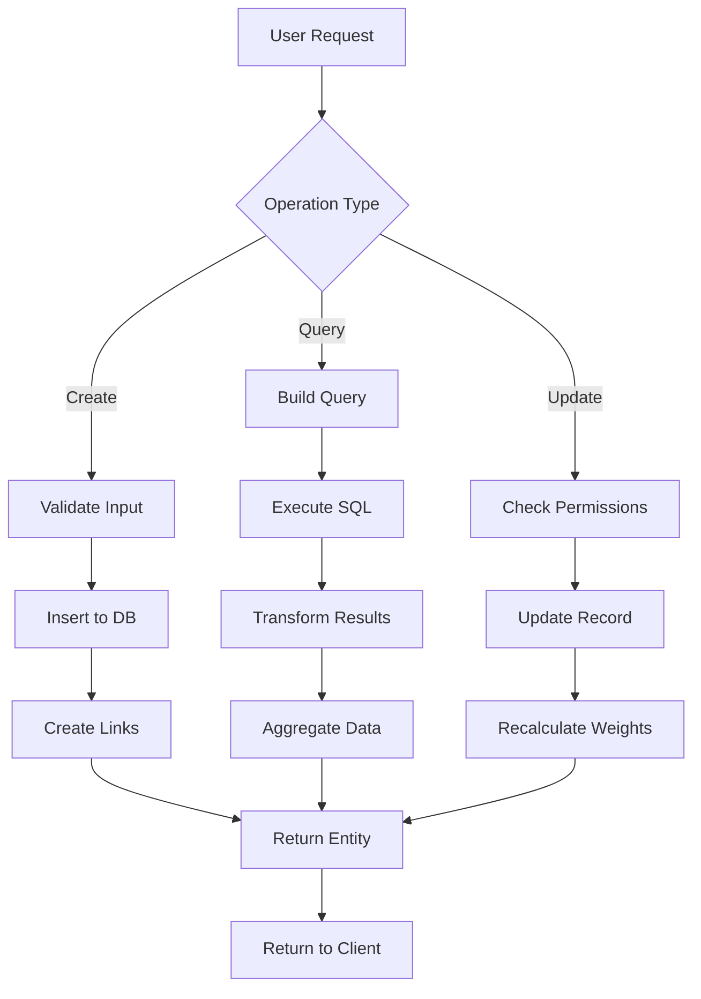
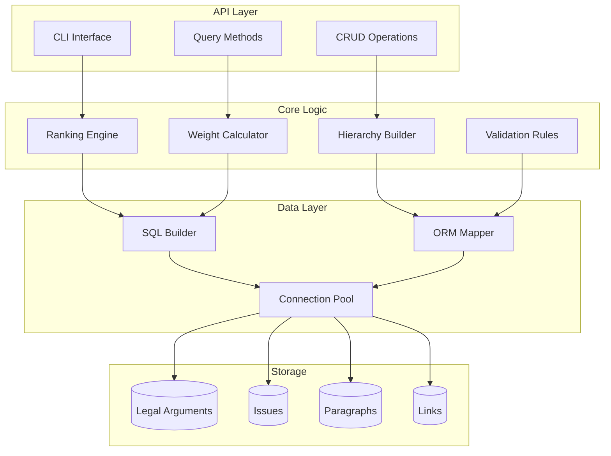

# Hierarchical Issue Framework - Technical Architecture Documentation

## Table of Contents

1. [System Architecture](#system-architecture)
2. [Mermaid Diagrams](#mermaid-diagrams)
3. [Formal Specifications](#formal-specifications)
4. [Grammar Definitions](#grammar-definitions)
5. [VM Examples](#vm-examples)

---

## System Architecture

### Overview

The Hierarchical Issue Framework implements a structurally intelligent system for organizing legal arguments with weighted influence tracking across four hierarchical levels.

### Architecture Layers

```
┌─────────────────────────────────────────────────────────┐
│              Presentation Layer                          │
│  - CLI Interface                                         │
│  - Query API                                             │
│  - Strength Calculations                                 │
└─────────────────────────────────────────────────────────┘
                        ▼
┌─────────────────────────────────────────────────────────┐
│           Business Logic Layer                           │
│  - HierarchicalIssueManager                             │
│  - Ranking Algorithms                                    │
│  - Weight Aggregation                                    │
└─────────────────────────────────────────────────────────┘
                        ▼
┌─────────────────────────────────────────────────────────┐
│            Data Access Layer                             │
│  - SQL Query Builder                                     │
│  - Drizzle ORM                                           │
│  - Transaction Management                                │
└─────────────────────────────────────────────────────────┘
                        ▼
┌─────────────────────────────────────────────────────────┐
│             Persistence Layer                            │
│  - PostgreSQL Database                                   │
│  - Relational Schema                                     │
│  - Indexes & Constraints                                 │
└─────────────────────────────────────────────────────────┘
```

---

## Mermaid Diagrams

### 1. Entity Relationship Diagram



### 2. Hierarchical Structure Flow



### 3. Class Diagram



### 4. Sequence Diagram - Creating Hierarchy



### 5. State Machine Diagram



### 6. Data Flow Diagram



### 7. Component Architecture



---

## Formal Specifications

### Z++ Specification

```z++
schema HierarchicalIssueFramework

-- Basic Types
[ArgumentId, IssueId, ParagraphId]
RANK ::= 1..∞
WEIGHT ::= 0..100
IssueType ::= feature | task
LinkType ::= proves | disproves | supports | contradicts

-- Legal Argument
LegalArgument ::= ⟨
  id: ArgumentId,
  name: String,
  description: String,
  type: String,
  strategy: String,
  status: String
⟩

-- Issue Entity
Issue ::= ⟨
  id: IssueId,
  number: ℕ,
  title: String,
  description: String,
  issueType: IssueType,
  parentId: IssueId?,
  rankOrder: RANK?,
  weight: WEIGHT?,
  status: String
⟩

-- Paragraph Entity
Paragraph ::= ⟨
  id: ParagraphId,
  featureIssueId: IssueId,
  number: ℕ,
  title: String,
  content: String,
  rankOrder: RANK,
  weight: WEIGHT
⟩

-- System State
HierarchyState ::= ⟨
  arguments: ArgumentId → LegalArgument,
  issues: IssueId → Issue,
  paragraphs: ParagraphId → Paragraph,
  argLinks: (IssueId × ArgumentId) → LinkType × WEIGHT,
  paraLinks: (ParagraphId × IssueId) → RANK × WEIGHT
⟩

-- Invariants
invariant FeatureHasNoParent
  ∀ i: Issue | i.issueType = feature ⇒ i.parentId = null

invariant TaskHasFeatureParent
  ∀ i: Issue | i.issueType = task ⇒ 
    ∃ p: Issue | p.id = i.parentId ∧ p.issueType = feature

invariant RankOrderUnique
  ∀ para: Paragraph, i₁, i₂: Issue |
    (para.id, i₁.id) ∈ dom paraLinks ∧ 
    (para.id, i₂.id) ∈ dom paraLinks ∧
    i₁ ≠ i₂ ⇒
    fst(paraLinks(para.id, i₁.id)) ≠ fst(paraLinks(para.id, i₂.id))

invariant WeightInRange
  ∀ i: Issue | i.weight ≠ null ⇒ 0 ≤ i.weight ≤ 100

-- Operations
operation CreateLegalArgument
  Δ(arguments)
  name?: String
  description?: String
  type?: String
  strategy?: String
  
  pre: name? ≠ ""
  post: ∃ id: ArgumentId |
    arguments' = arguments ⊕ {id ↦ ⟨id, name?, description?, type?, strategy?, "active"⟩}

operation CreateFeatureIssue
  Δ(issues, argLinks)
  number?: ℕ
  title?: String
  argumentId?: ArgumentId
  
  pre: argumentId? ∈ dom arguments ∧
       number? ∉ {i.number | i ∈ ran issues}
  post: ∃ id: IssueId |
    issues' = issues ⊕ {id ↦ ⟨id, number?, title?, ..., feature, null, null, null, "open"⟩} ∧
    argLinks' = argLinks ⊕ {(id, argumentId?) ↦ (proves, 90)}

operation CalculateFeatureStrength
  Ξ(HierarchyState)
  featureId?: IssueId
  strength!: WEIGHT
  
  pre: featureId? ∈ dom issues ∧ issues(featureId?).issueType = feature
  post: 
    let paras = {p | p ∈ ran paragraphs ∧ p.featureIssueId = featureId?} in
    let totalWeight = Σ{p.weight | p ∈ paras} in
    let contributions = {p.weight × avgTaskWeight(p) | p ∈ paras} in
    strength! = (Σ contributions / totalWeight) × 100
    where
      avgTaskWeight(p) = 
        let tasks = {i | (p.id, i.id) ∈ dom paraLinks} in
        (Σ{snd(paraLinks(p.id, i.id)) | i ∈ tasks}) / #tasks
```

### Formal Grammar Templates

#### Generic Hierarchy Template

```z++
template HierarchyTemplate[Node, Rank, Weight]
  where
    Rank: TotalOrder
    Weight: BoundedValue[0, 100]

  -- Node structure
  Node ::= ⟨
    id: NodeId,
    parentId: NodeId?,
    rank: Rank?,
    weight: Weight?,
    children: 𝔓(NodeId)
  ⟩

  -- Ranking constraint
  invariant UniqueRankPerParent
    ∀ n₁, n₂: Node |
      n₁.parentId = n₂.parentId ∧ 
      n₁.rank ≠ null ∧ 
      n₂.rank ≠ null ∧
      n₁ ≠ n₂ ⇒
      n₁.rank ≠ n₂.rank

  -- Weight propagation
  function aggregateWeight(n: Node): Weight
    if n.children = ∅ then
      n.weight
    else
      let childWeights = {aggregateWeight(c) | c ∈ getChildren(n)} in
      n.weight × (average childWeights)
```

---

## Grammar Definitions

### ANTLR Grammar (.g4)

```antlr
grammar HierarchicalIssue;

// Parser Rules
hierarchy
    : legalArgument+
    ;

legalArgument
    : 'argument' STRING '{' argumentBody '}'
    ;

argumentBody
    : 'type' ':' argumentType
      'description' ':' STRING
      'strategy' ':' STRING
      features
    ;

argumentType
    : 'defense' | 'offense' | 'counterclaim'
    ;

features
    : 'features' '{' feature+ '}'
    ;

feature
    : 'issue' NUMBER '{' featureBody '}'
    ;

featureBody
    : 'title' ':' STRING
      'priority' ':' priority
      paragraphs
    ;

priority
    : 'critical' | 'high' | 'medium' | 'low'
    ;

paragraphs
    : 'paragraphs' '{' paragraph+ '}'
    ;

paragraph
    : 'paragraph' NUMBER '{' paragraphBody '}'
    ;

paragraphBody
    : 'title' ':' STRING
      'rank' ':' NUMBER
      'weight' ':' NUMBER
      'content' ':' STRING
      tasks
    ;

tasks
    : 'tasks' '{' task+ '}'
    ;

task
    : 'task' NUMBER '{' taskBody '}'
    ;

taskBody
    : 'title' ':' STRING
      'description' ':' STRING
      'rank' ':' NUMBER
      'weight' ':' NUMBER
      'priority' ':' priority
    ;

// Lexer Rules
STRING : '"' (~["\r\n])* '"' ;
NUMBER : [0-9]+ ;
WS : [ \t\r\n]+ -> skip ;
COMMENT : '//' ~[\r\n]* -> skip ;
BLOCK_COMMENT : '/*' .*? '*/' -> skip ;
```

### Yacc Parser (.y)

```yacc
%{
#include <stdio.h>
#include <stdlib.h>
#include "hierarchy.h"

void yyerror(const char *s);
int yylex(void);
%}

%union {
    int num;
    char *str;
    struct node *node_ptr;
}

%token <str> STRING IDENTIFIER
%token <num> NUMBER
%token ARGUMENT FEATURE PARAGRAPH TASK
%token RANK WEIGHT PRIORITY TYPE TITLE DESCRIPTION CONTENT
%token CRITICAL HIGH MEDIUM LOW
%token LBRACE RBRACE COLON SEMICOLON

%type <node_ptr> hierarchy argument feature paragraph task
%type <num> priority weight_value rank_value

%%

hierarchy:
    /* empty */
    | hierarchy argument
    ;

argument:
    ARGUMENT STRING LBRACE argument_body RBRACE
    {
        $$ = create_argument_node($2);
    }
    ;

argument_body:
    TYPE COLON STRING SEMICOLON
    DESCRIPTION COLON STRING SEMICOLON
    features
    ;

features:
    /* empty */
    | features feature
    ;

feature:
    FEATURE NUMBER LBRACE feature_body RBRACE
    {
        $$ = create_feature_node($2);
    }
    ;

feature_body:
    TITLE COLON STRING SEMICOLON
    PRIORITY COLON priority SEMICOLON
    paragraphs
    ;

priority:
    CRITICAL { $$ = 4; }
    | HIGH { $$ = 3; }
    | MEDIUM { $$ = 2; }
    | LOW { $$ = 1; }
    ;

paragraphs:
    /* empty */
    | paragraphs paragraph
    ;

paragraph:
    PARAGRAPH NUMBER LBRACE paragraph_body RBRACE
    {
        $$ = create_paragraph_node($2);
    }
    ;

paragraph_body:
    TITLE COLON STRING SEMICOLON
    RANK COLON rank_value SEMICOLON
    WEIGHT COLON weight_value SEMICOLON
    tasks
    ;

rank_value:
    NUMBER
    {
        if ($1 < 1) {
            yyerror("Rank must be >= 1");
            YYERROR;
        }
        $$ = $1;
    }
    ;

weight_value:
    NUMBER
    {
        if ($1 < 0 || $1 > 100) {
            yyerror("Weight must be between 0 and 100");
            YYERROR;
        }
        $$ = $1;
    }
    ;

tasks:
    /* empty */
    | tasks task
    ;

task:
    TASK NUMBER LBRACE task_body RBRACE
    {
        $$ = create_task_node($2);
    }
    ;

task_body:
    TITLE COLON STRING SEMICOLON
    RANK COLON rank_value SEMICOLON
    WEIGHT COLON weight_value SEMICOLON
    PRIORITY COLON priority SEMICOLON
    ;

%%

void yyerror(const char *s) {
    fprintf(stderr, "Parse error: %s\n", s);
}
```

### Lex Lexer (.l)

```lex
%{
#include "y.tab.h"
#include <string.h>
%}

%%

"argument"      { return ARGUMENT; }
"feature"       { return FEATURE; }
"paragraph"     { return PARAGRAPH; }
"task"          { return TASK; }
"rank"          { return RANK; }
"weight"        { return WEIGHT; }
"priority"      { return PRIORITY; }
"type"          { return TYPE; }
"title"         { return TITLE; }
"description"   { return DESCRIPTION; }
"content"       { return CONTENT; }
"critical"      { return CRITICAL; }
"high"          { return HIGH; }
"medium"        { return MEDIUM; }
"low"           { return LOW; }

[0-9]+          { yylval.num = atoi(yytext); return NUMBER; }
\"[^\"]*\"      { 
                  yylval.str = strdup(yytext + 1);
                  yylval.str[strlen(yylval.str) - 1] = '\0';
                  return STRING;
                }
[a-zA-Z_][a-zA-Z0-9_]* { 
                  yylval.str = strdup(yytext);
                  return IDENTIFIER;
                }

"{"             { return LBRACE; }
"}"             { return RBRACE; }
":"             { return COLON; }
";"             { return SEMICOLON; }

[ \t\n]+        { /* skip whitespace */ }
"//"[^\n]*      { /* skip line comments */ }
"/*"([^*]|\*+[^*/])*\*+"/" { /* skip block comments */ }

.               { fprintf(stderr, "Unexpected character: %s\n", yytext); }

%%

int yywrap(void) {
    return 1;
}
```

---

## Module Structure (.m)

### Core Module

```modula
MODULE HierarchicalIssue;

IMPORT Database, Validation, Ranking;

TYPE
    ArgumentId = INTEGER;
    IssueId = INTEGER;
    ParagraphId = INTEGER;
    
    Rank = [1..MAX(INTEGER)];
    Weight = [0..100];
    
    IssueType = (Feature, Task);
    LinkType = (Proves, Disproves, Supports, Contradicts);
    
    Argument = RECORD
        id: ArgumentId;
        name: ARRAY 255 OF CHAR;
        description: TEXT;
        argumentType: ARRAY 100 OF CHAR;
        strategy: TEXT;
        status: ARRAY 50 OF CHAR;
    END;
    
    Issue = RECORD
        id: IssueId;
        number: INTEGER;
        title: ARRAY 255 OF CHAR;
        description: TEXT;
        issueType: IssueType;
        parentId: IssueId;
        rankOrder: Rank;
        weight: Weight;
        status: ARRAY 50 OF CHAR;
    END;
    
    Paragraph = RECORD
        id: ParagraphId;
        featureIssueId: IssueId;
        paragraphNumber: INTEGER;
        title: ARRAY 255 OF CHAR;
        content: TEXT;
        rankOrder: Rank;
        weight: Weight;
    END;

PROCEDURE CreateArgument(
    name: ARRAY OF CHAR;
    description: TEXT;
    argType: ARRAY OF CHAR;
    strategy: TEXT
): Argument;
VAR
    arg: Argument;
BEGIN
    Validation.ValidateNotEmpty(name);
    arg.name := name;
    arg.description := description;
    arg.argumentType := argType;
    arg.strategy := strategy;
    arg.status := "active";
    Database.Insert("legal_arguments", arg);
    RETURN arg;
END CreateArgument;

PROCEDURE CreateFeature(
    number: INTEGER;
    title: ARRAY OF CHAR;
    argumentId: ArgumentId
): Issue;
VAR
    issue: Issue;
BEGIN
    Validation.ValidateUniqueNumber(number);
    issue.number := number;
    issue.title := title;
    issue.issueType := Feature;
    issue.status := "open";
    Database.Insert("issues", issue);
    Database.LinkToArgument(issue.id, argumentId, Proves, 90);
    RETURN issue;
END CreateFeature;

PROCEDURE CalculateStrength(featureId: IssueId): Weight;
VAR
    paragraphs: ARRAY OF Paragraph;
    totalWeight, contribution, strength: REAL;
    i: INTEGER;
BEGIN
    paragraphs := Database.GetParagraphs(featureId);
    totalWeight := 0.0;
    strength := 0.0;
    
    FOR i := 0 TO LEN(paragraphs) - 1 DO
        contribution := paragraphs[i].weight * GetAvgTaskWeight(paragraphs[i].id);
        strength := strength + contribution;
        totalWeight := totalWeight + paragraphs[i].weight;
    END;
    
    IF totalWeight > 0.0 THEN
        RETURN TRUNC((strength / totalWeight) * 100.0);
    ELSE
        RETURN 0;
    END;
END CalculateStrength;

END HierarchicalIssue.
```

---

## Instance Files (.b)

### Example Instance

```b
INSTANCE revenue_defense_case

LEGAL_ARGUMENTS = {
    arg1 ↦ ⟨
        name: "Revenue Stream Defense",
        type: "defense",
        strategy: "Prove R1M investment was legitimate"
    ⟩
}

FEATURES = {
    feat1001 ↦ ⟨
        number: 1001,
        title: "Payment Structure Analysis",
        issueType: feature,
        argumentId: arg1,
        status: "open"
    ⟩
}

PARAGRAPHS = {
    para1 ↦ ⟨
        featureIssueId: feat1001,
        paragraphNumber: 1,
        title: "R1M Investment Evidence",
        rankOrder: 1,
        weight: 100
    ⟩,
    para2 ↦ ⟨
        featureIssueId: feat1001,
        paragraphNumber: 2,
        title: "R1K Admin Fee",
        rankOrder: 2,
        weight: 95
    ⟩
}

TASKS = {
    task2001 ↦ ⟨
        number: 2001,
        title: "Document bank transfer",
        issueType: task,
        parentId: feat1001,
        paragraphId: para1,
        rankOrder: 1,
        weight: 100
    ⟩,
    task2002 ↦ ⟨
        number: 2002,
        title: "Allocation breakdown",
        issueType: task,
        parentId: feat1001,
        paragraphId: para1,
        rankOrder: 2,
        weight: 90
    ⟩
}

ARGUMENT_LINKS = {
    (feat1001, arg1) ↦ (proves, 90)
}

PARAGRAPH_LINKS = {
    (para1, task2001) ↦ (1, 100),
    (para1, task2002) ↦ (2, 90)
}

INVARIANTS:
    ∀ t ∈ TASKS | t.issueType = task ⇒ 
        ∃ f ∈ FEATURES | f.id = t.parentId ∧ f.issueType = feature
    
    ∀ p ∈ PARAGRAPHS | 
        ∃ f ∈ FEATURES | f.id = p.featureIssueId
    
    ∀ (para, task) ↦ (rank, weight) ∈ PARAGRAPH_LINKS |
        0 ≤ weight ≤ 100 ∧ rank ≥ 1
```

---

## VM Examples

### DIS VM Bytecode

```dis
# Hierarchical Issue Framework VM Module

implement HierarchyVM;

include "sys.m";
    sys: Sys;
include "draw.m";
include "db.m";
    db: Database;

# Type definitions
Argument: adt {
    id: int;
    name: string;
    argtype: string;
    strategy: string;
    
    create: fn(name, argtype, strategy: string): ref Argument;
    link_to_feature: fn(arg: self ref Argument, feature: ref Issue): int;
};

Issue: adt {
    id: int;
    number: int;
    title: string;
    issuetype: string;  # "feature" or "task"
    parent_id: int;
    rank: int;
    weight: int;
    
    create_feature: fn(number: int, title: string, argid: int): ref Issue;
    create_task: fn(number: int, title: string, parent, paraid, rank, weight: int): ref Issue;
    get_children: fn(issue: self ref Issue): array of ref Issue;
};

Paragraph: adt {
    id: int;
    feature_id: int;
    number: int;
    title: string;
    rank: int;
    weight: int;
    
    create: fn(feature_id, number: int, title: string, rank, weight: int): ref Paragraph;
    add_task: fn(para: self ref Paragraph, task: ref Issue, rank, weight: int): int;
    get_tasks: fn(para: self ref Paragraph): array of ref Issue;
    calculate_strength: fn(para: self ref Paragraph): int;
};

HierarchyManager: adt {
    db_conn: ref Database->Connection;
    
    init: fn(): ref HierarchyManager;
    create_argument: fn(mgr: self ref HierarchyManager, name, argtype, strategy: string): ref Argument;
    create_feature: fn(mgr: self ref HierarchyManager, number: int, title: string, argid: int): ref Issue;
    create_paragraph: fn(mgr: self ref HierarchyManager, featid, number: int, title: string, rank, weight: int): ref Paragraph;
    create_task: fn(mgr: self ref HierarchyManager, number: int, title: string, featid, paraid, rank, weight: int): ref Issue;
    get_hierarchy: fn(mgr: self ref HierarchyManager, argid: int): ref HierarchyTree;
    calculate_feature_strength: fn(mgr: self ref HierarchyManager, featid: int): int;
};

HierarchyTree: adt {
    argument: ref Argument;
    features: array of ref FeatureNode;
};

FeatureNode: adt {
    issue: ref Issue;
    paragraphs: array of ref ParagraphNode;
};

ParagraphNode: adt {
    paragraph: ref Paragraph;
    tasks: array of ref Issue;
};

# Implementation
init(nil: ref Draw->Context, nil: list of string)
{
    sys = load Sys Sys->PATH;
    db = load Database Database->PATH;
}

HierarchyManager.init(): ref HierarchyManager
{
    mgr := ref HierarchyManager;
    mgr.db_conn = db->connect("postgresql://...");
    return mgr;
}

HierarchyManager.create_argument(mgr: self ref HierarchyManager, name, argtype, strategy: string): ref Argument
{
    arg := Argument.create(name, argtype, strategy);
    
    # Insert into database
    query := sys->sprint("INSERT INTO legal_arguments (argument_name, argument_type, strategy) VALUES ('%s', '%s', '%s') RETURNING id", name, argtype, strategy);
    result := mgr.db_conn.exec(query);
    arg.id = result.get_int(0, "id");
    
    return arg;
}

HierarchyManager.calculate_feature_strength(mgr: self ref HierarchyManager, featid: int): int
{
    # Get all paragraphs for feature
    query := sys->sprint("SELECT id, weight FROM issue_paragraphs WHERE feature_issue_id = %d", featid);
    para_result := mgr.db_conn.exec(query);
    
    total_weight := 0;
    strength := 0.0;
    
    for (i := 0; i < para_result.num_rows(); i++) {
        para_id := para_result.get_int(i, "id");
        para_weight := para_result.get_int(i, "weight");
        
        # Get average task weight for this paragraph
        task_query := sys->sprint("SELECT AVG(weight) as avg_weight FROM paragraph_issue_links WHERE paragraph_id = %d", para_id);
        task_result := mgr.db_conn.exec(task_query);
        avg_task_weight := task_result.get_real(0, "avg_weight");
        
        contribution := real para_weight * (avg_task_weight / 100.0);
        strength += contribution;
        total_weight += para_weight;
    }
    
    if (total_weight > 0)
        return int ((strength / real total_weight) * 100.0);
    else
        return 0;
}

Paragraph.calculate_strength(para: self ref Paragraph): int
{
    tasks := para.get_tasks();
    
    if (len tasks == 0)
        return para.weight;
    
    total := 0;
    for (i := 0; i < len tasks; i++)
        total += tasks[i].weight;
    
    avg := total / len tasks;
    return (para.weight * avg) / 100;
}
```

### Example VM Execution

```dis
# Example: Creating a hierarchy
{
    mgr := HierarchyManager.init();
    
    # Create legal argument
    arg := mgr.create_argument(
        "Revenue Stream Defense",
        "defense",
        "Prove R1M investment was legitimate"
    );
    
    # Create feature issue
    feature := mgr.create_feature(1001, "Payment Analysis", arg.id);
    
    # Create paragraph
    para := mgr.create_paragraph(
        feature.id, 1,
        "R1M Investment Evidence",
        1, 100  # rank, weight
    );
    
    # Create tasks
    task1 := mgr.create_task(
        2001, "Document transfer",
        feature.id, para.id,
        1, 100  # rank, weight
    );
    
    task2 := mgr.create_task(
        2002, "Allocation breakdown",
        feature.id, para.id,
        2, 90  # rank, weight
    );
    
    # Calculate strength
    strength := mgr.calculate_feature_strength(feature.id);
    sys->print("Feature strength: %d%%\n", strength);
    
    # Get full hierarchy
    tree := mgr.get_hierarchy(arg.id);
    print_hierarchy(tree);
}

print_hierarchy(tree: ref HierarchyTree)
{
    sys->print("Argument: %s\n", tree.argument.name);
    
    for (i := 0; i < len tree.features; i++) {
        feat := tree.features[i];
        sys->print("  Feature #%d: %s\n", feat.issue.number, feat.issue.title);
        
        for (j := 0; j < len feat.paragraphs; j++) {
            para_node := feat.paragraphs[j];
            sys->print("    Paragraph %d (Rank %d, Weight %d): %s\n",
                para_node.paragraph.number,
                para_node.paragraph.rank,
                para_node.paragraph.weight,
                para_node.paragraph.title);
            
            for (k := 0; k < len para_node.tasks; k++) {
                task := para_node.tasks[k];
                sys->print("      Task #%d (Rank %d, Weight %d): %s\n",
                    task.number, task.rank, task.weight, task.title);
            }
        }
    }
}
```

---

## References

1. **Z++ Specification Language**: Formal Methods for Software Specification
2. **ANTLR4**: Parser Generator for Reading, Processing, Executing Languages
3. **Yacc/Lex**: Classic Parser/Lexer Generator Tools
4. **Dis VM**: Inferno Operating System Virtual Machine
5. **Modula-2**: Systems Programming Language

---

## Version History

- v1.0.0 - Initial technical architecture documentation
- Created: 2025-10-26
- Author: Hierarchical Issue Framework Team
