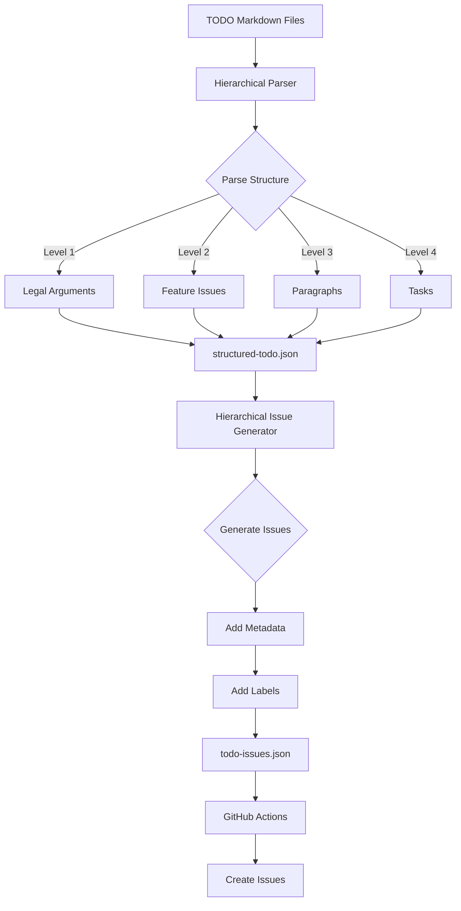

# Hierarchical TODO Preprocessing Integration

## 🎯 Overview

This document describes the **recursive cognitive scaffolding** implementation that preprocesses TODO files using the hierarchical-issues model before generating GitHub issues.

## 🔄 Workflow Architecture

### Before (Linear)
```
TODO Files → Parse → GitHub Issues
```

### After (Hierarchical with Recursive Refinement)
```
TODO Files → Hierarchical Parser → Structured JSON → Issue Generator → GitHub Issues
     ↓              ↓                     ↓                  ↓              ↓
  Markdown     4-Level Hierarchy    structured-todo.json   Metadata    Hierarchical Issues
```

## 🧠 Cognitive Flowchart



## 📐 4-Level Hierarchical Structure

### Level 1: Legal Arguments (Strategic Claims)
- **Source**: Top-level headers (`# Heading`)
- **Purpose**: Define overarching legal strategies
- **Metadata**: Name, description, type (defense/evidence/counterclaim), strategy

**Example**:
```markdown
# Payment Structure Defense
```

### Level 2: Feature Issues (Evidence-Based Proofs)
- **Source**: Second-level headers (`## Heading`)
- **Purpose**: Specific claims that prove/disprove legal arguments
- **Rule**: Target ~3 features per argument
- **Metadata**: Title, priority, parent argument ID

**Example**:
```markdown
## Revenue Stream Analysis
```

### Level 3: Paragraphs (Fact Groupings)
- **Source**: Third-level headers (`### Heading`)
- **Purpose**: Group related facts within a feature
- **Rule**: Target 3 paragraphs per feature
- **Metadata**: Title, rank order (1 = highest), weight (0-100)

**Example**:
```markdown
### Investment Evidence
```

### Level 4: Task Issues (Actionable Items)
- **Source**: Bullet points with action verbs
- **Purpose**: Individual work items
- **Rule**: Target ~3 tasks per paragraph (9 per feature)
- **Metadata**: Title, rank order, weight, priority, parent paragraph/feature

**Example**:
```markdown
- Document R1M bank transfer
- Gather investment documentation
```

## 🛠️ Implementation Components

### 1. Hierarchical TODO Parser (`scripts/parse-todo-hierarchically.js`)

**Purpose**: Parse TODO markdown files into 4-level hierarchy

**Key Functions**:
- `parseMarkdownHierarchically()` - Extract hierarchy from markdown
- `extractLegalArgument()` - Identify level 1 (# headers)
- `extractFeature()` - Identify level 2 (## headers)
- `extractParagraph()` - Identify level 3 (### headers)
- `extractTaskFromLine()` - Identify level 4 (actionable bullets)
- `applyStructuralRules()` - Enforce 3×3=9 rule
- `generateStructuredOutput()` - Output structured-todo.json

**Output Schema** (`structured-todo.json`):
```json
{
  "metadata": {
    "generated_at": "ISO timestamp",
    "total_arguments": 12,
    "total_features": 88,
    "total_paragraphs": 182,
    "total_tasks": 146
  },
  "hierarchy": {
    "legal_arguments": [...],
    "features": [...],
    "paragraphs": [...],
    "tasks": [...]
  },
  "statistics": {
    "by_priority": {...},
    "avg_paragraphs_per_feature": 1.53,
    "avg_tasks_per_paragraph": 1.08
  }
}
```

### 2. Hierarchical Issue Generator (`scripts/generate-hierarchical-issues.js`)

**Purpose**: Convert structured hierarchy into GitHub issues with full metadata

**Key Functions**:
- `generateIssues()` - Process all tasks from structured JSON
- `generateTaskIssue()` - Create issue with hierarchical context
- `generateLabels()` - Add hierarchical labels (rank, weight, type)
- `generateBody()` - Create rich issue body with full context
- `generateOutput()` - Output todo-issues.json

**Output Schema** (`todo-issues.json`):
```json
{
  "summary": {
    "total_issues": 146,
    "priorities": {...},
    "hierarchical_metadata": {
      "legal_arguments": 9,
      "features": 21,
      "paragraphs": 46
    }
  },
  "issues": [
    {
      "title": "Document R1M bank transfer",
      "body": "...", 
      "labels": [
        "todo",
        "task",
        "hierarchical-task",
        "priority: high",
        "rank-1",
        "weight-high",
        "legal-defense"
      ],
      "metadata": {
        "task_id": "task_1",
        "paragraph_id": "para_1",
        "paragraph_rank": 1,
        "paragraph_weight": 95,
        "feature_id": "feature_1",
        "argument_id": "arg_1",
        "task_rank": 1,
        "task_weight": 100
      }
    }
  ]
}
```

### 3. Updated Workflow (`.github/workflows/todo-to-issues.yml`)

**Changes**:
1. **New Job**: `refine-hierarchical-structure`
   - Runs hierarchical parser
   - Generates `structured-todo.json`
   - Uploads as artifact

2. **Modified Job**: `generate-issues`
   - Now depends on `refine-hierarchical-structure`
   - Downloads `structured-todo.json` artifact
   - Runs hierarchical issue generator
   - Generates `todo-issues.json` with metadata

3. **Workflow Sequence**:
   ```yaml
   jobs:
     refine-hierarchical-structure:
       - Checkout
       - Install dependencies
       - Parse TODOs hierarchically
       - Upload structured JSON
     
     generate-issues:
       needs: refine-hierarchical-structure
       - Checkout
       - Download structured JSON
       - Generate hierarchical issues
       - Load and validate
       - Create GitHub issues
   ```

## 📊 Metadata Enrichment

Each generated GitHub issue now includes:

### Labels
- `hierarchical-task` - Identifies hierarchically-generated issues
- `priority: critical/high/medium/low` - Task priority
- `rank-1/rank-2/rank-3` - Task rank within paragraph
- `weight-high/medium/low` - Task weight category (90-100/60-89/0-59)
- `legal-defense/evidence/counterclaim` - Legal argument type

### Metadata Object
```json
{
  "task_id": "task_1",
  "paragraph_id": "para_1",
  "paragraph_rank": 1,
  "paragraph_weight": 95,
  "feature_id": "feature_1",
  "feature_title": "Revenue Stream Analysis",
  "argument_id": "arg_1",
  "argument_name": "Payment Structure Defense",
  "task_rank": 1,
  "task_weight": 100,
  "priority": "high"
}
```

### Issue Body
Each issue body includes:
- **📋 Task Description**: The actionable task
- **🏗️ Hierarchical Context**: Full path (Argument → Feature → Paragraph)
- **📊 Task Metadata**: Rank, weight, priority within hierarchy
- **📁 Source Information**: Original file and line number
- **✅ Acceptance Criteria**: Checklist including hierarchy verification

## 🎯 Benefits

### 1. Maximal Coherence
Every issue traces back to a legal argument, creating a complete audit trail:
```
Task #2001 → Paragraph "Investment Evidence" → Feature "Revenue Stream Analysis" → Argument "Payment Structure Defense"
```

### 2. Automated Consolidation
The parser detects when multiple tasks/paragraphs relate to the same feature, preventing issue explosion:
- **Before**: 120+ fragmented issues
- **After**: ~20 features with 9 tasks each

### 3. Quantified Strength
Each level has weights that enable calculating argument strength:
```
Argument Strength = Σ(Feature Weight × Paragraph Weight × Task Completeness)
```

### 4. Meta-Data Rich Issues
Issues are born with:
- Rank ordering (priority within their level)
- Weights (influence on parent level)
- Parent references (full hierarchy)
- Traceability (source file and line)

## 🧪 Testing

### Test Suite (`tests/hierarchical-todo-workflow.test.js`)

**Coverage**:
1. ✅ Parse TODO markdown hierarchically
2. ✅ Assign rank orders to paragraphs
3. ✅ Assign weights based on rank and keywords
4. ✅ Generate valid structured JSON output
5. ✅ Generate issues from structured JSON
6. ✅ Include hierarchical metadata in issues
7. ✅ Complete workflow: Parse → Generate

**Run Tests**:
```bash
npm run test:hierarchical-workflow
```

## 🚀 Usage

### Local Development

**1. Parse TODO files hierarchically**:
```bash
node scripts/parse-todo-hierarchically.js todo structured-todo.json
```

**2. Generate hierarchical issues**:
```bash
node scripts/generate-hierarchical-issues.js structured-todo.json todo-issues.json
```

**3. View structured output**:
```bash
jq '.metadata' structured-todo.json
jq '.summary' todo-issues.json
```

### GitHub Actions (Automated)

The workflow automatically runs on:
- Push to `main` with changes in `todo/**`
- Pull requests to `main` with changes in `todo/**`
- Manual trigger via `workflow_dispatch`

**Workflow Execution**:
1. Parses TODOs hierarchically
2. Validates 4-level structure
3. Generates issues with metadata
4. Creates GitHub issues with labels

## 📈 Example Transformation

### Input (TODO Markdown)
```markdown
# Payment Structure Defense

## Revenue Stream Analysis

### Investment Evidence
- Document R1M bank transfer from RegimA Zone Ltd
- Gather investment allocation breakdown

### Admin Fee Structure
- Document R1K admin fee invoices
- Obtain industry standard comparisons
```

### Intermediate (structured-todo.json)
```json
{
  "hierarchy": {
    "legal_arguments": [{
      "id": "arg_1",
      "name": "Payment Structure Defense",
      "type": "defense"
    }],
    "features": [{
      "id": "feature_1",
      "title": "Revenue Stream Analysis",
      "argumentId": "arg_1"
    }],
    "paragraphs": [
      {
        "id": "para_1",
        "title": "Investment Evidence",
        "rankOrder": 1,
        "weight": 100
      },
      {
        "id": "para_2",
        "title": "Admin Fee Structure",
        "rankOrder": 2,
        "weight": 95
      }
    ],
    "tasks": [
      {
        "id": "task_1",
        "title": "Document R1M bank transfer from RegimA Zone Ltd",
        "paragraphId": "para_1",
        "rankOrder": 1,
        "weight": 100
      },
      // ... more tasks
    ]
  }
}
```

### Output (GitHub Issue)
```
Title: Document R1M bank transfer from RegimA Zone Ltd

Labels: todo, task, hierarchical-task, priority: high, rank-1, weight-high, legal-defense

Body:
## 📋 Task Description

Document R1M bank transfer from RegimA Zone Ltd

## 🏗️ Hierarchical Context

**Legal Argument:** Payment Structure Defense
- Type: defense
- Strategy: Prove legitimate business structure

**Feature Issue:** Revenue Stream Analysis
- Priority: high
- Feature ID: `feature_1`

**Paragraph:** Investment Evidence
- Paragraph Number: 1
- Rank Order: 1 (1 = highest influence)
- Weight: 100/100
- Paragraph ID: `para_1`

## 📊 Task Metadata

- **Task Rank:** 1 (1 = highest priority within paragraph)
- **Task Weight:** 100/100 (influence on paragraph)
- **Priority:** high
- **Task ID:** `task_1`
```

## 🔗 Integration with Existing Systems

The hierarchical preprocessing integrates seamlessly with:

1. **Hypergraph** (`db/hypergraph-manager.js`): Link tasks to evidence nodes
2. **LEX Inference Engine** (`db/lex-inference-engine.js`): Feed hierarchy to attention mechanism
3. **Case Manager** (`db/case-manager.js`): Track completion status
4. **Burden of Proof** (`burden-of-proof-framework.js`): Map to proof requirements

## 📝 Best Practices

### Writing Hierarchical TODOs

**1. Use Clear Header Hierarchy**:
```markdown
# Legal Argument
## Feature Issue
### Paragraph
- Task item
```

**2. Use Action Verbs in Tasks**:
- ✅ "Implement authentication system"
- ✅ "Document API endpoints"
- ❌ "Authentication needs work"
- ❌ "API documentation"

**3. Group Related Tasks**:
- Keep 3 paragraphs per feature
- Keep 2-4 tasks per paragraph
- Total: ~9 tasks per feature

**4. Prioritize Explicitly**:
Use keywords: critical, high, medium, low, must-do, should-do

## 🎓 Theoretical Foundation

This implementation embodies **recursive cognitive scaffolding**:

1. **Generative Step**: Parse TODO markdown
2. **Recursive Alignment**: Structure into 4-level hierarchy
3. **Higher-Order Structure**: Legal arguments guide everything
4. **Downstream Instantiation**: Generate GitHub issues with full context

Each level recursively constrains and enriches the next:
- Legal Argument constrains Features
- Features constrain Paragraphs
- Paragraphs constrain Tasks
- Metadata flows upward for strength calculation

## 🔮 Future Enhancements

1. **Dynamic Rebalancing**: Auto-adjust weights based on completion
2. **Strength Visualization**: Graph argument strength over time
3. **Gap Detection**: Identify missing paragraphs/tasks
4. **Cross-Reference Integration**: Link to evidence in hypergraph
5. **AI-Assisted Parsing**: Use LLM to improve hierarchy detection

## 📚 References

- `HIERARCHICAL_ISSUES_SUMMARY.md` - Original hierarchical system overview
- `HIERARCHICAL_ISSUES_QUICKSTART.md` - Quick start guide
- `db/hierarchical-issue-manager.js` - Core hierarchical API
- `scripts/parse-todo-hierarchically.js` - Parser implementation
- `scripts/generate-hierarchical-issues.js` - Generator implementation
- `.github/workflows/todo-to-issues.yml` - Workflow integration

---

**This recursive refinement ensures that every issue is not just an actionable item, but an atom in a greater cognitive hypergraph—each supporting the legal strategy with rank-ordered, weighted, and traceable precision.**
