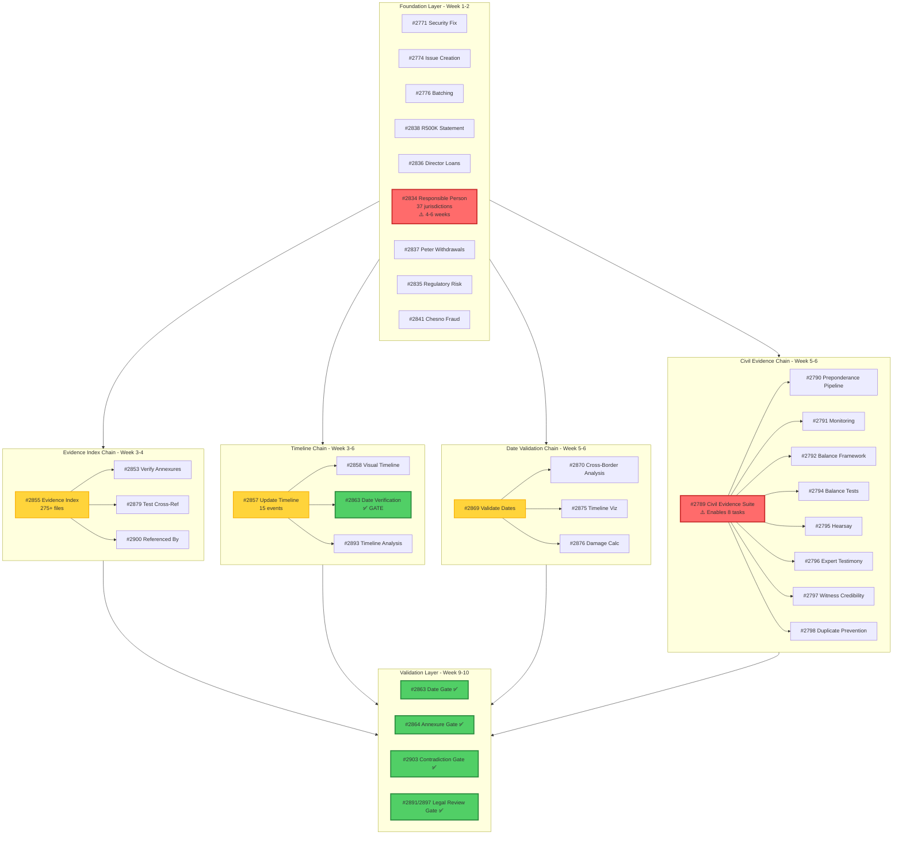

# Critical Path Dependencies - Mermaid Diagram



## Dependency Statistics

- **Foundation Tasks:** 9
- **Integration Chains:** 4 (total 28 tasks)
- **Validation Gates:** 4
- **Critical Bottlenecks:** 2 (RP, CIV)
- **Total Tracked Tasks:** 150+

## Critical Path Analysis

### Longest Chain: Civil Evidence Suite
```
#2789 → [8 dependent tasks] → 6-week cascade risk
Timeline: Week 5-6
Mitigation: Modular design, daily standup
```

### Biggest Bottleneck: Responsible Person Documentation
```
#2834 → 37 jurisdictions → 4-6 weeks
Timeline: Week 1-2 START
Mitigation: Parallelize by jurisdiction
```

### Quality Gates (No Bypass)
```
Week 9-10:
  ✅ #2863 - Date Accuracy
  ✅ #2864 - Annexure Numbering
  ✅ #2903 - Contradiction Check
  ✅ #2891/2897 - Legal Review Prep
```
