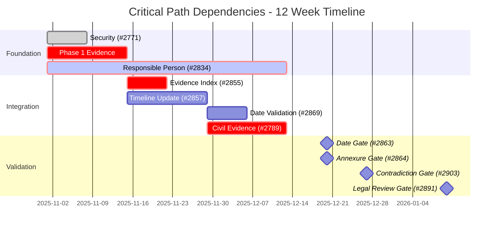

# Critical Path Timeline - Gantt Chart

## Week-by-Week Breakdown

| Week    | Focus                        | Tasks    | Critical |
|---------|------------------------------|----------|----------|
| 1-2     | Critical Foundation          | 9        | 8        |
| 3-4     | Evidence Building            | 12       | 2        |
| 5-6     | Forensic Analysis            | 18       | 3        |
| 7-8     | Integration & Quality        | 18       | 1        |
| 9-10    | Pre-Legal Review             | 28       | 4        |
| 11-12   | Final Validation             | 27       | 0        |
| **Total** | **All Phases**             | **112**  | **18**   |
