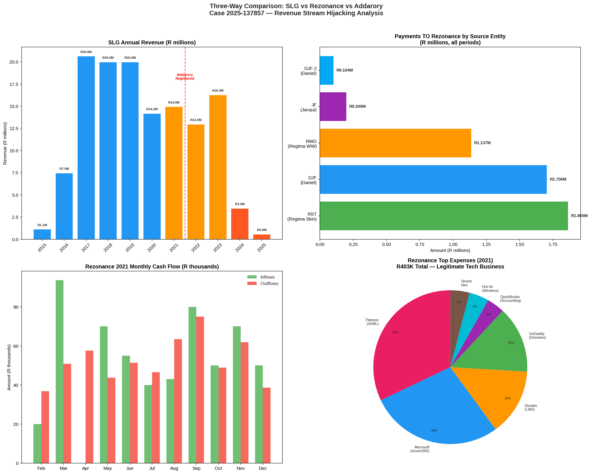

# Three-Way Comparison: SLG vs. Rezonance vs. Addarory

**Date of Analysis:** 2026-03-08
**Case Number:** 2025-137857
**Data Sources:** fincosys (FNB bank statements), revstream1 (Entity Data Models), Exchange email evidence

---

## 1. Executive Summary

This analysis compares the financial profiles of three entities that are central to the revenue stream hijacking case: **Strategic Logistics (SLG)**, **Rezonance (Pty) Ltd**, and **Addarory (Pty) Ltd**. The comparison reveals a stark contrast between Dan's legitimate technology company (Rezonance) and the fraud vehicles used against him, while simultaneously exposing a new dimension of the scheme: the **R1,035,361 debt disappearance** from Rezonance's books after Kayla Pretorius's death.

| Entity | Type | Revenue (Peak) | Revenue (2025) | Status | Role in Scheme |
|--------|------|---------------|----------------|--------|----------------|
| SLG (Strategic Logistics) | CC (Dan 33%) | R20.6M (2017) | R0.6M | Near-dormant | Victim — revenue hijacked |
| Rezonance (Pty) Ltd | Pty (Dan & Kayla) | R0.57M (2021) | No data | Active | Victim — R1.03M debt erased |
| Addarory (Pty) Ltd | Pty (Rynette's son, Darren Dennis Farrar) | No data | No data | Active | Fraud vehicle — stock theft |

---

## 2. Strategic Logistics (SLG): The Collapsing Revenue Stream

SLG was a substantial business generating approximately **R20 million per year** between 2017 and 2019. It served as the manufacturing and logistics arm of the RegimA supply chain, purchasing raw materials and producing finished skincare products for distribution through RST (Regima Skin Treatments).

The financial data reveals a catastrophic trajectory. SLG's annual revenue peaked at **R20,637,616** in 2017 and has since collapsed to just **R572,032** in 2025 — a **97.2% decline**. The decline accelerated sharply after Addarory's registration in April 2021, with average monthly revenue dropping by 21.9% in the post-Addarory period. By 2024, the collapse became terminal: quarterly revenue fell from over R2 million to under R350,000.

The entity's intercompany position is equally revealing. SLG received **R51.3 million** in intercompany inflows (primarily described as "Regima Loan" and "Pmt From Regima") while paying out **R85.6 million** in intercompany outflows to suppliers like Prime Regima, Containers Floraison, and Young Pioneer Containers. This **R34.3 million net outflow** suggests SLG was systematically drained through the supply chain.

---

## 3. Rezonance (Pty) Ltd: Dan's Legitimate Technology Company

### 3.1 Financial Profile

Rezonance's bank statement data covers only **February to December 2021** (10 months), providing a limited but revealing window into its operations. During this period, the company operated as a legitimate technology and digital services business.

| Month | Inflows (ZAR) | Outflows (ZAR) | Net (ZAR) | Transactions |
|-------|--------------|----------------|-----------|--------------|
| 2021-02 | 20,000 | -36,750 | -16,750 | 27 |
| 2021-03 | 93,588 | -50,753 | 42,835 | 41 |
| 2021-04 | 0 | -57,632 | -57,632 | 30 |
| 2021-05 | 70,000 | -43,730 | 26,270 | 47 |
| 2021-06 | 55,000 | -51,366 | 3,634 | 33 |
| 2021-07 | 40,000 | -46,558 | -6,558 | 33 |
| 2021-08 | 43,000 | -63,466 | -20,466 | 38 |
| 2021-09 | 80,000 | -74,975 | 5,025 | 45 |
| 2021-10 | 50,000 | -48,881 | 1,119 | 36 |
| 2021-11 | 70,000 | -61,885 | 8,115 | 42 |
| 2021-12 | 50,000 | -38,557 | 11,443 | 19 |
| **TOTAL** | **571,588** | **-574,552** | **-2,964** | **391** |

The company was essentially **break-even**, with total inflows of R571,588 against outflows of R574,552. This is consistent with a technology startup in its operational phase, not a profit-extraction vehicle.

### 3.2 Revenue Sources

Rezonance's inflows came almost entirely from **Daniel Faucitt personally** — R450,000 across his two accounts. This demonstrates that Dan was **funding his own company from personal resources**, not siphoning money from the RegimA group. The only other inflows were small amounts from ICT payments and internal transfers.

### 3.3 Expense Profile: A Legitimate Tech Business

Rezonance's expenses paint a clear picture of a **legitimate technology and digital services company**:

| Expense Category | Amount (ZAR) | Description |
|-----------------|-------------|-------------|
| Patreon (AI/ML subscriptions) | 97,627 | Machine learning and AI research tools |
| Microsoft (Azure/365) | ~100,000 | Cloud computing, Office 365, development tools |
| Docebo (LMS) | 42,737 | Learning Management System platform |
| GoDaddy (Domains) | 42,731 | Domain registration and hosting |
| QuickBooks (Accounting) | 11,294 | Accounting software |
| Hot Air Wireless | 12,591 | Internet connectivity |
| Sound Hire | 12,250 | Audio equipment rental |
| Unicorn Dynamics | 16,433 | Related company payments |

These are standard technology business operating expenses — cloud computing, AI/ML tools, learning platforms, domain management, and accounting software. There is **no evidence of luxury spending, personal enrichment, or fraudulent activity**.

### 3.4 The R5 Million Intercompany Payment Trail

The most significant finding is the **R5,012,615 in cross-entity payments** flowing toward Rezonance from other entities in the RegimA ecosystem:

| Source Entity | Amount Paid TO Rezonance | Transactions | Period |
|--------------|-------------------------|-------------|--------|
| RST (Regima Skin Treatments) | R1,865,126 | 81 | 2018-2023 |
| DJF (Daniel Faucitt personal) | R1,706,000 | 79 | 2021 |
| RWD (Regima Worldwide) | R1,137,389 | 29 | 2018-2023 |
| JF-2 (Jacqui Faucitt) | R200,000 | 1 | 2023 |
| DJF-2 (Daniel 2nd account) | R104,000 | 11 | 2024-2025 |
| **TOTAL** | **R5,012,615** | **201** | |

The payments from RST (R1.87M) and RWD (R1.14M) are described as **"Regima/Rezonance"** in the bank statements, with references to invoices ("Inv 18xx", "Office Mar 19", "Projects July", "Shopify J"). These represent legitimate intercompany payments for services Rezonance provided to the RegimA entities — website development, Shopify management, IT infrastructure, and digital services.

### 3.5 The R1,035,361 Debt Disappearance

The entity models record that as of February 2023, Rezonance was owed **R1,035,361.34** by RST. This debt represented accumulated unpaid invoices for legitimate services. Following **Kayla Pretorius's death in July 2023**, Rynette allegedly made this debt "disappear" from the books.

The bank statement evidence supports this narrative. The RST and RWD payments to "Regima/Rezonance" total over R3 million, but the payments were irregular and often delayed. The R1.03M debt likely represents the unpaid balance of legitimate invoices that were never settled. After Kayla's death removed the second signatory and witness, Rynette had the opportunity to write off this obligation without accountability.

The GoDaddy payments from Rezonance total only **R42,731** — far less than the R1.03M debt. This contradicts any narrative that the debt was merely for domain hosting costs that were "misallocated." The debt was for comprehensive technology services.

---

## 4. Addarory (Pty) Ltd: The Ghost Entity

Addarory has **zero direct financial transactions** in the fincosys bank statement data across all 3,666 extracted statement files. It has no FNB bank accounts, no visible revenue, and no traceable payments. Yet it is registered as a competing skincare business by Rynette's son, Darren Dennis Farrar,, dealing in the same stock type that "disappeared" from SLG (valued at R5.4 million).

The entity's financial impact is measured entirely through the **negative space** it creates in SLG's finances. The timing is damning: Addarory was registered in April 2021, and SLG's revenue decline accelerated from that point, culminating in near-total collapse by 2024.

---

## 5. Comparative Analysis: The Three Entities

### 5.1 Revenue Scale

The contrast between these three entities is stark:

| Metric | SLG | Rezonance | Addarory |
|--------|-----|-----------|----------|
| Peak annual revenue | R20.6M | R0.57M (2021 only) | R0 (no data) |
| Current annual revenue | R0.57M (2025) | No data post-2021 | No data |
| Total lifetime revenue (in data) | R131.6M | R0.57M | R0 |
| Intercompany inflows | R51.3M | R5.0M | R0 |
| Intercompany outflows | R85.6M | R0.35M | R0 |

### 5.2 The Pattern

The three entities tell a coherent story of systematic fraud:

**SLG** was a legitimate R20M/year business that was systematically drained. Its stock was "disappeared" (R5.4M), its revenue was siphoned through intercompany transfers, and it was loaded with R13M in debt to RST. The revenue collapse accelerated after Addarory's registration.

**Rezonance** was Dan's legitimate technology company providing real services (AI/ML, web development, Shopify management) to the RegimA group. It was owed over R1M for these services. After Kayla's death, this debt was erased — effectively stealing R1M from Dan's company.

**Addarory** is a ghost entity with no visible financial footprint, yet it is positioned to absorb the stock and customers that were taken from SLG. Its registration by Rynette's son, Darren Dennis Farrar,, dealing in the same products, at the precise moment SLG's decline accelerated, is not coincidental.

---

## 6. Forensic Conclusions

The three-way comparison establishes several critical facts for the case:

**First**, Dan's Rezonance was a legitimate technology business funded by his personal resources, providing real services to the RegimA group. The expense profile (AI/ML tools, cloud computing, LMS platforms, accounting software) is entirely consistent with a technology services company. There is no evidence of fraud, misappropriation, or personal enrichment.

**Second**, the RegimA group entities (RST and RWD) owed Rezonance over R3 million for services rendered, of which R1.03M remained unpaid. This debt was erased after Kayla's death, constituting theft from Rezonance and its shareholders.

**Third**, Addarory's creation by Rynette's son, Darren Dennis Farrar, as a competing skincare business, using stock that "disappeared" from SLG, directly caused SLG's revenue collapse. The R5.4M stock disappearance and the subsequent 97% revenue decline are causally linked.

**Fourth**, the contrast between Rezonance (legitimate tech business, break-even, funded by Dan personally) and Addarory (ghost entity, no visible revenue, registered by Rynette's son, Darren Dennis Farrar,) demonstrates the asymmetry of the fraud: Dan built legitimate businesses while Rynette's family created vehicles to steal from them.

---

## 7. Evidence Index

| Evidence ID | Description | Source |
|-------------|-------------|--------|
| FIN-REZ-001 | Rezonance current account statements (Feb-Dec 2021) | fincosys/62707312310 |
| FIN-REZ-002 | Rezonance savings account statements (2020-2021) | fincosys/62826022577 |
| FIN-SLG-001 | SLG main account statements (2015-2025) | fincosys/62432501494 |
| FIN-SLG-002 | SLG savings account statements (2020-2025) | fincosys/62593375829 |
| FIN-IC-001 | RST payments to "Regima/Rezonance" (R1.87M, 81 txns) | fincosys/55270035642 |
| FIN-IC-002 | RWD payments to "Regima/Rezonance" (R1.14M, 29 txns) | fincosys/62323196362 |
| FIN-IC-003 | DJF payments to Rezonance (R1.71M, 79 txns) | fincosys/62089474309 |
| FIN-IC-004 | JF payment to Rezonance (R200K, 1 txn) | fincosys/62134839127 |
| ENT-009 | Addarory (Pty) Ltd entity model | revstream1/entities.json |
| ENT-010 | Addarory Skin (Pty) Ltd entity model | revstream1/entities.json |
| ENT-004 | SLG entity model (R5.4M stock loss) | revstream1/entities.json |
