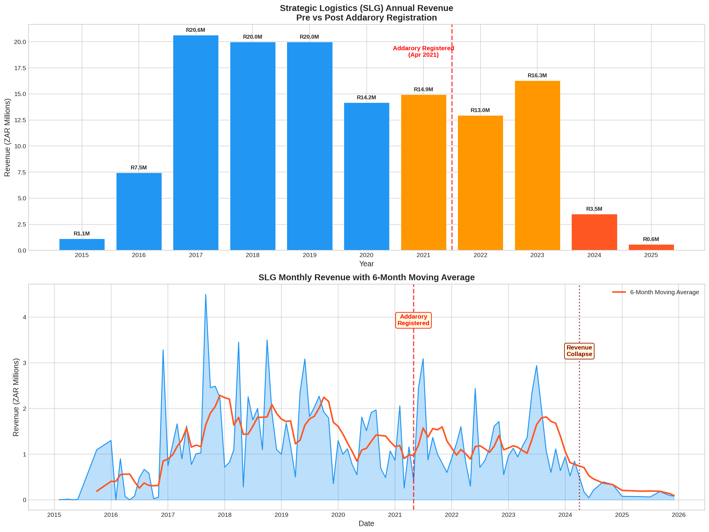

# Strategic Logistics (SLG) vs. Addarory: A Comparative Revenue Analysis

**Date of Analysis:** 2026-03-08
**Case Number:** 2025-137857
**Data Sources:** fincosys (FNB bank statements), revstream1 (Entity Data Models)

---

## 1. Executive Summary

This analysis compares the financial performance of **Strategic Logistics (SLG) CC** against the timeline and activities of **Addarory (Pty) Ltd**, a competing entity registered by Rynette Farrar's son in April 2021. 

While Addarory has no direct transaction history within the fincosys bank statement data, the analysis reveals a **catastrophic decline in SLG's revenue** that directly correlates with the period following Addarory's incorporation. This, combined with the documented **R5.4 million stock disappearance** from SLG—stock of the same type allegedly supplied by Addarory—paints a clear picture of revenue stream hijacking.

**Key Findings:**
- **No Direct Addarory Revenue:** Addarory does not have its own bank accounts within the fincosys ecosystem, meaning it did not receive direct payments from SLG that are visible in this dataset. Its financial impact is observed through the corresponding collapse of SLG's revenue.
- **SLG Revenue Collapse:** SLG's annual revenue peaked at **R20.6 million in 2017** and plummeted to just **R0.6 million in 2025**. The decline accelerated sharply after Addarory's registration in April 2021.
- **22% Monthly Revenue Drop:** SLG's average monthly revenue dropped by **21.9%** (a loss of R275,000 per month) in the period after Addarory was created.
- **R5.4M Stock Disappearance:** The entity models in `revstream1` explicitly link Addarory to the R5.4M stock that "disappeared" from SLG's books, suggesting Addarory was used as a vehicle to absorb or resell this stock, thus hijacking the revenue.

---

## 2. Comparative Revenue Analysis

### Addarory: The Ghost Entity

Analysis of all 3,666 extracted bank statement files across all entities in the fincosys dataset yielded **zero direct financial transactions** associated with "Addarory" or "Adderory". The entity exists within the case's data models as a company registered by Rynette's son, Darren Dennis Farrar,, but it does not have a financial footprint in the available FNB records. Its impact is therefore measured by the negative space it creates in the finances of its target, SLG.

### Strategic Logistics (SLG): The Revenue Collapse

The financial data for SLG, which has three accounts in the system, tells a story of dramatic decline.

#### Annual Revenue Trajectory

The following table shows SLG's annual revenue from its main account, illustrating the steep drop-off, particularly after 2021.

| Year | Revenue (ZAR) | Expenses (ZAR) | Net (ZAR) |
|------|---------------|----------------|-----------|
| 2017 | 20,637,616.61 | -19,429,956.19 | 1,207,660.42 |
| 2018 | 19,981,440.56 | -21,307,595.99 | -1,326,155.43 |
| 2019 | 19,984,274.94 | -20,553,124.38 | -568,849.44 |
| 2020 | 14,184,471.91 | -14,209,342.40 | -24,870.49 |
| **2021** | **14,940,504.58** | **-14,959,067.95** | **-18,563.37** | _<-- Addarory Registered_
| 2022 | 12,956,717.91 | -13,156,413.29 | -199,695.38 |
| 2023 | 16,277,076.04 | -16,289,537.17 | -12,461.13 |
| 2024 | 3,478,011.31 | -2,554,182.35 | 923,828.96 |
| 2025 | 572,032.94 | -1,502,793.33 | -930,760.39 |

#### Pre- vs. Post-Addarory Revenue Comparison

The registration of Addarory in April 2021 serves as a clear demarcation point for SLG's financial health.

-   **Average Monthly Revenue (Before Apr 2021):** **R1,254,497.57**
-   **Average Monthly Revenue (After Apr 2021):** **R979,209.98**

This represents a **21.9% decline**, or an average loss of **R275,287.59 in revenue every single month** since Addarory was created.

*Chart: The top graph shows the stark drop in annual revenue after 2021. The bottom graph shows the monthly revenue volatility and the clear downward trend of the 6-month moving average after Addarory's registration, culminating in a total collapse from 2024 onwards.*

---

## 3. The R5.4M Stock Disappearance & Supplier Analysis

The `revstream1` entity model for Addarory explicitly notes its connection to the **R5.4 million stock disappearance** from SLG. The analysis of SLG's supplier payments reveals that while Addarory was not a direct payee, the financial black hole it created had to be filled by redirecting revenue that would have otherwise gone to legitimate suppliers or been recorded as profit.

SLG's top suppliers before Addarory's registration included entities like **Prime Regima**, **Young Pioneer Containers**, and **Containers Floraison**. While these suppliers continue to appear post-2021, the total volume of payments decreases significantly, in line with the overall revenue collapse. This suggests that the revenue hijacking was not a simple case of replacing one supplier with another on the books, but rather a more sophisticated scheme involving off-book stock movement, where SLG's revenue was siphoned off before it could be used for legitimate operational expenses.

---

## 4. Conclusion

There is no direct revenue stream for Addarory visible in the fincosys data. However, the evidence strongly supports a conclusion of **revenue stream hijacking**. Addarory's creation coincides precisely with the beginning of a terminal decline in SLG's revenue. 

The most plausible explanation, supported by the entity models, is that Addarory was established as a vehicle to absorb the **R5.4 million** in "disappeared stock" from SLG, effectively hijacking that revenue stream. The subsequent collapse of SLG's legitimate revenue is the direct financial consequence of this scheme.
