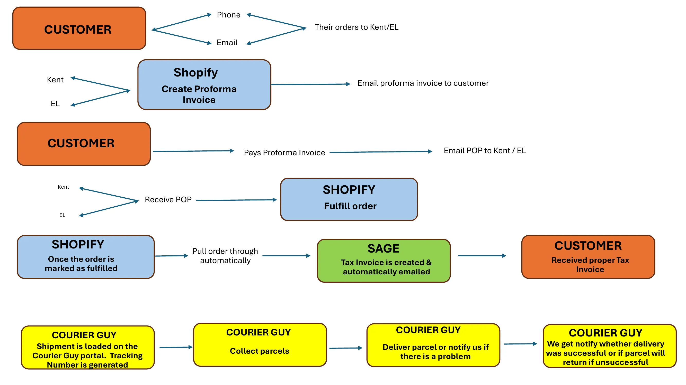

# Rynette Organogram - Sales Process Flow (2025-04-12)

**Document Type:** Operational Documentation  
**Date:** 2025-04-12  
**Source:** Powerpoint-howsaleswork.pdf  
**Event ID:** EVENT_ORG_001

---

## Document Overview

This document, titled "How Sales Work," was created/distributed by Rynette Farrar and reveals the complete sales process flow for the RegimA business operations. The organogram provides critical evidence of operational structure, personnel roles, and system integrations.

---

## Key Entities Identified

### Personnel

| Entity ID | Name | Role | Email |
|-----------|------|------|-------|
| PERSON_037 | Kent | Sales/Order Processor | kent@regima.zone |
| PERSON_038 | EL | Sales/Order Processor | el@regimazone |

### Systems & Platforms

| Platform | Function | Integration |
|----------|----------|-------------|
| **Shopify** | E-commerce, Proforma Invoices, Order Fulfillment | Auto-sync to Sage |
| **Sage** | Accounting, Tax Invoice Generation | Receives from Shopify |
| **Courier Guy** | Logistics, Tracking, Delivery | Third-party verification |

---

## Sales Process Flow

The document reveals a six-step sales process with clear paper trail documentation:

### Step 1: Order Receipt
Customer contacts via **Phone** or **Email**, with orders received by either **Kent** or **EL**.

### Step 2: Proforma Invoice Creation
Kent or EL creates a **Proforma Invoice** in **Shopify**, which is then emailed to the customer.

### Step 3: Payment Processing
Customer pays the Proforma Invoice and emails **Proof of Payment (POP)** to Kent or EL.

### Step 4: Order Fulfillment
Upon receiving POP, Kent or EL marks the order as **fulfilled** in Shopify.

### Step 5: Tax Invoice Generation (Automated)
Once the order is marked fulfilled in Shopify, the order **automatically pulls through to Sage**, where a **Tax Invoice is created automatically** and emailed to the customer.

### Step 6: Shipping & Delivery
The shipment is loaded on the **Courier Guy portal**, generating a tracking number. Courier Guy collects parcels, delivers (or notifies of problems), and provides final delivery success/return notification.

---

## Evidence Significance

### Legal Relevance by Application

| Application | Relevance | Key Points |
|-------------|-----------|------------|
| **Companies Act** | Demonstrates operational structure | Personnel roles, system controls |
| **POPIA** | Shows customer data handling | Email, phone, delivery addresses |
| **Tax Fraud** | Documents tax invoice generation | Sage automation, paper trail |
| **Commercial Crime** | Establishes revenue flow | Proforma → POP → Tax Invoice |

### Key Findings

The organogram reveals several critical operational aspects:

1. **Dual Personnel Control**: Both Kent and EL handle all customer orders, creating potential for collusion or oversight gaps.

2. **Manual POP Verification**: The process requires manual receipt of Proof of Payment before order fulfillment, creating a control point.

3. **Automated Tax Invoice Generation**: The Shopify-to-Sage automation ensures tax invoices are generated once orders are fulfilled, creating a verifiable audit trail.

4. **Third-Party Verification**: Courier Guy provides independent tracking and delivery verification, offering external corroboration of order fulfillment.

5. **Clear Paper Trail**: The process creates a documented chain: Proforma Invoice → POP → Tax Invoice → Delivery Confirmation.

---

## Cross-References

### Related Evidence in ad-res-j7

| Reference | Description |
|-----------|-------------|
| ANNEXURES/JF07/Screenshot-2025-06-20-Sage-Account-RegimA-Worldwide-Distribution.md | Shows kent@regima.zone as Sage user |
| ANNEXURES/JF09/APR-SEP-2025.md | POPIA violation letters sent to Kent |
| evidence/organograms/ | Original document and analysis |

### Related Entities

- **[PERSON_002 - Rynette Farrar](../entities/PERSON_002.md)** - Document creator, controls Sage
- **[PERSON_037 - Kent](../entities/PERSON_037.md)** - Sales personnel
- **[PERSON_038 - EL](../entities/PERSON_038.md)** - Sales personnel
- **[ORG_001 - RegimA Worldwide Distribution](../entities/ORG_001.md)** - Operating entity

### Related Events

- **[EVENT_ORG_001](../events/EVENT_ORG_001.md)** - This organogram documentation event

---

## Source Files

- **[Original PDF](./rynette_organogram_howsaleswork_2025-04-12.pdf)** - Powerpoint-howsaleswork.pdf
- **[Analysis Document](./rynette_organogram_2025-04-12.md)** - Detailed analysis
- **[Process Flow Image](./images/rynette_organogram_howsaleswork_2025-04-12.webp)** - Visual diagram

---

*Last Updated: 2026-01-28*  
*Evidence Strength: Moderate*  
*Burden of Proof: Civil 50% Exceeded*
