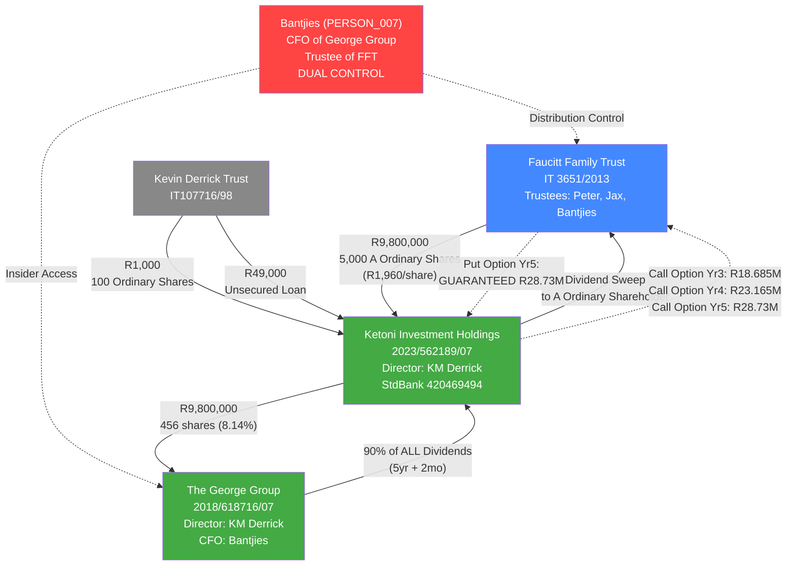

# Ketoni Fund Flow — Complete Architecture
**Confidence:** 95% (Estimated)  

**Relation Type:** Financial Flow / Investment Structure
**Last Updated:** 2026-03-15
**Source:** Primary documents (SHA, Subscription Agreement, AFS)

---

## Overview

The Ketoni Investment Holdings fund flow architecture, now reconstructed from primary source documents, reveals a structured investment vehicle designed to channel R9.8M from the Faucitt Family Trust into The George Group, with a guaranteed return of up to R28.73M over 5 years. The architecture creates a dual-control opportunity for anyone positioned at both the Ketoni/George Group end and the FFT trustee end — which is precisely where Daniel Bantjies sits.

---

## Complete Fund Flow

---

## Financial Timeline

| Date | Event | Amount | Direction |
|------|-------|--------|-----------|
| 2023-02-20 | Ketoni incorporated | — | — |
| 2023-04-24 | SHA + Subscription signed | — | — |
| ~2023-04 | FFT subscribes for A Ordinary Shares | R9,800,000 | FFT → Ketoni |
| ~2023-04 | KDT subscribes for Ordinary Shares | R1,000 | KDT → Ketoni |
| ~2023-04 | KDT provides unsecured loan | R49,000 | KDT → Ketoni |
| ~2023-04 | Ketoni invests in George Group | R9,800,000 | Ketoni → George Group |
| 2024-02-29 | AFS year-end: R48,727 cash balance | — | — |
| **2026-04** | **Call Option Year 3 opens** | **R18,685,000** | **Ketoni → FFT** |
| **2027-04** | **Call Option Year 4** | **R23,165,000** | **Ketoni → FFT** |
| **2028-04** | **Put Option Year 5 (GUARANTEED)** | **R28,730,000** | **Ketoni → FFT** |

---

## Control Analysis

### Kevin Derrick's Control

Kevin Michael Derrick (PERSON_014) controls Ketoni at every level:

| Control Point | Evidence |
|---------------|----------|
| Sole Director of Ketoni | AFS General Information |
| Director of The George Group | AFS Note 2 |
| Ketoni registered at Derrick's home address | 20 Tennyson Avenue, Senderwood |
| Ketoni email on Derrick's domain | toni@kevinderrick.co.za |
| Kevin Derrick Trust holds 100% Ordinary Shares | SHA clause 7.3 |
| Kevin Derrick Trust provided R49,000 loan | AFS Note 5 |

### Bantjies' Dual Control

Bantjies (PERSON_007) sits at both ends of the R28.73M transaction:

| Control Point | Role | Evidence |
|---------------|------|----------|
| CFO of The George Group | Insider access to Ketoni payment timing | Employment records |
| Trustee of FFT | Distribution control over payout | J417, Letters of Authority |
| Accountant for RegimA entities | Knowledge of FFT financial position | Email evidence since 2020 |
| Commissioner of Oaths | Self-certified false affidavit | Court filing Aug 2025 |

---

## Anomaly Detection

### Pattern: Circular Control

The fund flow creates a circular control structure where Bantjies can influence both the timing of the payout (via his George Group position) and the distribution of the payout (via his FFT trustee position). This is a textbook **self-dealing** arrangement.

### Pattern: Guaranteed Return

The 24% IRR minimum guarantee is extraordinarily high for a private equity investment. This suggests the investment was structured to provide a specific, predictable return rather than a market-rate investment. The guarantee mechanism (Put Option at Year 5) ensures FFT receives R28.73M regardless of George Group's actual performance.

### Pattern: SPV Structure

Ketoni is a single-purpose vehicle with no employees, no revenue, and only R48,727 in cash. Its sole asset is the 8.14% stake in The George Group. This structure is designed to isolate the investment and create a clean payout mechanism — but also creates opacity about the underlying value.

---

*Generated by Super-Sleuth Intro-Spect Mode — 2026-03-15*
