# Cross-Repository Feature Flow Visualization

**Visual Guide to Feature Sharing Across Repositories**

## Repository Ecosystem Overview

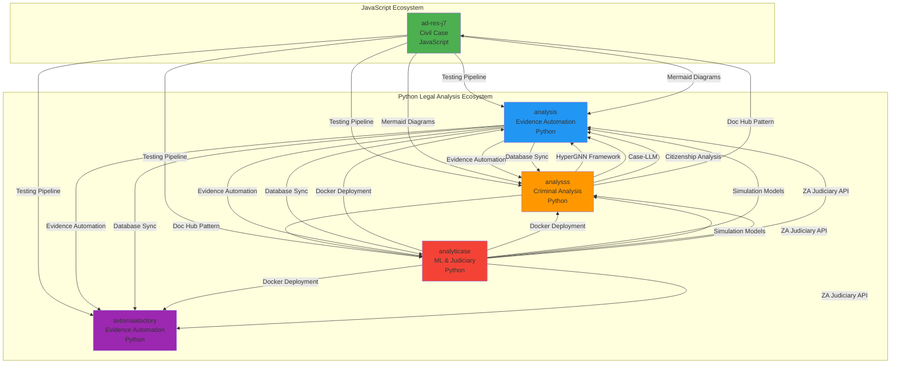

## Feature Adoption Flow

### High Priority Features (Immediate Implementation)

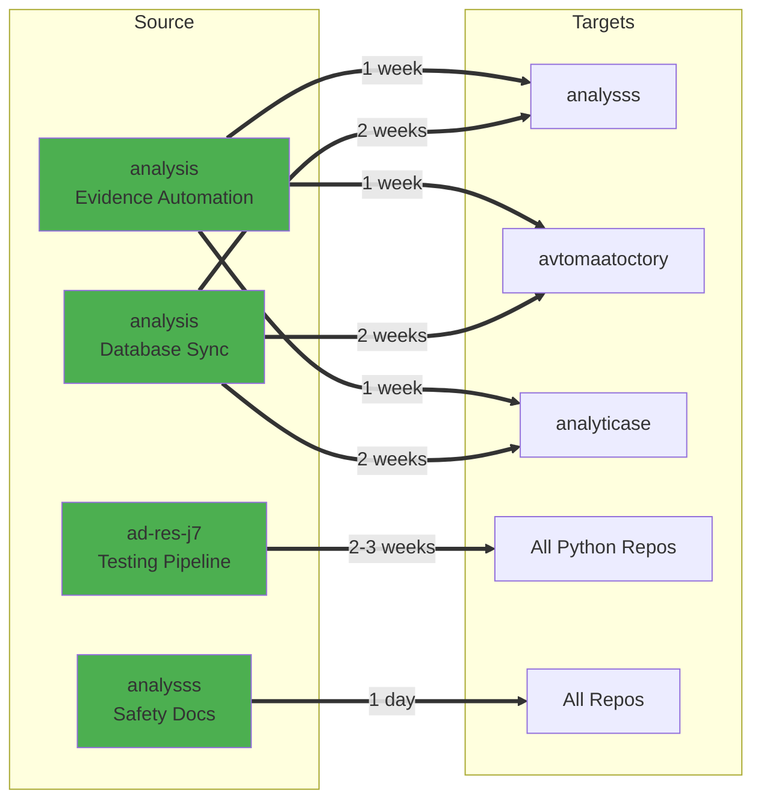

### Infrastructure Features (Weeks 5-8)

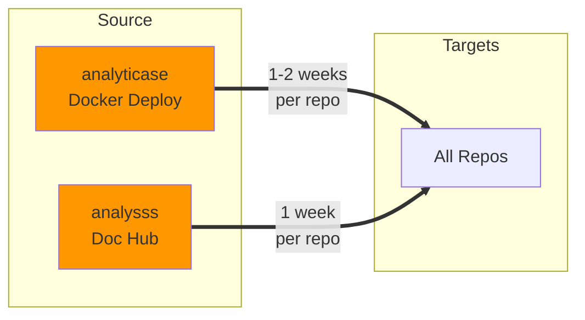

### Advanced Features (Weeks 9-14)

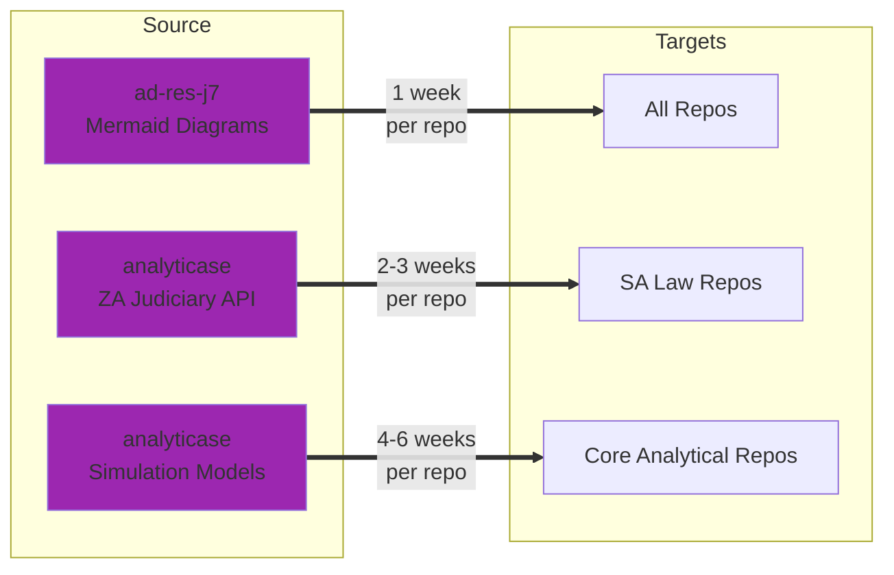

## Feature Dependency Map

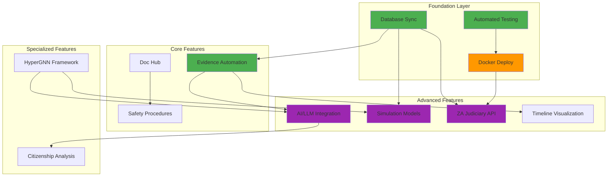

## Implementation Timeline

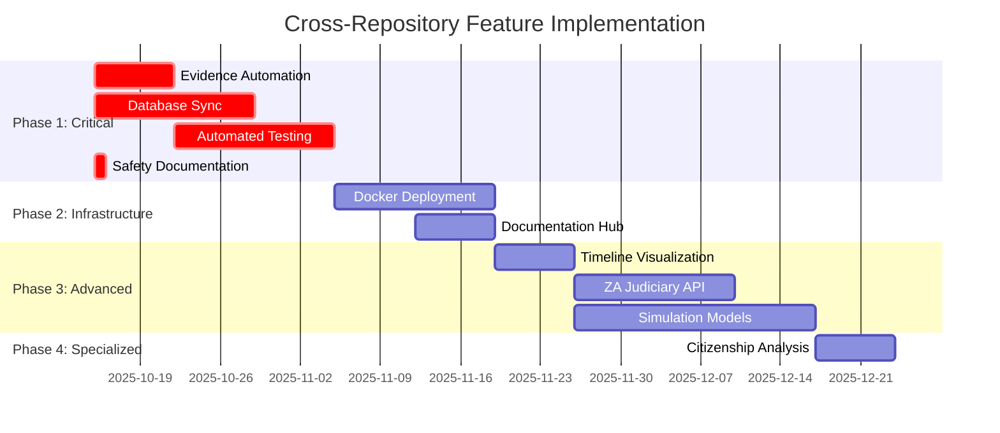

## Technology Stack Integration

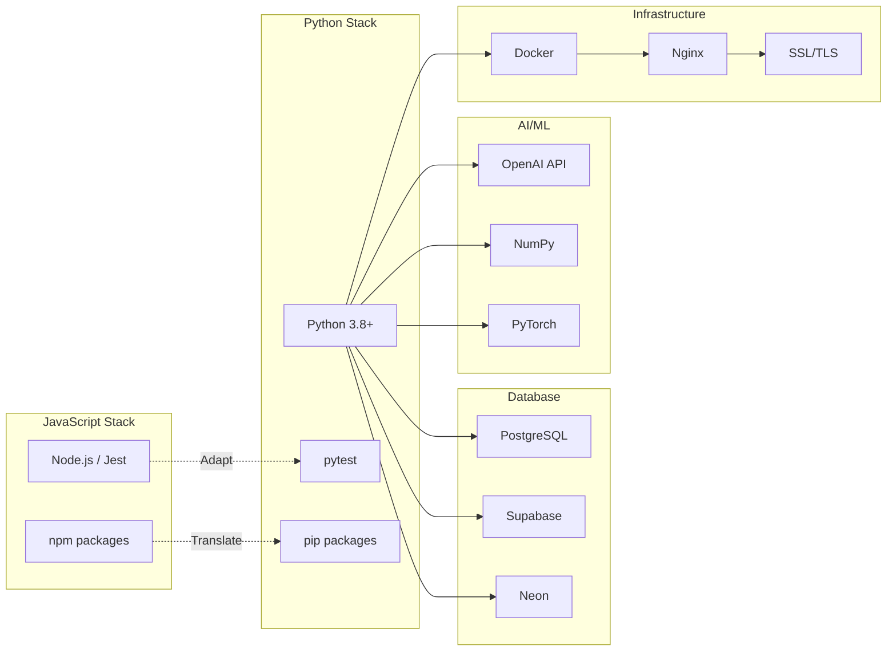

## Cross-Repository Communication Flow

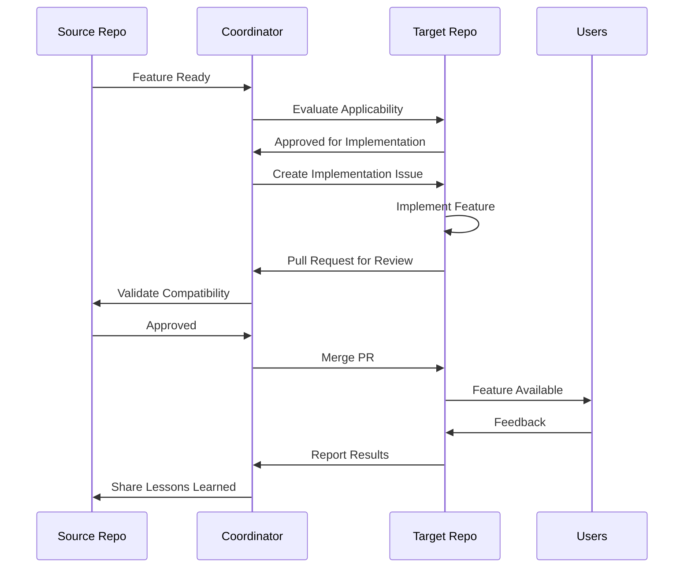

## Feature Maturity Matrix

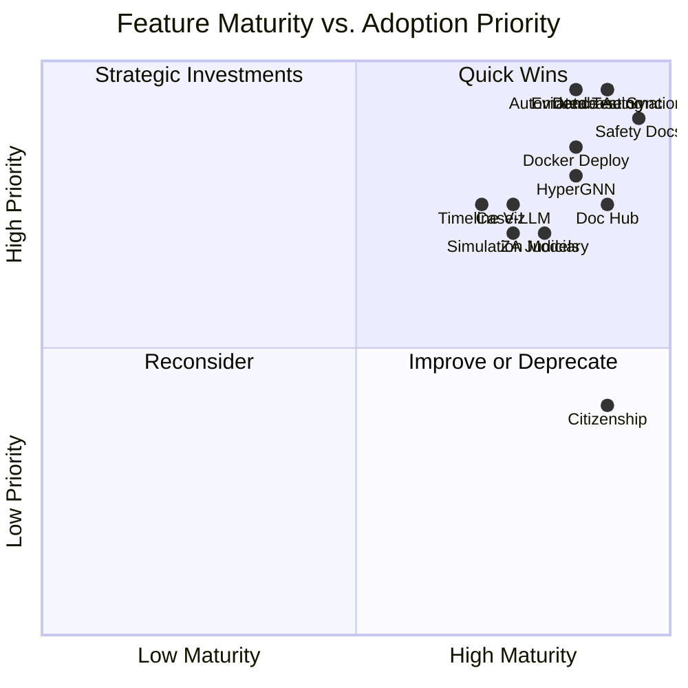

## Repository Capability Radar

### ad-res-j7
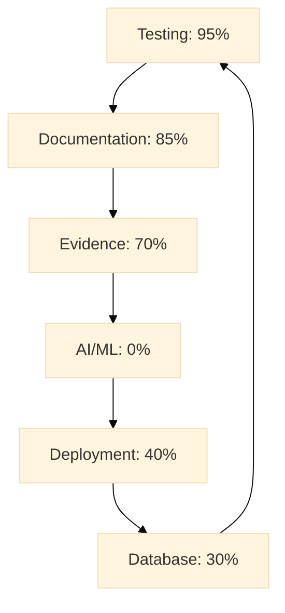

### analysss

### analysis (Current)

### analyticase
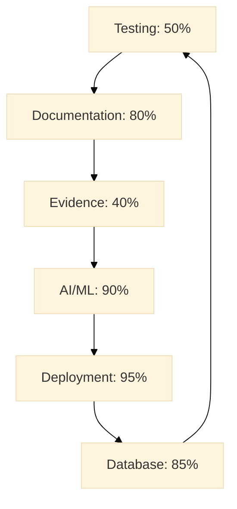

## Feature Adoption Heatmap

| Feature | ad-res-j7 | analysss | analysis | avtomaatoctory | analyticase |
|---------|-----------|----------|----------|----------------|-------------|
| **Testing** | 🟢🟢🟢 | 🟡 | 🟢🟢 | 🟡 | 🟡 |
| **Evidence** | 🟢🟢 | 🟢🟢🟢 | 🟢🟢🟢 | 🟢🟢🟢 | 🟡 |
| **Database** | 🟡 | 🟢🟢 | 🟢🟢🟢 | 🟢🟢 | 🟢🟢 |
| **AI/ML** | 🔴 | 🟢🟢🟢 | 🟢 | 🟢 | 🟢🟢🟢 |
| **Deploy** | 🟡 | 🟡 | 🟡 | 🟡 | 🟢🟢🟢 |
| **Docs** | 🟢🟢 | 🟢🟢🟢 | 🟢🟢 | 🟢🟢 | 🟢🟢 |
| **Timeline** | 🟢🟢🟢 | 🟢🟢 | 🟢🟢 | 🟢🟢 | 🟡 |
| **Legal** | 🟢🟢🟢 | 🟢🟢🟢 | 🟢🟢 | 🟢🟢🟢 | 🟢🟢 |
| **Safety** | 🟢 | 🟢🟢🟢 | 🟡 | 🟢🟢🟢 | 🟡 |

**Legend:**  
🟢🟢🟢 = Excellent (90-100%)  
🟢🟢 = Good (70-89%)  
🟢 = Adequate (50-69%)  
🟡 = Basic (30-49%)  
🔴 = Missing (0-29%)

## Success Metrics Dashboard

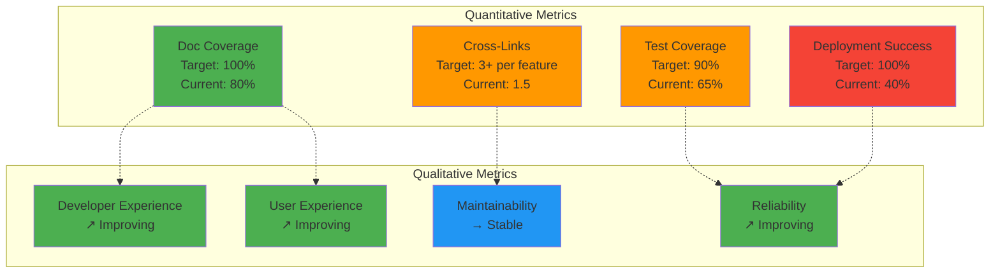

## Quick Navigation Legend

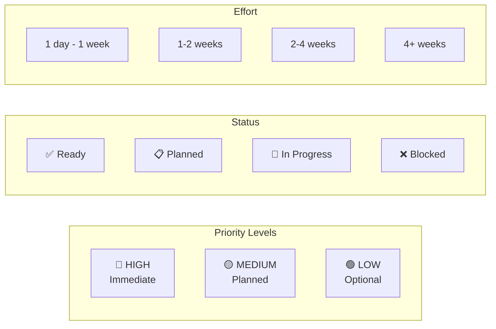

---

**Visual Guide Version:** 1.0  
**Last Updated:** October 15, 2025  
**For detailed analysis:** See [REPOSITORY_CROSS_LINK_ANALYSIS.md](./REPOSITORY_CROSS_LINK_ANALYSIS.md)  
**For quick reference:** See [CROSS_LINK_SUMMARY.md](./CROSS_LINK_SUMMARY.md)
