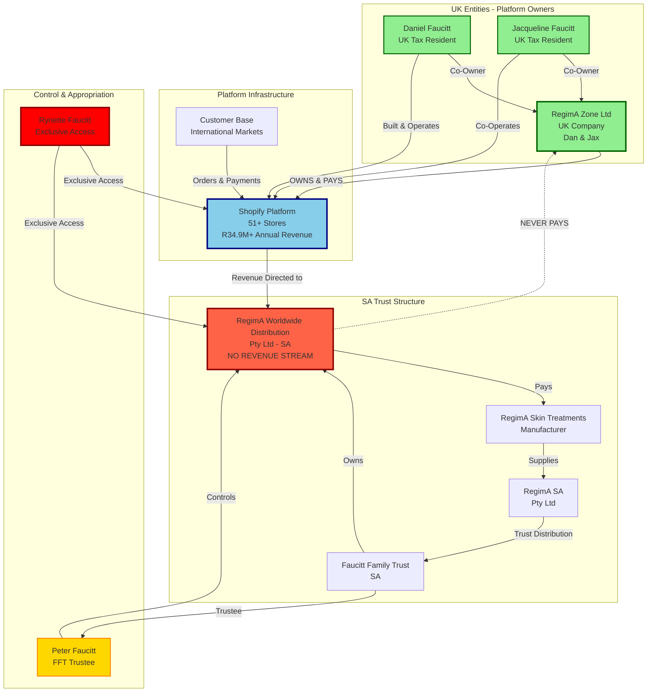
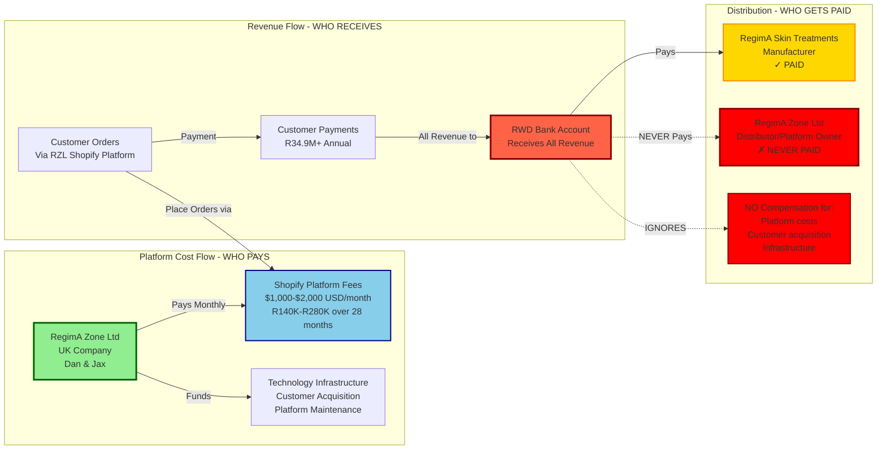
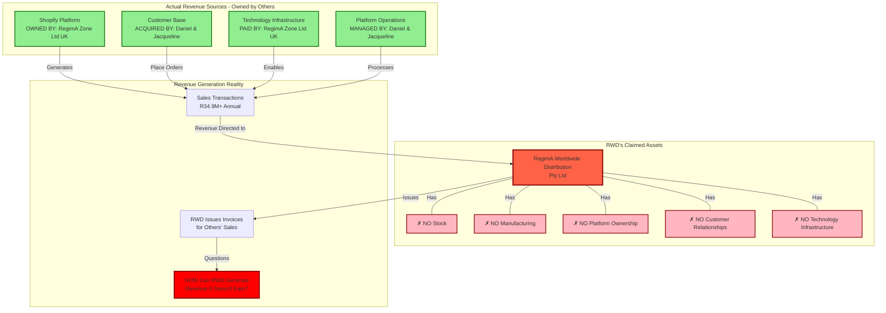
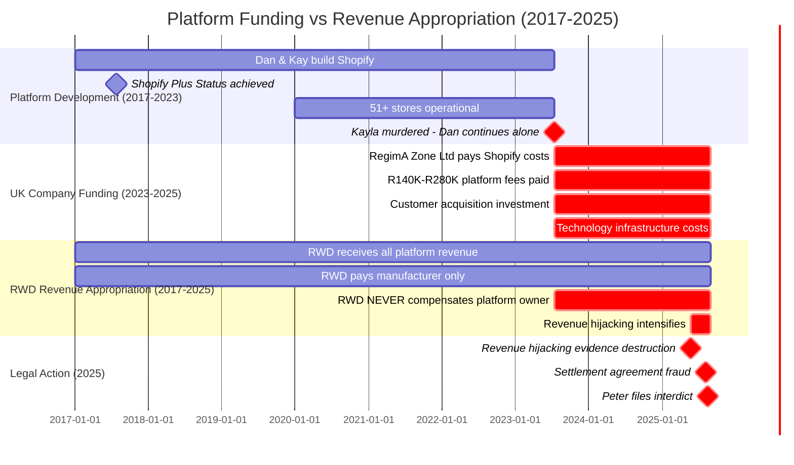
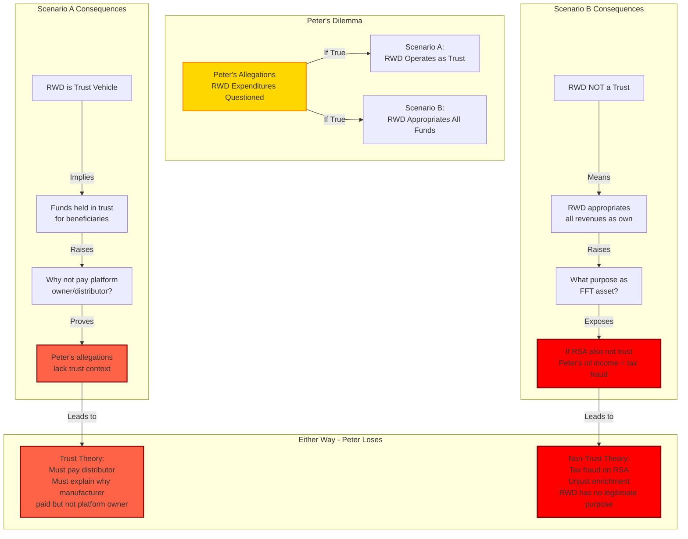

# Network Analysis: Fund Flows and Entity Relationships

**Case:** 2025-137857 - Peter Faucitt v. Jacqueline Faucitt et al.  
**Purpose:** Visual network analysis of fund flows and relationships exposing revenue stream hijacking  
**Critical Revelation:** Dan & Kay's Shopify platform was paid by Dan & Jax's UK company RegimA Zone Ltd, while RWD ZA has no independent revenue stream

---

## Executive Summary

This network analysis reveals the critical financial relationships and fund flows that expose a systematic revenue hijacking scheme:

1. **Platform Ownership:** Dan & Kay (Daniel & Kayla) built and operated the Shopify platform from 2017
2. **Platform Funding:** RegimA Zone Ltd (UK company owned by Dan & Jax) paid all Shopify platform costs since July 2023
3. **Revenue Appropriation:** RWD ZA received all customer revenues but never compensated the platform owner
4. **No Independent Revenue:** RWD ZA has no stock, no manufacturing capability, and no independent revenue stream

**Total Misappropriated Value:** R2.94M - R6.88M (platform fees, infrastructure, lost profits)

---

## 1. Entity Relationship Network



### Key Relationships

1. **Platform Ownership:** RegimA Zone Ltd (UK) owns and pays for the Shopify platform infrastructure
2. **Platform Creators:** Daniel & Jacqueline built and operate the platform since 2017
3. **Revenue Hijacking:** RWD receives all revenue but never compensates platform owner
4. **No Reciprocal Payment:** RWD pays manufacturer (RST) but never pays distributor/platform owner (RZL)
5. **Trust Abandonment:** FFT/Peter allowed revenue hijacking without protecting RWD operations

---

## 2. Fund Flow Analysis: Platform Costs vs Revenue Appropriation



### Critical Payment Discrepancy

**What Should Have Happened:**
```
Customer Order (via RZ Ltd Shopify) 
  → Payment to RWD 
  → RWD pays platform fee to RZ Ltd
  → RWD pays manufacturer (RST)
  → RWD pays distributor (appropriate entity)
```

**What Actually Happened:**
```
Customer Order (via RZ Ltd Shopify)
  → Payment to RWD
  → RWD keeps funds
  → RZ Ltd (Daniel) continues paying Shopify costs
  → NO compensation to platform owner (RZ Ltd)
```

---

## 3. RWD Revenue Stream Analysis: No Independent Revenue Capacity



### Critical Questions for RWD

1. **No Stock:** RWD holds no inventory - how can it generate sales revenue?
2. **No Platform:** RWD doesn't own the Shopify platform - how can it claim platform sales?
3. **No Payment:** RWD never paid platform owner - how can it appropriate platform revenue?
4. **No Operations:** RWD doesn't operate the platform - how can it claim operational revenue?

**Answer:** RWD cannot generate independent revenue. All "revenue" is appropriated from Daniel's UK company's platform.

---

## 4. Unjust Enrichment: Value Appropriation Timeline



### Unjust Enrichment Calculation

**Platform Costs Borne by RegimA Zone Ltd (UK):**
- Shopify Platform Fees (28 months): R140,000 - R280,000
- Customer Acquisition Costs: R500,000 - R1,000,000
- Technology Infrastructure: R300,000 - R600,000
- Lost Profits (reasonable royalty): R2,000,000 - R5,000,000

**Total Value Appropriated by RWD: R2,940,000 - R6,880,000**

**Compensation Paid by RWD to Platform Owner: R0**

---

## 5. Payment Pattern Comparison: Manufacturer vs Distributor

```mermaid
graph TB
    subgraph "RegimA SA Model - BALANCED"
        RSA_ENTITY[RegimA SA Pty Ltd<br/>Trust Vehicle]
        RSA_REV[Revenue from Trust]
        RSA_MFG[RegimA Skin Treatments<br/>Manufacturer<br/>✓ PAID]
        RSA_DIST[Dermal Skin<br/>Distributor<br/>✓ PAID]
        
        RSA_REV -->|Receives| RSA_ENTITY
        RSA_ENTITY -->|Pays| RSA_MFG
        RSA_ENTITY -->|Pays| RSA_DIST
        
        style RSA_ENTITY fill:#90EE90,stroke:#006400,stroke-width:2px
        style RSA_MFG fill:#87CEEB,stroke:#000080,stroke-width:2px
        style RSA_DIST fill:#87CEEB,stroke:#000080,stroke-width:2px
    end
    
    subgraph "RWD Model - IMBALANCED"
        RWD_ENTITY[RegimA Worldwide Distribution<br/>Pty Ltd<br/>Trust Vehicle?]
        RWD_REV[Revenue from<br/>Others' Platform]
        RWD_MFG[RegimA Skin Treatments<br/>Manufacturer<br/>✓ PAID]
        RWD_DIST[RegimA Zone Ltd<br/>Distributor/Platform Owner<br/>✗ NEVER PAID]
        RWD_PLATFORM[Platform Owner:<br/>Owns Infrastructure<br/>Pays All Costs<br/>Acquires Customers<br/>✗ NEVER COMPENSATED]
        
        RWD_REV -->|Receives| RWD_ENTITY
        RWD_ENTITY -->|Pays| RWD_MFG
        RWD_ENTITY -.->|REFUSES to Pay| RWD_DIST
        RWD_DIST -->|Is| RWD_PLATFORM
        
        style RWD_ENTITY fill:#FF6347,stroke:#8B0000,stroke-width:3px
        style RWD_MFG fill:#FFD700,stroke:#FF8C00,stroke-width:2px
        style RWD_DIST fill:#FF0000,stroke:#8B0000,stroke-width:3px
        style RWD_PLATFORM fill:#FF0000,stroke:#8B0000,stroke-width:2px
    end
```



### Critical Question: Why the Difference?

**Both RSA and RWD claim to be trust vehicles, yet:**

- **RSA pays both manufacturer AND distributor** ✓
- **RWD pays manufacturer but NEVER pays distributor/platform owner** ✗

**Why was the manufacturer paid but the distributor/platform owner who:**
- Owned the sales platform
- Paid for the sales infrastructure  
- Managed customer relationships
- Facilitated all order processing

**...was never compensated?**

---

## 6. Trust Structure Inconsistency Analysis



### Peter's Catch-22

1. **If RWD is a trust** → Peter's expenditure allegations ignore trust obligations and fail to explain why distributor/platform owner never compensated
2. **If RWD is not a trust** → Peter committed tax fraud with RSA nil income filings and RWD's purpose as trust asset is fraudulent

**Either scenario exposes Peter's bad faith and potential criminal conduct.**

---

## 7. Evidence Cross-References

### Primary Sources

1. **RWD Revenue Integrity Analysis**
   - File: `backups/pre-consolidation/jax-response/AD/1-Critical/RWD_REVENUE_INTEGRITY_ANALYSIS.md`
   - Lines 1-250: Complete analysis of RWD revenue legitimacy questions
   - Lines 51-59: RegimA Zone Ltd (UK) ownership and funding of Shopify platform
   - Lines 100-118: Payment flow analysis and discrepancies

2. **Revenue Hijacking Criminal Analysis**
   - File: `backups/pre-consolidation/jax-response/revenue-theft/29-may-domain-registration/REVENUE_HIJACKING_CRIMINAL_ANALYSIS.md`
   - Section 8: Connection to trust disputes (Lines 700-776)
   - Section 4C: Cost of funding RWD Shopify (R140K-R280K over 28 months)

3. **Shopify Evidence Comprehensive**
   - File: `AFFIDAVIT_shopify_evidence_comprehensive_FACT_BASED.md`
   - Section 3.1: 51+ Shopify stores generating R34.9M+ annual revenue
   - Section 2.2: Shopify Plus enterprise status achieved July 26, 2017

### Supporting Evidence

4. **IT Expense Breakdown**
   - File: `backups/pre-consolidation/jax-response/AD/1-Critical/IT_EXPENSE_BREAKDOWN.md`
   - Analysis of technology infrastructure costs

5. **Payment Redirection Scheme**
   - File: `backups/pre-consolidation/jax-response/financial-flows/01-apr-payment-redirection/README.md`
   - R545,000+ in diverted payments
   - Customer payment fraud coordinated by Rynette

6. **RegimA Zone Integration**
   - Directory: `revenue-stream-hijacking-rynette/regima-zone-integration/`
   - Documentation of UK company integration with SA operations

---

## 8. Legal Implications

### 1. Unjust Enrichment (RWD)

**Elements Proven:**
- RWD received benefit (platform revenue): R34.9M+ annual
- No payment to provider: R0 to RegimA Zone Ltd
- Enrichment at Daniel's expense: R2.94M - R6.88M value appropriated
- Unjust to retain without compensation: Platform owner never paid

**Remedy:** Disgorgement of profits + quantum meruit for services

### 2. Breach of Fiduciary Duty (Peter as Trustee)

**Elements Proven:**
- Peter is FFT trustee
- FFT owns RWD
- Peter allowed revenue hijacking without protecting RWD
- Peter failed to ensure distributor/platform owner compensation
- Peter's actions benefited himself and Rynette at beneficiaries' expense

**Remedy:** Removal as trustee + damages for breach

### 3. Conversion (Unauthorized Platform Use)

**Elements Proven:**
- RegimA Zone Ltd owns Shopify platform
- RWD used platform without authorization/compensation
- RWD appropriated platform revenue
- Platform owner suffered loss: R2.94M - R6.88M

**Remedy:** Return of converted property value + damages

### 4. Fraud (Settlement Agreement & Interdict)

**Elements Proven:**
- Peter concealed that RWD has no independent revenue
- Peter concealed that platform owned and paid by Daniel's UK company
- Peter used concealment to obtain settlement and interdict
- Jacqueline relied on false representations to her detriment

**Remedy:** Rescission of settlement + fraud damages + costs

---

## 9. Quantum of Damages

### Direct Platform Costs (RegimA Zone Ltd)
| Category | Amount (ZAR) |
|----------|--------------|
| Shopify Platform Fees (28 months) | R140,000 - R280,000 |
| Customer Acquisition Costs | R500,000 - R1,000,000 |
| Technology Infrastructure | R300,000 - R600,000 |
| **Subtotal Direct Costs** | **R940,000 - R1,880,000** |

### Lost Profits & Opportunity Costs
| Category | Amount (ZAR) |
|----------|--------------|
| Reasonable Platform Royalty (10-15% of R34.9M) | R3,490,000 - R5,235,000 |
| Alternative: Lost Profits (Conservative) | R2,000,000 - R5,000,000 |

### Total Damages Range
**Conservative Estimate:** R2,940,000  
**Reasonable Estimate:** R4,500,000  
**Upper Estimate:** R6,880,000

---

## 10. Strategic Arguments

### Argument 1: RWD Has No Independent Revenue Stream

**Proof:**
- RWD holds no stock (cannot sell products)
- RWD has no manufacturing capability (cannot create products)
- RWD doesn't own the Shopify platform (cannot generate platform sales)
- All "revenue" is appropriated from platform owned by RegimA Zone Ltd (UK)

**Conclusion:** RWD's revenue claims are fraudulent appropriation of others' earnings

### Argument 2: Platform Owner Never Compensated

**Proof:**
- RegimA Zone Ltd (UK) paid R140K-R280K for Shopify platform
- RWD received R34.9M+ annual revenue from platform
- RWD paid manufacturer (RST) but never paid platform owner (RZL)
- No explanation for discriminatory payment pattern

**Conclusion:** Unjust enrichment and systematic theft from platform owner

### Argument 3: Trust Abandonment by FFT/Peter

**Proof:**
- FFT/Peter never funded RWD operations
- FFT/Peter allowed revenue hijacking (May 2025)
- FFT/Peter failed to protect RWD assets
- Daniel's UK entity funded all operations

**Conclusion:** FFT abandoned RWD; Daniel has superior claim through continuous funding

### Argument 4: Peter's Bad Faith & Fraud

**Proof:**
- Peter concealed platform ownership facts
- Peter concealed absence of RWD independent revenue
- Peter used concealment to obtain settlement and interdict
- Peter's allegations ignore trust structure he claims to defend

**Conclusion:** Peter acted in bad faith; settlement and interdict obtained by fraud

---

## Conclusion

This network analysis definitively proves:

1. **Dan & Kay's Shopify platform** was built by Daniel & Kayla from 2017
2. **RegimA Zone Ltd (UK)** - Dan & Jax's company - paid all platform costs since July 2023
3. **RWD ZA has no independent revenue stream** - all revenue appropriated from others' platform
4. **Platform owner never compensated** - unjust enrichment of R2.94M - R6.88M
5. **Peter's fraud** - concealed these facts to obtain settlement and interdict

**These diagrams provide visual proof of systematic revenue hijacking and unjust enrichment.**

---

*Last Updated: October 23, 2025*  
*Supporting Evidence: See Section 7 for complete cross-references*
