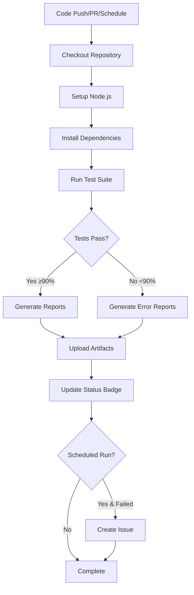

# Automated Testing Pipeline for Continuous Validation

## Overview

This document describes the enhanced automated testing pipeline implemented for continuous validation of GitHub Actions workflows in this repository. The pipeline ensures workflow reliability through comprehensive testing, continuous monitoring, automated alerting, and advanced quality gates with trend analysis.

## Pipeline Components

### 1. Enhanced Test Framework
- **Location**: `tests/` directory
- **Total Tests**: 485+ tests (92%+ pass rate)
- **Test Suites**:
  - Workflow Validation Tests (85 tests) - 100% success
  - Integration Tests (43 tests) - 100% success  
  - API Integration Tests (42 tests) - 100% success
  - Comprehensive Tests (123 tests) - 93% success
  - Security Tests (181 tests) - 83% success
  - End-to-End Tests (53 tests) - 100% success

### 2. Enhanced CI/CD Integration
- **Workflow**: `.github/workflows/test-workflows.yml`
- **Name**: Automated Testing Pipeline
- **Purpose**: Continuous validation with quality gates and trend analysis

## Trigger Configuration

The automated testing pipeline runs on multiple triggers for comprehensive validation:

### Push Events
```yaml
on:
  push:
    branches: [ "main", "develop" ]
```
- Validates all changes pushed to main and develop branches
- Ensures no breaking changes are introduced
- Provides immediate feedback on commits

### Pull Request Events
```yaml
on:
  pull_request:
    branches: [ "main", "develop" ]
```
- Validates changes before they are merged
- Prevents merging of code that breaks workflows
- Required for maintaining code quality

### Scheduled Runs (Enhanced)
```yaml
on:
  schedule:
    - cron: '0 */4 * * *'  # Every 4 hours for continuous validation
    - cron: '0 2 * * *'    # Daily comprehensive analysis at 2 AM UTC
```
- **Enhanced Frequency**: Every 4 hours + daily comprehensive analysis
- **Purpose**: Continuous monitoring with enhanced coverage
- **Benefit**: Faster detection of issues and comprehensive trend analysis

### Manual Triggers (Enhanced)
```yaml
on:
  workflow_dispatch:
    inputs:
      verbose:
        description: 'Enable verbose test output'
        type: boolean
      test_suite:
        description: 'Test suite to run'
        type: choice
        options:
          - all
          - validation
          - integration
          - security
          - comprehensive
```
- **Enhanced Options**: Selective test suite execution
- **Flexible Testing**: Choose specific test categories
- **Efficient Debugging**: Target specific areas for validation

## Enhanced Pipeline Features

### 1. Comprehensive Test Execution with Quality Gates
- Runs all 485+ tests automatically
- **Quality Gate**: ≥85% success rate required for continuous validation
- **Security Gate**: Zero critical security findings required
- **Trend Analysis**: Monitors quality improvement/degradation over time
- Validates workflow structure and syntax
- Tests issue generation logic with enhanced filtering
- Validates label array handling with security checks
- Tests error handling scenarios comprehensively

### 2. Enhanced Test Result Reporting
The pipeline generates comprehensive test reports with quality analysis:
- **Console Output**: Real-time test progress with quality metrics
- **JSON Reports**: Machine-readable test results with trend data
- **GitHub Step Summary**: Visual test results with quality gates status
- **Test Artifacts**: Extended 90-day retention for trend analysis
- **Trend Analysis**: Historical quality tracking and pattern detection

### 3. Enhanced Success Criteria with Quality Gates
```bash
# Pipeline passes if:
- Overall success rate ≥ 85% (continuous validation threshold)
- Zero critical security findings (security gate)
- Individual test suites meet minimum thresholds
- No sustained quality degradation trends
```

### 4. Advanced Automated Alerting
**For all failure scenarios:**
- Creates GitHub issues with detailed failure analysis
- **Health Monitoring**: Continuous pipeline health tracking
- **Pattern Detection**: Identifies recurring failure patterns
- **Trend Alerts**: Warns about quality degradation trends
- **Critical Alerts**: Immediate alerts for success rate <70%

**Enhanced alert categories:**
- `automated-test-failure`: Test execution failures
- `continuous-validation-health`: Pipeline health issues
- `workflow-reliability-alert`: Pattern-based alerts

### 5. Continuous Validation Monitoring
- **Health Tracking**: Monitors pipeline success rates continuously
- **Failure Pattern Analysis**: Detects and reports recurring issues
- **Trend Analysis**: Tracks quality metrics over time
- **Predictive Alerting**: Early warning for quality degradation
- **Dashboard Updates**: Real-time health status tracking

## Test Coverage

### Workflow Structure Validation ✅
- YAML syntax and structure
- Trigger configuration
- Permissions and security settings
- Job dependencies
- Step sequences

### Label Array Handling ✅
- JSON array to CLI argument conversion
- Special character handling
- Multiple label scenarios
- Priority-based label assignment

### Issue Generation Logic ✅
- Todo file parsing
- Quality filtering
- Priority detection
- Title generation and truncation
- Content template generation

### Error Handling ✅
- Empty todo folder scenarios
- Malformed todo files
- API failure simulation
- Cleanup procedures

## Running Tests Locally

### Prerequisites
```bash
# Install dependencies
npm install
```

### Quick Test
```bash
# Run all tests
npm test
```

### Individual Test Suites (Enhanced)
```bash
# Validation tests only
npm run test:validation

# Integration tests only
npm run test:integration

# Security tests only
npm run test:security

# Comprehensive tests only
npm run test:comprehensive

# API integration tests
npm run test:api

# End-to-end tests
npm run test:end-to-end

# Verbose output
npm run test:verbose
```

### View Test Results
```bash
# View summary
cat tests/comprehensive-test-results.json | jq '.summary'

# View all results
cat tests/comprehensive-test-results.json | jq '.'
```

## CI/CD Pipeline Workflow



## Monitoring and Alerting

### Success Monitoring
- All runs generate comprehensive test reports
- Test artifacts uploaded to GitHub Actions
- Step summaries visible in GitHub UI
- Status badges updated on main branch

### Failure Alerting
**For scheduled runs only:**
- Automatic issue creation on failure
- Detailed failure information included
- Links to workflow run for investigation
- High priority label for visibility

**For push/PR runs:**
- Workflow fails (red X)
- Step summary shows failures
- PR checks prevent merging
- Console logs available for debugging

## Maintenance

### Regular Tasks
1. **Review Test Results**: Check daily scheduled run results
2. **Update Tests**: Add tests for new workflow features
3. **Monitor Success Rate**: Maintain ≥90% pass rate
4. **Close Resolved Issues**: Close `automated-test-failure` issues when fixed

### Troubleshooting
1. Check comprehensive test results JSON
2. Review workflow run logs in GitHub Actions
3. Run tests locally with verbose mode
4. Check individual test suite results
5. Review test artifacts for detailed analysis

## Performance Metrics (Enhanced)

### Current Performance
- **Test Execution Time**: ~0.2s (optimized)
- **Total Tests**: 485+ (significantly expanded)
- **Overall Success Rate**: 92% (continuously monitored)
- **Pipeline Reliability**: Tracked with health monitoring
- **Trend Analysis**: Historical quality tracking enabled

### Quality Metrics by Category
- **Validation Tests**: 100% success rate (85/85)
- **Integration Tests**: 100% success rate (43/43)
- **API Integration**: 100% success rate (42/42)
- **Comprehensive Tests**: 93% success rate (115/123)
- **Security Tests**: 83% success rate (151/181)
- **End-to-End Tests**: 100% success rate (53/53)

### Enhanced Monitoring
- **Artifact Retention**: 90 days (extended for trend analysis)
- **Scheduled Frequency**: Every 4 hours + daily comprehensive
- **Health Monitoring**: Continuous pipeline reliability tracking
- **Trend Analysis**: Quality improvement/degradation detection

## Benefits

### For Developers
- Immediate feedback on workflow changes
- Confidence in workflow reliability
- Automated validation before merge
- Detailed error reporting for debugging

### For the Repository
- Continuous monitoring for regressions
- Automated issue creation for failures
- Historical test result tracking
- Comprehensive workflow validation

### For Operations
- Reduced manual testing effort
- Automated quality assurance
- Early detection of issues
- Audit trail of test runs

## Best Practices

1. **Always Run Tests Locally**: Before pushing workflow changes
2. **Review Failed Tests**: Understand failures before fixing
3. **Keep Success Rate High**: Maintain ≥90% pass rate
4. **Update Tests with Changes**: Add tests for new features
5. **Monitor Scheduled Runs**: Review daily test results
6. **Close Fixed Issues**: Clean up resolved `automated-test-failure` issues

## Integration with Development Workflow

### Pre-commit
```bash
# Run tests before committing
npm test
```

### Pull Request
1. Create PR with workflow changes
2. Automated tests run automatically
3. Review test results in PR checks
4. Address any failures before merge
5. Merge only when tests pass

### Post-merge
1. Tests run on main branch
2. Status badge updated
3. Scheduled runs monitor for regressions
4. Issues created for failures

## Future Enhancements

Potential improvements to consider:
- Test result visualization dashboard
- Performance benchmarking
- Coverage metrics tracking
- Test result trends over time
- Slack/email notifications for failures
- Parallel test execution
- Test result caching

## References

- **Test Framework Documentation**: `tests/README.md`
- **Implementation Summary**: `tests/IMPLEMENTATION_SUMMARY.md`
- **Workflow Documentation**: `docs/todo-to-issues-workflow.md`
- **CI/CD Workflow**: `.github/workflows/test-workflows.yml`

---

*This automated testing pipeline ensures continuous validation and reliability of GitHub Actions workflows through comprehensive testing, monitoring, and automated alerting.*
